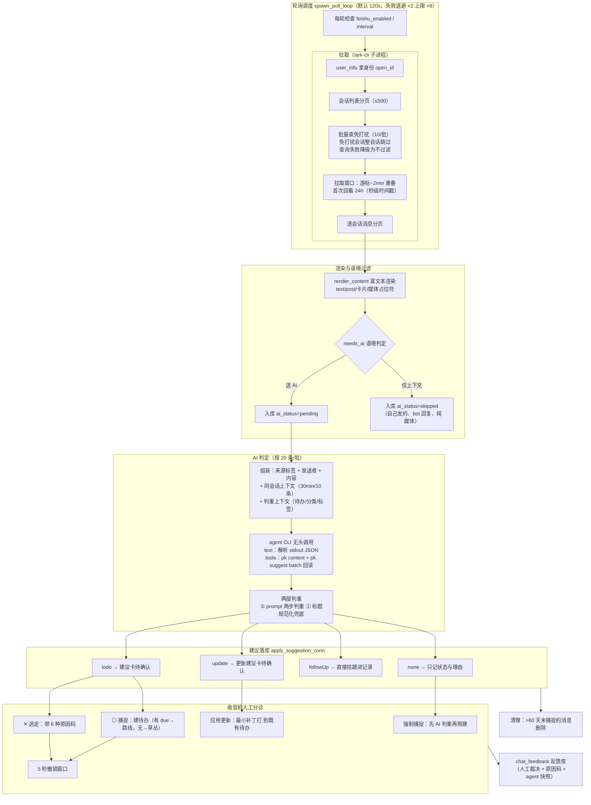
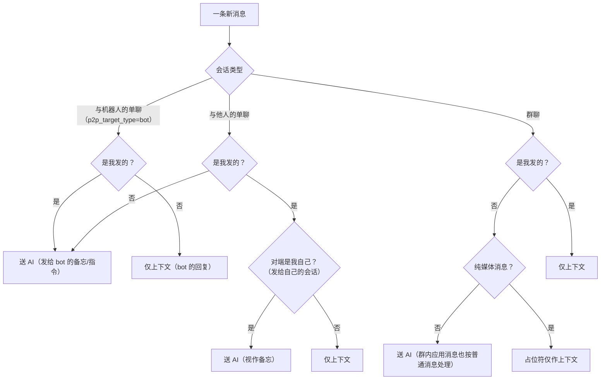
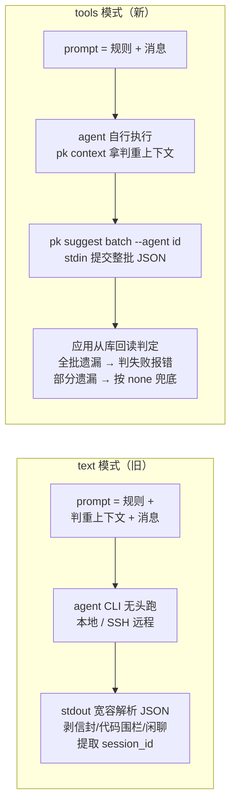
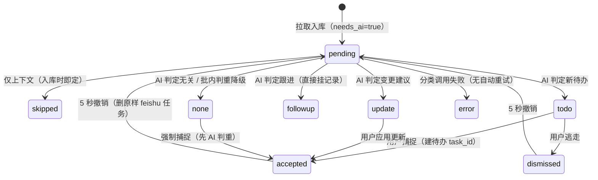

# 飞书聊天消息分析策略（收音机）

> **一句话**：以个人身份经官方 lark-cli 增量轮询飞书会话 → 按会话语境筛选出「需要本人行动」的消息 → 交本地 AI agent 无头判定 → AI 只产建议、由人在收音机里分诊 → 判定与人工裁决全部落库，形成可迭代的反馈闭环。

核心代码索引：

| 模块 | 文件 | 职责 |
|---|---|---|
| 拉取与语境规则 | `src-tauri/src/feishu.rs` | 轮询循环、会话/消息分页、免打扰过滤、富文本渲染、入库与 AI 分发 |
| lark-cli 封装 | `src-tauri/src/lark_cli.rs` | 子进程调用 `lark-cli api`，OAuth 凭证由 lark-cli 自管 |
| AI 判定 | `src-tauri/src/ai.rs` | 提示词、text/tools 双模式调用、输出解析、批内判重兜底 |
| 建议落库与分诊 | `src-tauri/src/commands/radio.rs` | `apply_suggestion_conn` 单一落库出口、捕捉/逃走/撤销、反馈记录 |
| pk CLI（tools 模式回写） | `src-tauri/src/bin/pk.rs` | `pk context` 取判重上下文、`pk suggest batch` 提交判定 |

---

## 1. 设计目标与基本原则

- **目标**：从 IM 的噪音里挑出隐含的待办——任务、承诺、会议、deadline、请求，而不是把聊天记录搬进待办清单。
- **宁漏勿滥（准确率优先）**：判 none 的消息仍留在收音机里可手动捕捉，误报则会污染待办清单。错误的代价不对称，所以策略整体偏收窄。
- **AI 建议、人确认**：AI 的判定落成建议卡，捕捉/逃走由用户决定；唯一例外是 followUp（挂跟进记录）直接生效。
- **本地优先与凭证边界**：数据在本机 SQLite；飞书凭证由官方 lark-cli 保管，不进本应用库；消息内容只送用户自己配置的 AI agent（本地或 SSH 远程）。

## 2. 总体链路

## 3. 阶段一：增量拉取

- **身份与传输**：所有飞书 API 经 `lark-cli api GET/POST ... --format json` 子进程透传（`lark_cli.rs`），应用只处理 `{"ok":true,"data":...}` 信封。GUI 进程 PATH 缺失问题由 `which` 模块补扫解决。
- **游标窗口**（`feishu.rs::window_secs`）：游标为毫秒、出口转秒（飞书 API 只收秒）；增量拉取回退 2 分钟容错，重叠消息靠 `message_id` 去重；首次拉取回看 24 小时。游标在**整轮成功后**才推进，失败自动重拉旧窗口。
- **免打扰过滤**（`chat_mute_outcomes`）：折叠状态开放平台未暴露，用免打扰做代理信号（折叠的噪音会话通常也设了免打扰），整会话不拉取；查询失败降级为不过滤，不阻断链路。（✅ 2026-09 起免打扰降为**默认值**：设置 → 飞书 → 「会话过滤」可逐会话三态覆盖（跟随/总是拉取/总是过滤），手动设置后以本应用为准——见 `specs/feishu-chat-filter/`）
- **富文本渲染**（`render_content`）：

  | msg_type | 渲染结果 |
  |---|---|
  | text | 正文 + @提及还原为人名（**@到我 渲染成「@我」**，让 AI 区分任务归属） |
  | post | 标题 + 段落；@人、链接带 href、媒体占位 |
  | interactive 卡片 | 递归收集 text/content/title 节点拼摘要（≤500 字），前缀 `[卡片]` |
  | image/audio/media/file/sticker/名片/合并转发 | 占位符（`[图片]`、`[文件:合同.pdf]`…），保留入上下文但**不送 AI** |
  | 未知/非法 JSON | 跳过 |

- **发送者名字**：自己→本人名；单聊→会话名即对方；群聊→`feishu_users` 缓存，未命中时每群每轮拉一次成员名单补缓存（≤3 页），仍失败退化为短 id（`ou_ab12cd34`）。

## 4. 阶段二：语境过滤（谁的消息送 AI）

规则出处：`feishu.rs::pull_new_messages`（needs_ai 计算）与 `feishu.rs:372-376` 的语境注释。lark-cli 用它自己的内置应用身份，没有「本应用机器人」概念，所以群里的应用消息按普通消息送 AI，bot 单聊靠会话级 `p2p_target_type=bot` 识别。

## 5. 阶段三：AI 判定

### 5.1 送判 payload

每条消息带四层语境（`AiMessage`）：

1. **来源标签**（`chat_label`）：`飞书·私聊「李四」` / `飞书·群聊「项目群」` / `飞书·机器人私聊`——告诉模型谁在什么场合说话；
2. **发送者**与渲染后的内容；
3. **同会话上下文**（`chat_context_lines`）：同 chat_id、时间在 `[t−30min, t)` 的最近 10 条，格式 `HH:MM 发送者: 内容`，**自己说的标注为「我」**（且不暴露原始显示名，防模型混淆），每条截 200 字，仅供理解指代，明确告知「最终判断只针对消息本身」；
4. **判重上下文**（`ClassifyContext`）：现有未完成待办（id+标题）、启用中的分类、标签（名+描述）。

### 5.2 双模式

tools 模式的优势：无文本解析环节，agent 落库前经 `pk` 统一校验（消息存在且 pending、action/枚举合法、分类/标签存在、目标待办存在），**错误信息带序号与 messageId，agent 可自纠整批重试**；整批单事务落库，一损俱损。

### 5.3 提示词策略要点（`ai.rs::SYSTEM_PROMPT` / `TOOLS_SYSTEM_PROMPT`，测试保证两份规则同步）

- **归属先行**：群聊先判断任务归属，只提取明确指派给用户的（@我 / 点名 / 接我的话头向我提请求）；@他人或点名他人的是别人的任务，内容再像待办也判 none 并在 reason 注明。
- **宁漏勿滥**：判 none 用户仍能看到、可手动捕捉；误报污染清单。
- **两步判重**：① 对照现有待办清单——本质相同绝不新建，改走 update / followUp / none；② 批内互相判重——同一件事只对信息最完整的一条生成 todo。
- **四类 action**：`todo`（新待办）/ `update`（改现有待办属性，最小补丁：只填要变的字段）/ `followUp`（补充信息挂跟进，不改属性）/ `none`。
- **字段约束**：title ≤20 字祈使句、category/tags 只能从清单选、priority 四档、due 规定 `YYYY-MM-DDTHH:MM`、每条必带 **reason**（一句话判定理由，≤30 字）与 **confidence**（high/medium/low，低置信提示用户多看一眼）。
- **确定性兜底**（`dedup_batch_todos`）：规范化标题（trim/折叠空白/小写）相同的多个 todo 只留最先一条，其余降级 none——防模型漏掉批内判重；tools 模式下兜底还会把 agent 已落库的重复建议卡清掉。

## 6. 阶段四：建议落库与消息生命周期

`apply_suggestion_conn`（`radio.rs:390`）是**单一落库出口**——后台轮询、强制捕捉、`pk suggest` 三路共用，语义幂等。

- 捕捉建待办：有 due → `scheduled`（路线），无 due → `inbox`（草丛）；非法优先级回落 normal、未知分类回落第一个启用分类、未知标签静默丢弃。
- 应用更新：只把 AI **明确给出**的字段打补丁（复用 `update_task` 的校验/标签替换/字段级日志），留空字段一律不动。
- followUp 幂等：已 accepted 且 followup 的重复提交直接跳过。

## 7. 阶段五：人工分诊与反馈回路

- **收音机列表**：只展示送过 AI 的消息（`ai_status != 'skipped'`），倒序 300 条，支持关键词搜索（内容/会话/发送者/建议标题，LIKE 通配符已转义）。
- **操作**：单条捕捉 / 逃走（原因码 `duplicate / not_task / wrong_info / noise / outdated / other`）、批量分诊（单条失败不影响其余）、5 秒撤销（应用更新与跟进不可撤——改的是既有待办，无法安全回滚）、**强制捕捉**（推翻 AI 原判，但先让 AI 判重：是跟进就挂记录、是变更就落更新建议卡，都不建重复待办）。
- **反馈飞轮**（`chat_feedback`）：每次人工裁决记录建议快照（AI 动作）、裁决（accepted/dismissed/forced）、原因码、判定时的 agent id+名称快照——为判重分析与提示词迭代积累本地数据。
- **清理**：>60 天仍未创建待办的消息删除，库不无限膨胀。

## 8. 可靠性与可观测性

- **健康三链路**（飞书/AI/Todoist）：成功/失败次数、下次预计轮询时间，诊断页可视 + 一键重试。
- **成本遥测**：每次分类调用按次落 `agent_sessions`（时长、session id、成败），支持回链 agent 自带的历史界面。
- **并发**：应用与 `pk` CLI 并发读写同一 SQLite（WAL + busy_timeout 5000ms）。
- **失败语义**：拉取失败→游标不推进、指数退避后重拉；分类失败→该批标 error、健康登记、后续批次继续；tools 模式全批遗漏→整次判失败给出可操作指引（工具白名单/PATH）。

---

## 9. 策略 Review

### 9.1 做得好的

1. **「宁漏勿滥」与产品哲学自洽，且错误代价闭环**。误报污染待办清单（高代价），漏报留在收音机可手动捕捉（低代价）——策略收窄的方向和「注意力友好」原则一致，收音机本身又是漏报的安全网。
2. **语境工程质量高**。三类会话的 needs_ai 门控、`@我` 渲染消歧任务归属、同会话 30min/10 条上下文并明确「仅供参考」、上下文里自己统一标注「我」（还有测试保证不泄漏原始显示名，避免模型把两个名字当成两个人）——这些细节直接决定归属判定的准确率。
3. **判重是三层的**：prompt 两步判重（对照清单 + 批内）→ 标题规范化确定性兜底 → 强制捕捉时再判一次。重复待办是最容易毁掉信任的问题，这里防得很认真。
4. **人机分工边界清晰**。AI 只产建议，出口统一（`apply_suggestion_conn` 单点），`pk suggest` 带前置校验和可自纠的报错、整批事务。tools 模式消灭了文本解析这个最脆的环节，方向正确。
5. **反馈飞轮是真数据资产**。原因码 + agent 快照 + 建议快照的 chat_feedback，是后续做 prompt 迭代、few-shot 示例、判重阈值调优的原料，而不只是埋点。
6. **可靠性细节到位**：游标 2 分钟重叠 + 失败不推进、退避上限、免打扰查询失败降级、WAL 并发、GUI PATH 补扫、SSH 模式提示词强制走 stdin（避免远端 shell 重解析打碎引号）。

### 9.2 风险与改进建议（按影响排序）

1. **followUp 未经确认直接生效，且不可撤销**（`radio.rs` attach_followup）。它是唯一绕过人工确认的写操作：AI 误判会把无关消息原文挂到某个待办的跟进记录里，并把消息标 accepted——用户不会在收音机里再看到它。建议：低置信度的 followUp 降级为待确认卡；或跟进记录也提供撤销（删 note + 回 pending，数据上都可定位）。
2. **分类失败的消息没有自动重试**（`feishu.rs:685`）。error 状态的消息停在原地，游标已推进，下一轮不会重新拉到；用户只能逐条强制捕捉。建议：下一轮把 `ai_status='error'` 的消息重新送判（限次数），或收音机提供「重判」入口。
3. **免打扰 = 整会话跳过，代理信号有假阳性**。用户为了免通知而 mute 一个重要单聊/群（常见），消息就静默消失——连上下文都不留，后续同会话消息的判定质量也受影响。建议：单聊与群聊区别对待（mute 的单聊很少是「噪音源」），或提供显式的会话黑名单设置，把「免打扰≈折叠」的启发式留作默认。（✅ 已落地 2026-09：会话过滤偏好——免打扰降为默认值，逐会话三态覆盖（跟随/总是拉取/总是过滤），含单聊；见 `specs/feishu-chat-filter/`）
4. **判重上下文无上限**（`radio.rs::classify_context`）。`pk task list` 都知道截断 50 条防刷爆上下文（`pk.rs:426`），而 open_tasks 全量进 prompt——待办积压几百条时 token 成本上升、模型判重注意力被稀释，反而更容易漏判重复。建议：加上限（如 100 条），优先保留近活跃/有 due 的条目。
5. **群内应用消息（机器人卡片）是误报高发源**。CI 失败、审批提醒的卡片摘要（`[卡片] 构建失败…`）非常「像待办」。宁漏勿滥的 prompt 有缓解，但更省的做法是：群内 interactive 卡片默认不送 AI（或仅 @我 的卡片送），能砍掉一大块噪音与 agent 调用成本。
6. **上下文窗口只向后看**。30min/10 条覆盖了「前因」，但「改口/撤销」往往发生在目标消息之后——当前依赖后续轮次的 update 判定兜住；若改口消息落在另一批/另一轮，指代链就断了。窗口参数（30/10）目前是经验值，可基于会话活跃度自适应，或对含时间指代的消息扩大窗口。
7. **批内判重兜底「保留第一条」与 prompt「保留最完整一条」语义冲突**（`ai.rs::dedup_batch_todos`）。模型若正确保留了更完整的后一条，兜底仍会把先到的重复项留下、把模型选中的降级（仅规范化标题相同时触发，影响小但方向相反）。建议：兜底保留模型给出 confidence 更高 / reason 标记为「保留」的那条。
8. **大群发送者退化为短 id**。成员名单只拉 3 页（300 人），超出后 AI 看到 `ou_ab12cd34` 说的话——归属判定（「点名让用户做」）质量下降。可对活跃群放宽上限，或按 sender_id 惰性单查。
9. **串行逐会话拉取，每个 API 一次 lark-cli（node）子进程**。会话多的用户单轮耗时可观，叠加上限 ×8 的退避，最长可能 16 分钟盲区。可小并发拉取（注意飞书限流），或评估 lark-cli 常驻进程/批量接口。
10. **观察**：text 模式的「截首尾花括号」宽容解析在极端输出下可能切错 JSON；tools 模式从根上规避了它——新用户引导与默认值可以向 tools 模式倾斜。另外值得在用户文档明示：消息全文会送至所配置的 agent（本地或 SSH 远程 + 云模型），隐私边界取决于 agent 配置，而非本应用。

### 9.3 演进方向（供参考）

- 用 chat_feedback 积累的数据做 prompt 迭代回归集（每次改提示词跑一遍历史判定对比 accepted/dismissed 率）。
- 收音机里按 confidence 分区展示（low 置信单独一档），进一步降低人工复核成本。
- ~~会话级黑白名单替代免打扰启发式，成为一等公民设置~~（✅ 已落地 2026-09：三态会话过滤偏好（跟随免打扰/总是拉取/总是过滤）+ 拉取快照管理界面，见 `specs/feishu-chat-filter/`）
