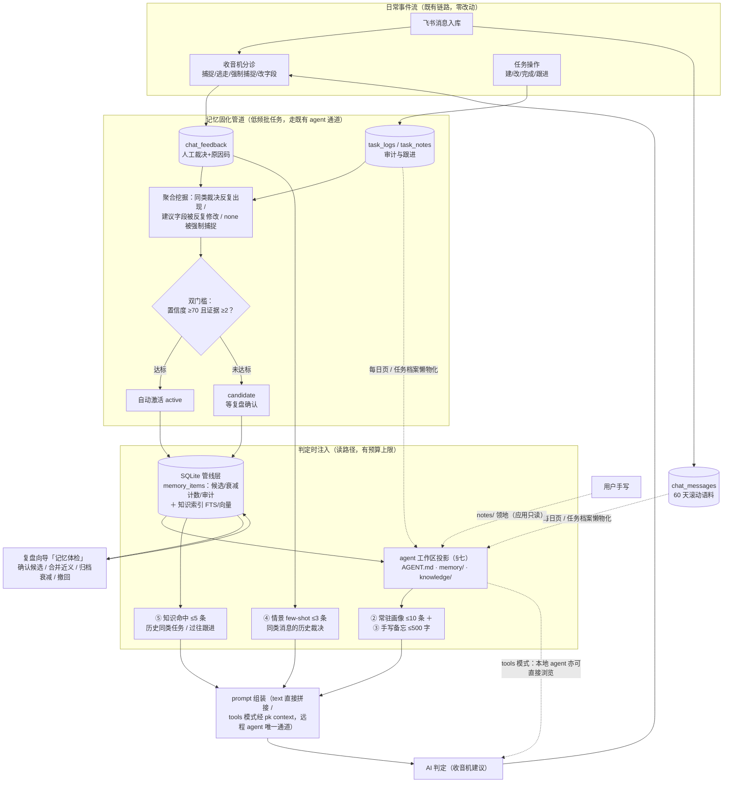
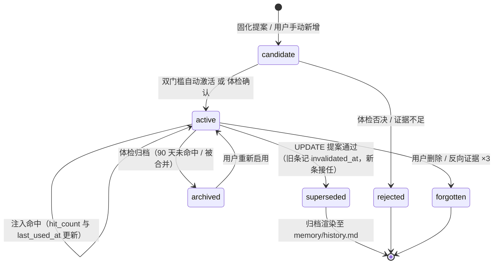
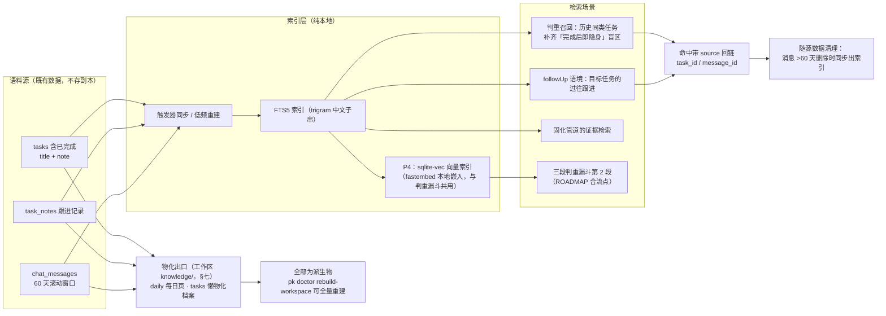
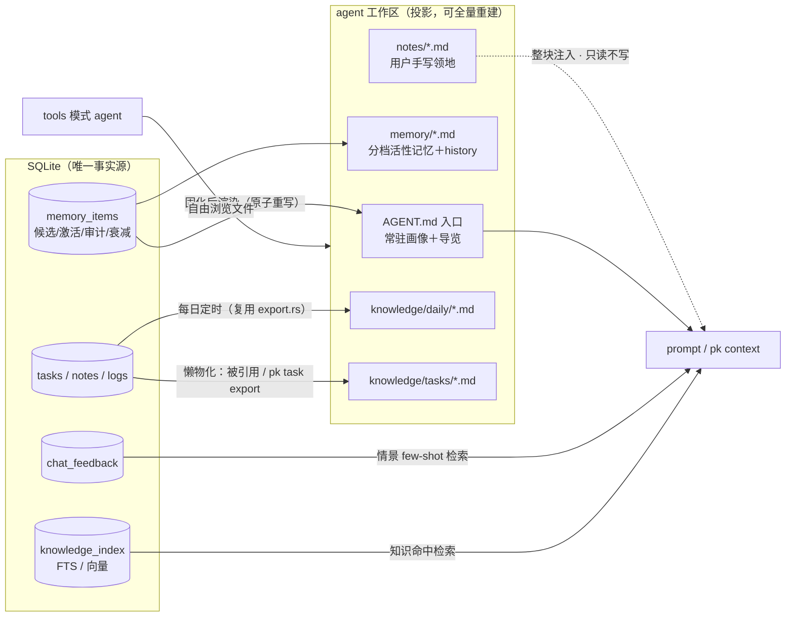
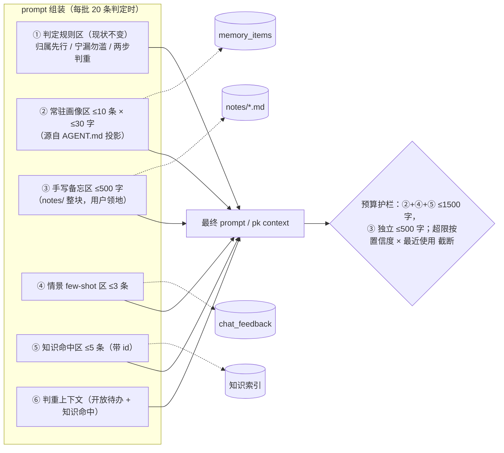

# 记忆与知识库机制方案 —— 反馈飞轮的闭环：分层记忆 + 本地知识检索

> 目标：① 让 AI 判定从「每次失忆」变成「越用越懂这个训练家」——把 `chat_feedback` 里攒下的人工裁决沉淀为可注入的长期记忆；
> ② 补齐判重的视野盲区——AI 判重时能看见已完成任务与任务的历史跟进，而不只是当前的开放待办；
> ③ 记忆与知识以**双形态**维护：SQLite 为管线层（候选/审计/衰减/索引），agent 工作区下的 **md 文件树为活性层**——人和 agent 共读、用户领地可直接手写。
> 写入遵循全产品既有哲学：**AI 只提议、人确认、宁少记勿错记**。
> 调研时间：2026-09-19。
> 状态：**方案（未实施）**。

## 一、现状与问题

当前 AI 链路（`ai.rs` + 收音机）每次判定都是**无状态的一次性无头调用**，已有四个断点：

| 断点 | 现状 | 后果 |
|---|---|---|
| 判定无画像 | prompt 只有规则 + 判重上下文，AI 不知道用户是谁、命名风格、哪些会话纯闲聊 | 同类错误反复犯：`chat_feedback` 攒了教训（裁决 + 原因码 + agent 快照），但**没有任何机制读它** |
| 判重视野只有开放待办 | `ClassifyContext` 只注入 open_tasks 全量（id+标题） | 周期性任务（周报/日报）一旦完成就「隐身」，下次再被提到会被当成新任务；且 open_tasks 全量注入随任务数线性膨胀（FEISHU 文档已列为风险） |
| followUp 语境断裂 | 判定输入只有同会话 30min/10 条上下文 | 任务自身的过往跟进（`task_notes`）不在判定输入里，AI 无法判断「这条消息是在补充哪个任务」 |
| 教训无沉淀出口 | TAG 方案二期「用户移除 AI 标签聚合注入负反馈 few-shot」是全仓唯一类似构想 | 该构想本质是情景记忆的特例，需要一个通用的记忆机制来承载 |

已有的「记忆原料」其实很充足：`chat_feedback`（情景记忆的原料）、`task_notes`、`chat_messages`（60 天）、`task_logs`（字段级审计）、agent 工作目录 `~/.choose-you`（存在但无跨会话沉淀）。缺的是**固化管道（写路径）、注入管道（读路径）与工作区文件组织（活性层）**。

## 二、社区调研结论

详细纪要见文末链接。对本方案有直接影响的共识：

1. **认知科学四分类是共同语言**（LangChain/LangMem、Mem0、Zep 皆采用）：工作记忆（当次上下文）/ 情景记忆（过去发生了什么）/ 语义记忆（事实与画像）/ 程序记忆（应该怎么做）。本方案只建**两类存储**，其余用既有数据承载（见 §四）。
2. **Letta/MemGPT：分层 + 常驻核心块 + 自编辑**。core memory 是常驻上下文的小块（persona/human），讲究「小而精 + 主动淘汰」；agent 通过工具自编辑记忆。**启发**：画像常驻注入、条数硬上限；**不采纳**自编辑——本产品 agent 是无头一次性会话，没有可自编辑的连续对话，且与「AI 提议、人确认」哲学冲突。
3. **Mem0：两阶段管道（抽取 → 归并）**。新事实不直接 append，而是与既有记忆比对后产出 `ADD / UPDATE / DELETE / NOOP` 提案，冲突由 LLM 归并解决；事实条目化（一句一条）。**启发**：固化管道输出「提案」而非直写，UPDATE 替代而非追加。
4. **Zep/Graphiti：时序与溯源是记忆的一等公民**。每个事实带生效/失效双时间轴，保留「曾经为真」的历史；每条记忆可回链到来源证据（provenance）。**启发**：`source_ids` 证据回链 + `invalidated_at` 简化双时间轴；**不采纳**图数据库——单机个人数据，SQLite 足够。
5. **文件即记忆是 Anthropic 官方路线**。Claude 的 memory tool 本质是「一个记忆文件目录 + CRUD 工具」（官方数据 context editing + memory tool 组合提升 ~39%）；Claude Code 的 CLAUDE.md（人写）+ auto memory（基于纠正自记笔记）同构，且明确「**记忆是上下文，不是配置**」——软提示、永远可被人覆盖；Letta 的文件系统 benchmark 证明文件式记忆效果不输结构化存储。本项目 agent 恰好是 Claude Code 类 CLI，工作目录就是天然载体；但**结构性数据（候选池、衰减计数、审计、检索索引）放文件会退化成手搓数据库**，且远程 agent 看不到本机文件——所以取混合形态：**md 为活性层，SQLite 为事实源**（§七）。
6. **治理共识与标签方案同构**：AI 提议 + 确认门 + 上限 + 定期体检（TAG 方案 §七的三层兜底原样适用）。Mem.ai 的教训（全自动无治理 → 口碑分化）在记忆上更严重——**错误记忆比没有记忆更糟**，因为它是被固化的偏见，会持续放大。

## 三、设计原则

1. **库是事实源，工作区是投影**：结构性数据（候选池、审计、衰减计数、FTS/向量索引）住 SQLite；agent 工作区下的 md 文件树是**可再生的活性投影**——人可读、agent 可读、用户领地可直接编辑。任何文件删了都能从库全量重建（`pk doctor rebuild-workspace`）。
2. **写路径窄、读路径宽**：写入只有两条路——固化管道（AI 提案，过门槛）与用户手动（设置页 / `notes/` 领地手写）。无头判定 agent 一期**只读不写**，防自我强化循环。
3. **记忆是上下文不是配置**：注入措辞为「参考画像」，明确告知模型可被消息内容推翻；用户裁决永远高于记忆，`notes/` 手写备忘优先级高于生成画像。
4. **注入有预算**：常驻画像 ≤10 条、手写备忘 ≤500 字、情景 few-shot ≤3 条、知识命中 ≤5 条，画像+手写+few-shot+知识合计 ≤2000 字，超限按「置信度 × 最近使用」截断（Letta 的淘汰思想）。
5. **每条记忆可溯源、可撤回**：`source_ids` 回链到具体裁决/日志，用户可看证据、可删；`origin` 标记谁写的。

## 四、总体架构：记忆与知识的双生命周期



分层与认知分类的映射（只建两类新存储，其余复用既有数据）：

| 认知分类 | 本产品的承载 | 形态 |
|---|---|---|
| 工作记忆 | 当批消息 + 同会话 30min 上下文 | 既有，不变 |
| 语义记忆（画像/事实） | **`memory_items`（新建）+ 工作区 `memory/*.md` 投影** | 常驻注入，小而精 |
| 情景记忆（经历） | **`chat_feedback`（既有）** | 按相似度检索注入，不搬家 |
| 程序记忆（怎么做） | SYSTEM_PROMPT 规则本身 | 由记忆体检产出的「规则修订建议」驱动人工迭代，不自动改 |
| 知识库（归档） | **FTS 索引（新建）** over tasks / task_notes / chat_messages ＋ 工作区 `knowledge/` 投影 | 检索注入 + 文件浏览 |

## 五、记忆生命周期



要点：

- **提案即数据**：固化管道不直写，产出带证据的提案；`ADD` 直接进 candidate/active，`UPDATE` 生成新条并 supersede 旧条（保留「曾经为真」，Zep 双时间轴的单机简化版），`DELETE` 需要反向证据计数（同一事实被用户行为反驳 ≥3 次才提议删除）。
- **激活门槛**：`confidence ≥70 && evidence_count ≥2` 自动激活，否则躺 candidate 等复盘确认——与收音机「followUp 直接生效、其余待确认」的信任分级同构。
- **衰减**：active 但 90 天未注入命中（`last_used_at`）→ 体检建议归档；近义条目（FTS 相似度预筛 + LLM judge）→ 合并建议，沿用标签体检的整套模式。
- **工作区联动**：active 条目按 kind 渲染至 `memory/` 分档文件；superseded 条目归档进 `memory/history.md`（只增）；任何状态变更触发受影响文件原子重写（§七）。

## 六、知识生命周期



要点：

- **判重上下文升级为两段**：开放待办（现状，加条数上限）+ 知识命中（按当批消息内容 FTS 召回的历史任务/跟进，带 id 供 update/followUp 引用）。周期性任务由此闭环：上周的周报任务完成后仍在索引里，这次再被提到时 AI 能看见它。
- **索引随源数据生命周期走**：消息清理、任务删除时索引同步删除，不存在「索引比数据活得久」。
- **知识是派生视图**：索引与工作区 `knowledge/` 文件都是 SQLite 的投影，任何时刻可全量重建，坏了不心疼。

## 七、agent 工作区：文件组织与领地规则

记忆与知识在 agent 工作区（缺省 `~/.choose-you`，取各 agent 配置的 workdir；每个**启用中**的 agent workdir 各渲染一份投影）以**一组 md 文件**组织，不是单一文档——拆分依据是**加载时机与治理动作不同**，不是为拆而拆。

### 7.1 目录布局

```text
~/.choose-you/                       # agent workdir（缺省值；每个启用 agent 的 workdir 各一份投影）
├── AGENT.md                         # 入口：常驻画像 top-N + 目录导览 + 协作规则（生成区，随渲染覆盖）
├── memory/                          # 记忆活性层（应用生成 · 固化后原子重写）
│   ├── profile.md                   # 画像事实（kind=profile 全量分档）
│   ├── preferences.md               # 判定偏好（kind=preference）
│   ├── patterns.md                  # 行为模式（kind=pattern，如某群全闲聊）
│   └── history.md                   # 已失效记忆档案（superseded 归档，只增）
├── notes/                           # 用户领地（应用只读，永不写入）
│   └── *.md                         # 手写给 AI 的备忘，可多文件按主题拆；全部整块注入
├── knowledge/                       # 知识层（应用生成 · 派生可重建）
│   ├── INDEX.md                     # 导览：最近变化 + 活跃项目 + pk 检索指引
│   ├── daily/
│   │   └── 2026-09-19.md            # 每日一页（复用 export.rs 日报三段式，Obsidian daily-note 兼容）
│   └── tasks/
│       └── 0142-写周报.md           # 任务档案（懒物化）：标题/状态/源消息/跟进/时间线
└── .cache/
    └── manifest.json                # 渲染清单（文件 hash 与源版本），漂移检测用
```

三类加载时机：**常驻**（AGENT.md + `notes/`，每批判定必注入/agent 自动加载）；**按需浏览**（`memory/` 全量分档、`knowledge/`，agent 用到才读）；**管线内部**（候选池、审计、衰减计数——只在 SQLite，不落文件）。

### 7.2 领地规则（谁写、谁读、何时更新）

| 路径 | 谁写 | 谁读 | 更新时机 | 漂移处理 |
|---|---|---|---|---|
| `AGENT.md` | 应用渲染 | agent 入口；text 模式由应用内联 | 每次固化后、每日 | 生成区被手改 → manifest hash 不符 → 体检提示「导入为 manual 记忆 / 恢复生成版」 |
| `memory/*.md` | 应用渲染 | 人浏览、agent 按需；增删改走设置页 | 固化后原子重写（temp + rename） | 同上 |
| `memory/history.md` | 应用渲染 | 人审计回溯 | 固化后追加 | 同上 |
| `notes/*.md` | **用户**（任何编辑器） | 应用整块注入（合计 ≤500 字，不拆条不入库） | 随时 | 无漂移问题——领地独立，应用永不写入 |
| `knowledge/daily/*.md` | 应用（复用 export.rs） | 人 / agent / Obsidian | 每日定时 | 派生物，可重建 |
| `knowledge/tasks/*.md` | 应用懒物化 | agent（执行/深查某任务时的上下文档案） | 被 AI 判定引用（update/followUp 目标）、`pk task export` 时 | 派生物，可重建；`pk doctor` 可清 |
| `knowledge/INDEX.md` | 应用渲染 | agent 导览 | 随每日页 | 派生物 |
| `.cache/manifest.json` | 应用 | 应用 | 每次渲染 | — |

**双向同步靠领地划分消解，不做文件级 merge**：生成区单向（库 → 文件），手改视为「导入请求」走体检；用户领地单向（文件 → 注入），应用只读。md 文件里**只放内容**，置信度/证据回链等元数据留在库里由设置页展示——文件保持人能读、agent 能读，不做 YAML frontmatter 解析。

### 7.3 文件格式示例

`AGENT.md`（自包含常驻注入所需的一切；tools 模式 agent 首读此文件）：

```markdown
<!-- 「就决定是你了」生成于 2026-09-19 14:32 · 生成区勿手改，手写备忘请放 notes/ · 管理入口：设置 → AI 记忆 -->
# 训练家档案（入口）

## 画像（常驻 · active 8/10，仅供参考，与消息内容冲突时以消息为准）
- 群「摸鱼俱乐部」的消息全为闲聊，应判 none（证据 ×12）
- 周报类任务多在周四下午被提到，标题习惯「写周报-MM/DD」（证据 ×6）
- 「李四」的消息多为工作指派（证据 ×9）

## 导览
- memory/　分类档案（profile / preferences / patterns）与已失效记忆 history.md
- notes/　训练家手写备忘（优先级高于本档案）
- knowledge/　daily 每日摘要 · tasks 任务档案
- 结构化检索请用 pk（pk task search / pk memory search）——文件仅供浏览，检索以库为准
```

`knowledge/tasks/0142-写周报.md`（懒物化任务档案，agent 代办与 followUp 判定的深查入口）：

```markdown
# 0142 · 写周报-09/18
状态 done · 项目 周报 · 来源 飞书·群「项目群」

## 时间线
- 09-14 捕捉自「@我 周五前把周报发了」（chat_messages #ab12）
- 09-15 followUp（AI）：「老板说这周起要附数据截图」
- 09-18 完成

## 源消息
- 09-14 张三：@我 周五前把周报发了
- 09-15 李四：这周起周报要附数据截图
```

### 7.4 文件领地与数据流向



### 7.5 多 agent、远程与重建

- **多 agent 多 workdir**：每个启用中 agent 的 workdir 各渲染一份投影，未启用的不渲染；SQLite 唯一事实源，多处投影无冲突。`manifest.json` 按 workdir 记录 hash 做增量与漂移检测。
- **远程 agent（SSH）**：workdir 在远端机器，本机投影不可见——`pk context` 的 memory/知识块是**必选通道而非兜底**（经既有反向隧道回读本机库）。文件活性层对远程 agent 是盲区，这是接受的成本。
- **入口命名与自动加载**：一期统一 `AGENT.md`，由 SKILL.md 协议指引 agent 首读；P5 可按 CLI 分发自动加载桩（Claude Code 放 `CLAUDE.md` 内容 `@AGENT.md` 引用，OpenCode 放 `AGENTS.md`），机制复用 `pk skill install` 的按 CLI 分发。
- **重建**：`pk doctor rebuild-workspace` 从库全量重建工作区（保留 `notes/` 用户领地）；文件丢失/损坏不构成数据事故。

## 八、注入组装（读路径明细）



画像区注入措辞强调「参考、可推翻」（见 §7.3 示例）；手写备忘区整块注入、优先级高于画像。

情景区示例：`「类似消息『把合同发我一下』→ AI 判 todo → 用户逃走（原因码=资料传递非待办）」×2`——这同时就是 TAG 方案二期「负反馈 few-shot」的通用化实现，两方案共用此基础设施。

双模式适配：text 模式在 `build_classify_prompt` 直接拼接（应用读 AGENT.md 与 notes/ 内联）；tools 模式扩展 `pk context` 输出（memory/手写/知识命中块），另加 `pk memory list/search`（只读）供 agent 自助查询，本地 agent 亦可直接浏览工作区文件。

## 九、数据模型

```sql
CREATE TABLE IF NOT EXISTS memory_items (
    id INTEGER PRIMARY KEY AUTOINCREMENT,
    kind TEXT NOT NULL,                      -- profile 画像事实 / preference 判定偏好 / pattern 行为模式
    content TEXT NOT NULL,                   -- 一句话自包含事实，≤60 字
    status TEXT NOT NULL DEFAULT 'candidate',-- candidate / active / archived / superseded / rejected
    confidence INTEGER NOT NULL DEFAULT 50,  -- 0–100，提案给出
    evidence_count INTEGER NOT NULL DEFAULT 1,
    origin TEXT NOT NULL DEFAULT 'ai',       -- ai / manual（P5 或加 agent）
    source_type TEXT,                        -- chat_feedback / task_logs / manual
    source_ids TEXT NOT NULL DEFAULT '[]',   -- JSON 数组，证据回链
    hit_count INTEGER NOT NULL DEFAULT 0,    -- 注入命中次数（衰减依据）
    last_used_at TEXT,
    invalidated_at TEXT,                     -- 被 UPDATE 替代的时间（简化双时间轴）
    created_at TEXT NOT NULL,
    updated_at TEXT NOT NULL
);

CREATE TABLE IF NOT EXISTS memory_runs (     -- 固化任务审计，风格对齐 agent_sessions
    id INTEGER PRIMARY KEY AUTOINCREMENT,
    agent_id TEXT,
    input_since TEXT,                        -- 本轮消化的事件窗口起点
    input_counts TEXT,                       -- 各源事件数 JSON
    proposals TEXT,                          -- 提案全文 JSON（op/kind/content/confidence/evidence）
    applied TEXT,                            -- 实际应用结果 JSON
    session_id TEXT,
    created_at TEXT NOT NULL
);

-- 知识索引：FTS5 外容表靠 rowid 关联源表，触发器同步（重建策略实现时定）
CREATE VIRTUAL TABLE knowledge_index USING fts5(
    kind,        -- task / note / message
    ref_id,
    title,
    body,
    tokenize='trigram'
);
```

提案格式（固化管道的 agent 输出协议，复用 `pk suggest batch` 的 stdin 批提交模式）：

```json
{"op":"ADD","kind":"pattern","content":"群聊「摸鱼俱乐部」消息全为闲聊，应判 none","confidence":85,"evidence":[1234,1301,1355]}
{"op":"UPDATE","target_id":42,"content":"周报任务标题习惯「写周报-MM/DD」","reason":"原条目描述与新证据冲突，已合并"}
{"op":"NOOP"}
```

渲染状态不入库表：工作区各文件的 hash 与源版本记在 `<workdir>/.cache/manifest.json`，由渲染器维护（§7.2）。`memory/kind` 与 `memory/*.md` 分档文件一一对应。

## 十、交互改动（最小集）

| 位置 | 改动 |
|---|---|
| 设置 → AI 记忆（新页） | 记忆列表（kind/status/origin 筛选）与证据回链、编辑/删除（触发工作区重渲染）、手动新增；工作区路径展示 + 「打开目录」「重建工作区文件」按钮；notes/ 应用内编辑框（也可用任何编辑器直接改文件） |
| 复盘向导 | 新增「记忆体检」步骤：候选批量确认、近义合并建议、衰减归档建议、矛盾检测（反向证据）、生成区手改漂移处理（导入为 manual / 恢复） |
| 收音机建议卡 | 不变——记忆是隐形改进，不加 UI 负担；可选二期在 reason 里引用依据条目 |
| `pk` CLI | `pk memory list/search`（只读）、`pk context` 增加 memory/手写/知识命中块、`pk task export <id>`（懒物化单任务档案）、`pk doctor rebuild-workspace` |
| 日报导出 | 每日页定时落 `knowledge/daily/`（复用 export.rs 既有三段格式）；用户手动导出动作不变 |

文案沿用既有词汇，统一叫「记忆」；若要走世界观，展示名可用「亲密度」（训练家与宝可梦的相互了解），仅作可选皮肤。

## 十一、分期落地

| 期 | 内容 | 涉及 |
|---|---|---|
| P1 记忆地基 | `memory_items`/`memory_runs` 表；**工作区渲染器 v1**（AGENT.md 入口 + memory/ 分档 + notes/ 手写领地，text 模式内联注入——手写备忘无需等固化管道即可见效）；设置页「AI 记忆」；`assemble_classify_prompt` 抽公共模块（与 TAG 方案共用） | db.rs / 渲染器（新 render 模块）/ ai.rs |
| P2 知识索引 | `knowledge_index` FTS5 + 触发器；判重上下文升级两段式（开放待办加上限 + 知识命中）；`pk context` 扩展；`knowledge/daily` 每日页（复用 export.rs） | db.rs / ai.rs / pk.rs / export.rs |
| P3 固化管道 | 每日固化任务（agent 通道，输入=窗口内 chat_feedback/task_logs）；双门槛激活；复盘向导「记忆体检」；情景 few-shot 注入（与 TAG P5 合流）；固化后工作区联动重渲染 | 新 memory.rs / ReviewWizard / 渲染器 |
| P4 向量化 | sqlite-vec + fastembed 本地嵌入；情景/知识检索升级语义召回；三段判重漏斗落地（ROADMAP 合流）；`knowledge/tasks` 懒物化档案（agent 代办铺路） | db.rs / ai.rs / pk.rs |
| P5（可选） | Obsidian vault 直接指向 knowledge/（或软链 daily/）；agent 自助写记忆（origin=agent，仍过门槛）；CLAUDE.md/AGENTS.md 自动加载桩按 CLI 分发 | export.rs / pk.rs |

排序理由：P1 含渲染器与手写领地，**用户第一天就能手写备忘影响判定**，价值不依赖任何管道；P2（FTS）无 LLM 依赖、成本最低、直接补「判重看不见已完成任务」这一已知盲区，其检索基建又被 P3/P4 复用，故置于固化管道之前。

## 十二、效果验收

- **回放回归**：用 `chat_feedback` 存量做离线回放（FEISHU 文档「prompt 迭代回归集」构想）——注入记忆前后，AI 判定与人工裁决的一致率对比；这是是否推进 P3/P4 的闸门。
- **盲区修复率**：周期任务误建新任务（可用后续 update/合并次数代理）下降。
- **预算约束**：prompt 注入区 token 增长 ≤1.5×；`agent_sessions` 已有成本遥测可直接观测固化任务开销。

## 十三、风险与取舍

- **记忆污染与自我强化**：错误记忆被固化后持续放大（比标签更隐蔽）。三层兜底：双门槛 + 体检确认门 + agent 一期只读；措辞上明确「记忆是参考可推翻」。宁少记勿错记是「宁漏勿滥」在记忆域的推广。
- **工作区投影漂移**：人误改生成区、或渲染与库不一致。缓解：manifest hash 检测 + 体检给出「导入为 manual / 恢复生成版」二选一；高频人为输入全部隔离在 `notes/` 领地，生成区单向渲染，不存在文件级 merge。
- **远程 agent 无文件活性层**：SSH 远程 workdir 看不到本机投影，`pk context` 是唯一通道（架构中已列为必选）。接受成本：远程 agent 仍获得全部注入内容，只是失去自由浏览文件的便利。
- **文件数增长**：`knowledge/tasks` 懒物化、按需生成；全部文件为派生物、重建即清。单机万级文件无压力。
- **与 TAG 方案的耦合**：两者都改 `ai.rs` prompt 组装与 `pk context`。缓解：P1 先抽 `assemble_classify_prompt` 公共模块；实施顺序建议 TAG 先（已立项）、记忆 P1 数据层可并行先行。
- **prompt 膨胀**：注入区有硬预算与截断策略；开放待办全量注入的老问题（无上限）顺带在 P2 修复。
- **中文 FTS**：trigram 中文子串可用但索引偏大，单机场景无碍；语义召回交给 P4 向量，不指望 FTS 理解同义。
- **嵌入模型体积**：fastembed 小模型约几十 MB 随包分发或首次使用下载，P4 才引入，与 ROADMAP 判重漏斗共用一份成本。
- **不做完整 bi-temporal / 图数据库**：Zep 的多租户服务端场景与单机个人数据不匹配，`invalidated_at` 单轴 + 证据回链 + `memory/history.md` 归档已覆盖「事实变迁可追溯」的实质需求。

## 附：调研来源

- Letta（MemGPT）：分层记忆与自编辑 <https://www.letta.com/blog/memory-context>；文件系统即记忆 benchmark <https://www.letta.com/blog/benchmarking-ai-agent-memory-file>；MemGPT 论文 <https://arxiv.org/abs/2310.08560>
- Mem0：两阶段抽取/归并管道 <https://docs.mem0.ai/overview>；论文（ECAI 2025，p95 时延 −91%、token 成本 −90%+）<https://arxiv.org/abs/2504.19413>
- Zep/Graphiti：时序知识图谱 <https://arxiv.org/abs/2501.13956>；开源引擎 <https://github.com/getzep/graphiti>
- Anthropic memory tool 与 context editing（组合提升 ~39%）：<https://platform.claude.com/docs/en/build-with-claude/memory-tool>
- Claude Code 记忆体系（CLAUDE.md 分层 + auto memory，「是上下文不是配置」）：<https://code.claude.com/docs/en/memory>；AGENTS.md 约定 <https://agents.md>
- LangChain/LangMem 记忆分类法与热/冷路径形成：<https://www.langchain.com/blog/memory-for-agents>、<https://www.langchain.com/blog/langmem-sdk-launch>
- 姊妹篇：本仓 `docs/proposals/TAG_SYSTEM_PROPOSAL.md`（确认门/治理模式复用来源）、`docs/proposals/FEISHU_MESSAGE_ANALYSIS.md`（反馈库与回归集构想来源）
