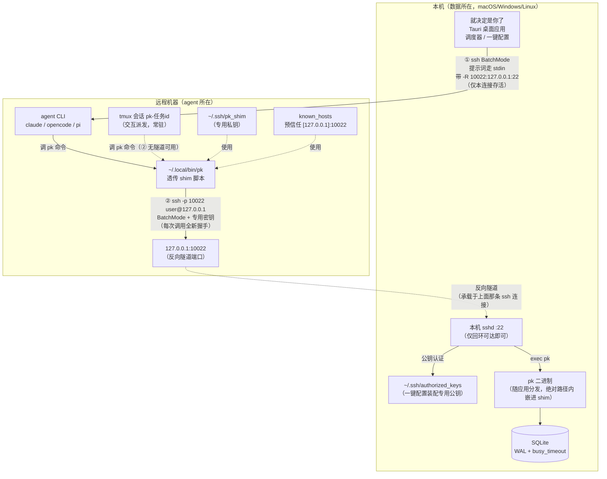
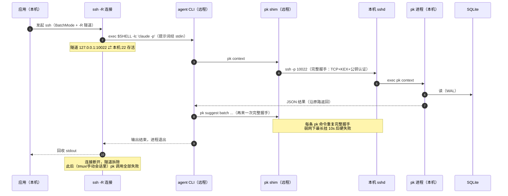
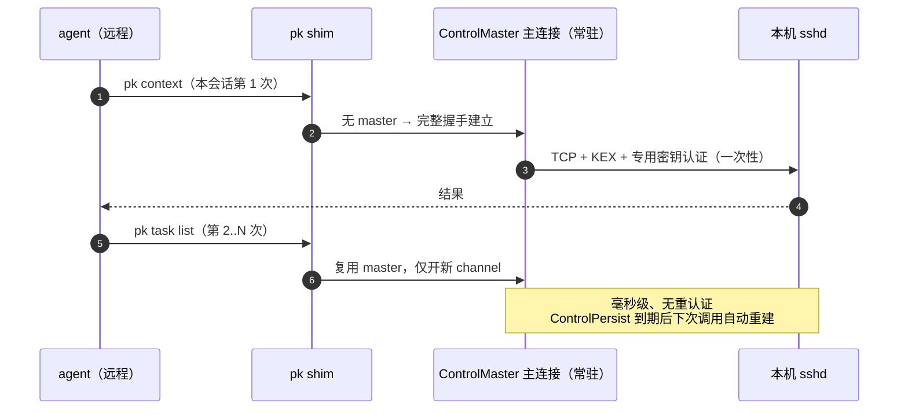
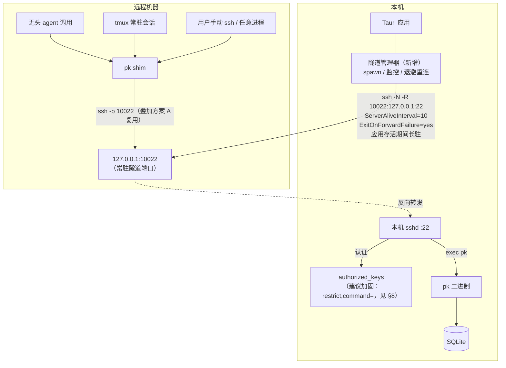
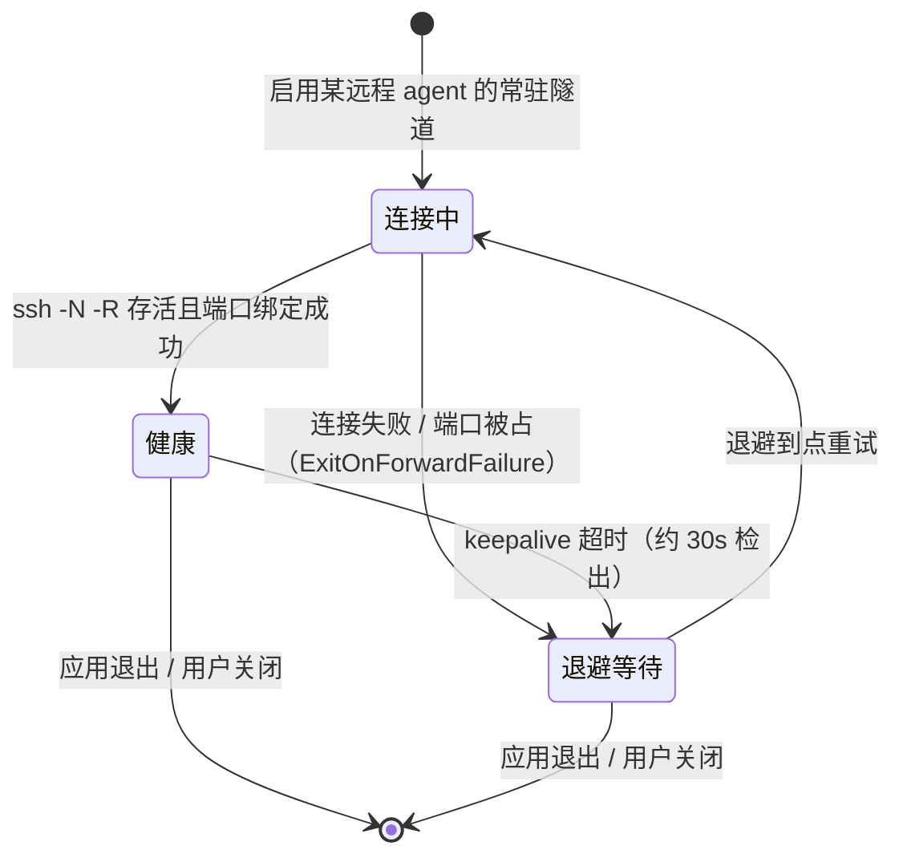
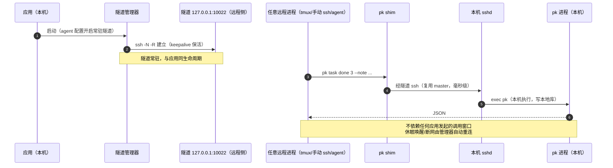
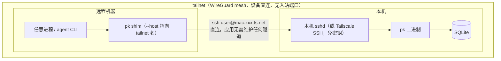
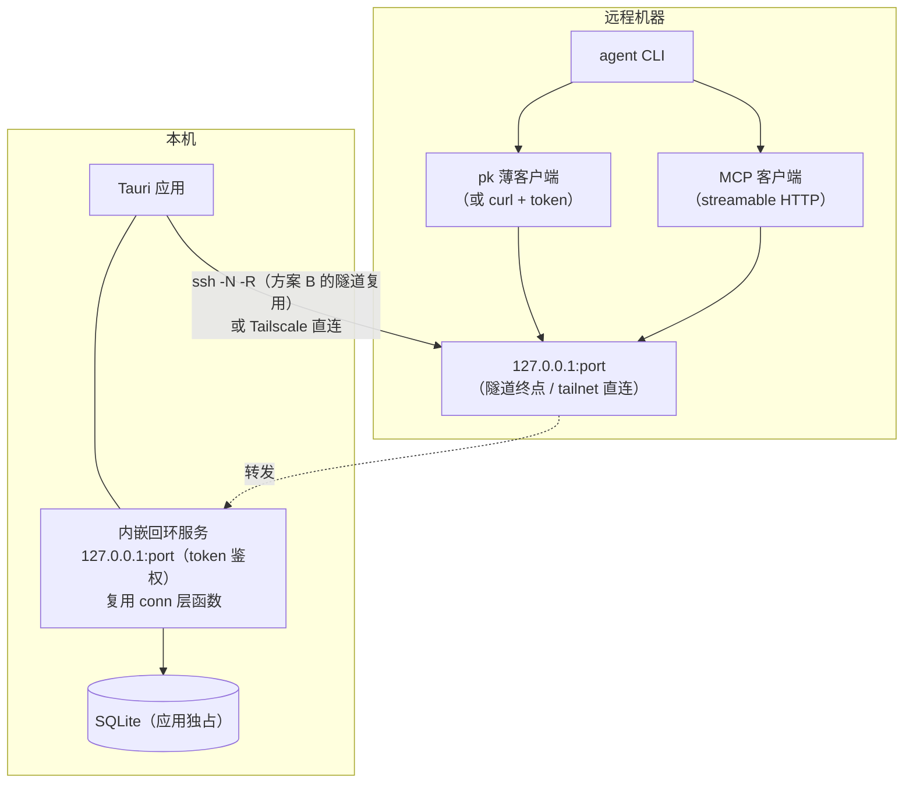
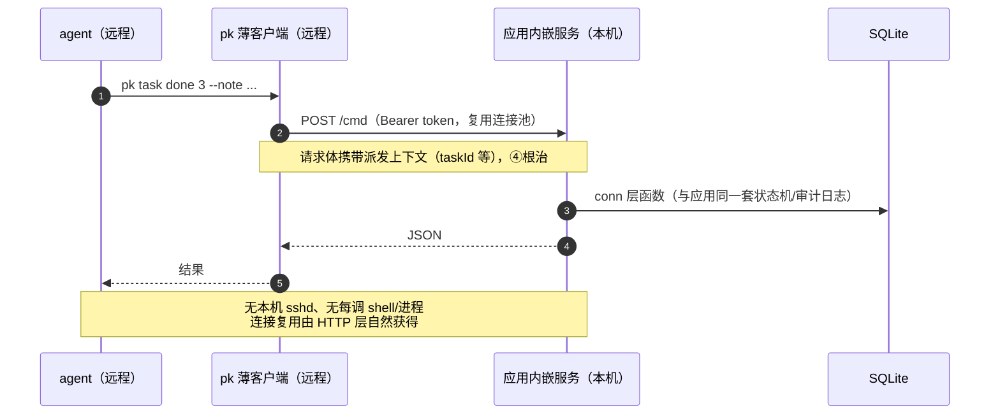

# 远程 pk 通道方案（常驻通信与可靠性）

> 状态：**A/B 已落地**（2026-09：shim 连接复用、常驻隧道管理器与设置页开关/状态、PK_* 环境透传；实施时对 §5.4 有一处偏离——无头调用保留按需 `-R` 作断线兜底而非「常驻健康时跳过」，理由见 §5.6）。§8 authorized_keys 加固已落地（2026-09-24：restrict,command= 受限条目 + pk __ssh_entry 语法级校验，旧裸公钥条目重跑一键配置自动升级）；T（Tailscale）经决策不做；C（内嵌服务 + MCP）待定。本文基于 2026-09 对代码现状的评估（评估时 `ai.rs` / `commands/remote_pk.rs` / `commands/dispatch.rs` / `bin/pk.rs`，2026-09-26 结构重构后为 `ai/`、`commands/dispatch/`、`bin/pk/` 目录模块，`remote_pk.rs` 不变）与社区实践调研。落地新条目时按 §10 排序实施，并回写本引言状态。

## 1. 背景与问题

场景：agent CLI 跑在远程机器（工作站/服务器），待办数据在本机（local-first，数据不出本机）。远程 agent 需要随时调用 `pk`（读上下文、回写判定、回传派发状态），pk 的每一次执行都必须落回本机数据库。

现状机制（一键配置，`commands/remote_pk.rs`）：远程放一个透传 shim（`~/.local/bin/pk`），命令经反向隧道回连本机 sshd 执行真正的 pk 二进制。**方向是反的（远程 → 本机），本机不开任何入站端口**——这是设计原则，下文所有方案都维持它。

### 1.1 四个不可靠点

| # | 问题 | 代码依据 |
|---|---|---|
| ① | **隧道生命周期 = 单次无头调用生命周期**。无头分类/派发的 ssh 连接带 `-R` 反向隧道，调用结束隧道即拆；两次调度之间、应用空闲时，远程 pk 必失败（connection refused） | `ai.rs:147-151`（注释「仅本连接存活」） |
| ② | **交互派发路径完全没有隧道**。`ssh -tt` + tmux 的交互会话里，agent 调 pk 直接失败；用户手动 ssh 上去的会话同理 | `dispatch.rs:348-377`（`tmux_attach_argv` / `direct_ssh_argv` 不拼 `-R`） |
| ③ | **每次 pk 调用 = 全新 SSH 握手**（TCP + KEX + 认证 + 起 shell + 拉进程，无连接复用），弱网下 `ConnectTimeout=10` 内每条命令最长挂 10 秒后硬失败 | `remote_pk.rs:124-143`（shim 脚本） |
| ④ | **环境变量不跨 ssh 边界**：`PK_DISPATCH_TASK`（派发回传兜底）与 `PK_LOG_FILE`（执行轨迹回应用日志）远程全丢 | `ai.rs:739`（注释「环境不透传，等价于无注入」）、`ai.rs:869` |

数据层本身可靠：pk 与应用共用 conn 层函数，WAL + `busy_timeout=5000`（`bin/pk.rs` `open_db`）保证并发读写安全。不可靠的全在传输层。

## 2. 现状架构与链路

### 2.1 网络拓扑（现状）



### 2.2 各调用路径的 pk 可用性对照（现状）

| 路径 | ssh 连接 | 带反向隧道？ | 该期间远程 pk |
|---|---|---|---|
| 无头分类（`ai.rs::build_invocation`） | 应用 → 远程，BatchMode | ✅（`remote.tunnel` 已配置时） | ✅ 可用 |
| 无头派发（`dispatch.rs` → `run_agent_env`） | 同上 | ✅ | ✅ 可用 |
| 交互派发（终端 `ssh -tt` + tmux，`dispatch.rs`） | 用户终端 → 远程 | ❌ | ❌ connection refused |
| 用户手动 ssh / 远程常驻会话 | 用户自己的连接 | ❌ | ❌ connection refused |

即「随时可以调 pk」目前只在「应用发起无头调用的那几分钟窗口内」成立。

### 2.3 时序：现状一次无头调用（含 pk 回传与隧道拆除）



## 3. 方案总览

| | **A. shim 连接复用** | **B. 常驻反向隧道**（推荐） | **T. Tailscale 自选路径** | **C. 内嵌服务 + MCP** |
|---|---|---|---|---|
| 解决 | ③（握手开销/弱网失败） | ①②③④（核心：随时可用） | ①②③（连接层全解） | 全部 + agent 原生工具化 |
| 改动量 | S：shim 脚本 3 行参数 | M：隧道管理器 + 配置开关 + UI 状态 | S：文档 + doctor 识别 | L：协议/鉴权/版本兼容 |
| 本机 sshd | 仍需 | 仍需 | 需（或 Tailscale SSH 替代） | **不再需要** |
| 新依赖 | 无 | 无（应用内实现） | 第三方 Tailscale（用户自选） | 无（应用内新增服务代码） |
| 社区对应 | ControlMaster 标配 | autossh 配方应用内化 | mesh VPN 消隧道 | dockerd/Ollama/MCP 生态 |
| 定位 | 立即缓解，随手带上 | **主方案** | 非默认的可选增强 | 长期演进方向 |

A 与 B 正交叠加；T 与 B 可共存（有 tailnet 的用户根本不需要 B）；C 是 B 落地后的下一步演进。

## 4. 方案 A：shim 连接复用（ControlMaster）

**原理**：shim 的 ssh 加连接复用参数——首次调用建立 ControlMaster 主连接，后续调用复用主连接只开新 channel，免 TCP/KEX/认证；主连接由 `ControlPersist` 在无活动后保持一段时间（期间调用毫秒级返回）。



**改动点**（`remote_pk.rs::shim_script`，三行参数）：

```sh
exec ssh -o BatchMode=yes -o ConnectTimeout=10 \
  -o ControlMaster=auto -o ControlPath=~/.ssh/pk-ctrl-%C -o ControlPersist=10m \
  -i "$HOME/.ssh/pk_shim" -p 10022 user@127.0.0.1 /abs/pk "$@"
```

**效果与局限**：单次握手成本摊薄到整个会话；弱网下失败率随连接数下降而大降。**不解决隧道生命周期（①②）**——隧道没建时连 master 都起不来，复用无从谈起。与 B 正交，B 落地后依然有价值（B 保证隧道常在，A 保证隧道之上的调用廉价）。

## 5. 方案 B：应用托管常驻反向隧道（推荐主方案）

**原理**：把「随每次无头调用捎带 `-R`」改为应用自己维持一条长连 `ssh -N -R`。隧道与任何 agent 调用解耦，应用存活（驻留托盘）期间隧道常在——远程任何进程（无头 agent、tmux 常驻会话、用户手动 ssh、cron）随时可调 pk。一键配置产出的密钥/shim/known_hosts 全部复用，零迁移成本。

**参数采用社区十年验证的 autossh 配方**（应用进程即 supervisor，无需引入 autossh 依赖）：

- `ServerAliveInterval=10` + `ServerAliveCountMax=3`：约 30 秒内检出死连接（macOS 休眠唤醒、网络切换、NAT 超时都能自愈）
- `ExitOnForwardFailure=yes`：远程端口被占（如 10022 冲突）时 ssh 非零退出触发重连，**杜绝「连接活着但隧道没建」的静默假隧道**——正面消除现状「多 agent 同端口」提示里的脆弱点
- 指数退避重连（上限封顶，如 30s），连接成功即复位

### 5.1 网络拓扑（方案 B）



### 5.2 隧道管理器状态机



### 5.3 时序：常驻隧道下的任意时刻调用



### 5.4 组件与改动清单

| 组件 | 内容 |
|---|---|
| 隧道管理器 | spawn `ssh -N -R ...`、监控退出码、keepalive 参数、指数退避重连；每个远程主机一条（多 agent 同主机共享，端口冲突由 `ExitOnForwardFailure` 检出后提示换端口） |
| agent 配置 | `AgentRemote` 增加 `persistent_tunnel: bool`（缺省 false，行为兼容） |
| UI | 设置页每 agent 显示隧道状态（健康/重连中/关闭），一键配置成功后引导开启 |
| doctor | `pk doctor --ssh` 增加常驻隧道探测项 |
| 环境变量透传（④的修复，随 B 一起做） | 无头派发时应用把 `PK_DISPATCH_TASK=42` 前缀进远端命令行（agent 侧可见）；shim 显式把自己继承到的 `PK_*` 变量透传进回连命令（在**本机**侧求值，pk 进程即拿到）。注意 shell 引用转义，实现时单独写测试 |

### 5.5 Trade-off

- 应用退出隧道即消失：tmux 常驻会话跨应用重启的调用会失败——可接受（应用是数据入口，应用不在时 pk 写库也无消费方），文档说明即可；真有需求再考虑 launchd/systemd 用户级守护作为自选项。
- 每远程主机一条长连 ssh：内存开销可忽略；笔记本休眠唤醒靠 keepalive 自愈，重连期间（秒级）调用会失败，shim 的错误信息应提示「隧道重连中，稍后重试」。
- 与方案 ①的原设计理由（「本机不开放任何入站端口」）不冲突：仍是反向隧道，仍无入站端口。

### 5.6 实施记录（2026-09 落地）

- 落地形态与 §5.4 一致：`commands/tunnel.rs`（`TunnelManager` managed state + `supervise` 保活循环 + `tunnel_status`/`sync_tunnels` 命令）、`AgentRemote.persistent` 配置、设置页开关与状态行（off/connecting/healthy/retrying，重试态附 ssh stderr 尾行）、应用启动 `spawn_startup_sync`、前端在保存 agent/一键配置成功后调 `sync_tunnels` 对齐。
- **一处有意偏离**：无头调用的按需 `-R` **保留不移除**（§5.4 原为「常驻健康时跳过」）。理由：常驻连接占住远程端口时 ssh 仅告警不失败（警告只在调用失败路径的 stderr 里可见，不污染正常路径）；而常驻隧道断线的空窗期，按需隧道正好兜底、shim 不断流，健壮性净增；代价是零——不用把管理器健康态耦合进 `build_invocation`。
- 环境透传（④）的契约：应用把 `PK_DISPATCH_TASK`/`PK_LOG_FILE` 以 `VAR='值'` 前缀进远端命令行 → 远端 agent 环境持有 → shim 把已设置的 `PK_*` 求值内联进回连命令（`env PK_...=... pk`，值含空格安全）→ 本机侧 pk 照常读到。Windows 本机 sshd 的 cmd shell 无 `env` 命令，shim 退化为直呼 pk（透传不生效，其余功能不受影响）。
- 测试口径：`tunnel_argv`（autossh 配方参数）、`TunnelKey`（去重与归一）、`sync` 增删停、`supervise` 健康判定/重试态与 stderr 尾行（假 ssh + 快拍档 + 谓词轮询，规避并行测试的时序脆性）、`build_invocation` env 前缀、shim 脚本内容（两个生成器）。

## 6. 自选路径：Tailscale overlay（不作为默认）

**原理**：两台机器加入同一 tailnet（WireGuard mesh）后直接互连，`ssh -R`、隧道生命周期、NAT 穿透问题**整体消失**——shim 直连 `user@本机tailnet名:22`，「随时可用」天然成立。`pk remote shim --host` 的帮助文本已写明支持 Tailscale 主机名，设计上留了位。



**定位**：用户自选增强，应用侧改动只有两件——USER_GUIDE 写清「装了 Tailscale 的用户可直连，无需一键配置」；`pk doctor` 识别 tailnet 环境（`tailscale status` 可用且本机在网）时给提示。**不作为默认推荐**：第三方账号依赖与本项目「无工具自有云依赖」的本地优先定义有张力（README「本地优先定义修正」），但用户自己选择引入不违背。

## 7. 方案 C：应用内嵌回环服务 + MCP（长期演进）

**原理**：Tauri 应用本就独占数据库。内嵌一个 `127.0.0.1` 的 JSON 服务（token 鉴权），隧道/直连的终点从「本机 sshd」改为「应用服务端口」。shim 从「ssh 起远程 shell」变成「薄客户端发 HTTP」，每调不再 spawn shell + pk 进程；`PK_DISPATCH_TASK` 等上下文直接随请求体携带（④根治）；**本机 sshd 依赖整个消失**（对不愿开远程登录的用户是显著解锁）。

### 7.1 网络拓扑（方案 C）



### 7.2 时序：方案 C 下一次远程调用



### 7.3 MCP 对齐（agent 生态的标准形态）

工具生态的主流模式（dockerd / Ollama / LM Studio / Syncthing）都是「数据进程绑回环 + 鉴权 API + 远程访问交给隧道/VPN」。agent 生态里这条路的标准化协议是 **MCP**：本地 agent 用 stdio 传输，远程用 Streamable HTTP（社区有 mcp-remote 桥、Cloudflare 托管等成熟配套）。把 pk 能力暴露成 MCP server 后，agent 从「跑 shell 命令拼 JSON」变为原生工具发现与结构化调用，也顺带解决「无头模式允许执行 pk 命令」的权限配置摩擦。

### 7.4 Trade-off 与前置条件

- **安全面扩大**：回环服务 + token 鉴权是第一天需求（MCP/FastMCP 默认配置普遍偏松有公开分析），token 的生成/分发/轮换要进一键配置流程
- **版本兼容**：pk 二进制与应用解耦的现状被打破（客户端协议与服务端同版本发布），需要协议版本协商或客户端随应用分发
- **前置**：隧道层（方案 B）先落地——C 复用 B 的常驻隧道，只是换终点
- 规模 L 级：走完整设计流程（SDD/AD/契约），不建议与 B 合并实施

## 8. 横切：安全加固（各方案通用，可立即做）

一键配置第 4 步写入 `authorized_keys` 的是裸公钥。社区标准做法是给该条目加强制命令限制，把回连密钥锁死为只能执行 pk——即使 `~/.ssh/pk_shim` 私钥泄露，也无法在本机开任意 shell：

```
restrict,command="/Applications/就决定是你了.app/Contents/MacOS/pk $SSH_ORIGINAL_COMMAND" ssh-ed25519 AAAA... pokemon-knock remote pk shim
```

改动点在 `remote_pk.rs` 公钥装配步骤（拼接 options 前缀）。注意 pk 绝对路径含空格时的引用，以及 `SSH_ORIGINAL_COMMAND` 在命令里的二次求值语义，需单独测试（Windows OpenSSH 的 forced command 支持差异也需验证）。

## 9. 社区实践对照

| 社区实践 | 对应方案 |
|---|---|
| `autossh -M 0` + `ServerAliveInterval=10`/`ServerAliveCountMax=3` + `ExitOnForwardFailure=yes` + systemd `Restart=always`（ServerFault/SuperUser 十年收敛的标准配方） | B（应用进程即 supervisor） |
| `ControlMaster=auto` + `ControlPersist`（远程高频小命令标配） | A |
| Tailscale/mesh 直连消隧道（tailscale.com 官方指引：设备互连后无需 `-R`） | T |
| dockerd/Ollama/Syncthing 的「回环绑定 + 鉴权 API + 隧道/VPN 远程访问」 | C（服务形态） |
| MCP stdio（本地）/ Streamable HTTP（远程）+ mcp-remote 桥 | C（协议层） |
| authorized_keys `restrict,command=` 受限密钥 | §8 |

## 10. 落地排序（建议）

1. ~~**第一批（S 级）**：方案 A（shim 复用）~~ ✅ 已落地（§5.6）；§8 authorized_keys 加固 ✅ 已落地（restrict,command= 进 remote_pk 装配步骤；forced command 指向 pk 的 __ssh_entry，严格校验「[env] PK_* 白名单 + 本 pk 路径 + 参数」形态后以 argv 直启自身）
2. ~~**第二批（M 级，主菜）**：方案 B 常驻隧道 + 环境变量透传修复（④）~~ ✅ 已落地（§5.6）
3. **第三批（S 级）**：~~Tailscale 文档与 doctor 识别~~ ❌ 经用户决策不做（本地优先，不引导第三方依赖；`pk remote shim --host` 的 Tailscale 主机名用法保留在既有帮助文本里，不算功能）
4. **远期（L 级）**：方案 C 内嵌服务 + MCP server 化——**待定**；待 agent 生态远程 MCP 消费侧更成熟、且 B 落地后仍有明确需求时再评估

## 11. 风险与开放问题

- **多 agent 同主机端口冲突**：B 用 `ExitOnForwardFailure` 检出，但「自动换端口并更新所有 shim」还是「提示用户手动统一」待定（shim 端口是内嵌的，换端口需重装 shim）
- **应用重启期间的服务空窗**：tmux 常驻会话在应用未运行时调 pk 会失败；错误信息如何引导（「启动应用以恢复通道」）
- **PK_* 透传的引用转义**：shim 一行 shell 里把远端 env 带进本机侧命令行，`$`/引号嵌套易错，实现时必须先写引用测试用例
- **Windows 差异**：sshd 服务化、forced command 行为、icacls ACL（一键配置已有处理，B/C 需回归验证）
- **休眠唤醒**：macOS 睡眠时 ssh 挂起，keepalive 检出后重连的实测时长与退避参数需要真机验证
- **C 的协议版本策略**：客户端随应用分发还是独立协议版本协商，AD 阶段决策

## 附录：参考资料（2026-09 调研）

- [ServerFault：Persistent reverse SSH tunnels](https://serverfault.com/questions/496333/persistent-reverse-ssh-tunnels) / [SuperUser：How to reliably keep an SSH tunnel open](https://superuser.com/questions/37738/how-to-reliably-keep-an-ssh-tunnel-open)——autossh + keepalive + ExitOnForwardFailure 配方
- [tailscale.com：Protect your SSH servers using Tailscale](https://tailscale.com/guides/ssh)、[Tailscale SSH](https://tailscale.com/kb/1193/tailscale-ssh)——mesh 直连替代反向隧道
- [punkpeye/mcp-remote](https://github.com/punkpeye/mcp-remote)、[Cloudflare：Bringing streamable HTTP transport to MCP](https://blog.cloudflare.com/mcp-transport/)、[MCP Academy：StreamableHTTP transport](https://academy.claude.com/docs/transport)——远程 MCP 传输生态
- [CardinalOps：MCP Defaults Will Betray You](https://cardinalops.com/blog/mcp-defaults-will-betray-you)——MCP/服务默认配置的安全教训（§7.4 依据）
