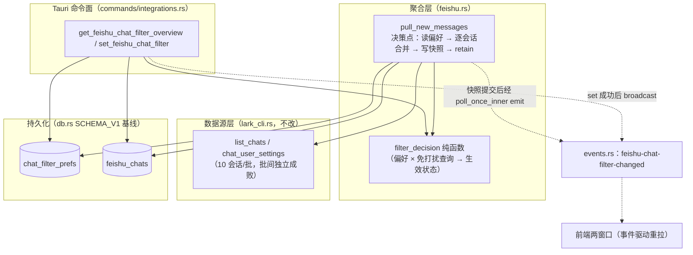
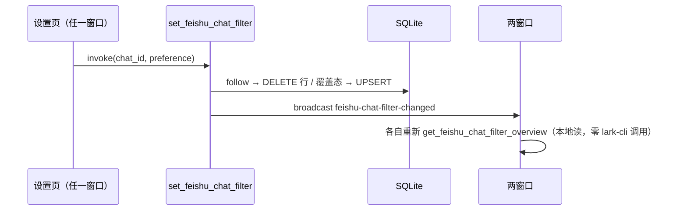
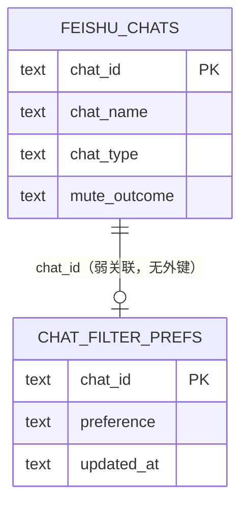

# 飞书会话过滤偏好 架构设计文档 (AD)

> 输入：`specs/feishu-chat-filter/requirements.md`（SDD，已过隔离评审）+ `design.md`（方向记录）。
> 本文是 API 契约与数据模型的单一事实源；UI 呈现层归 uiux-design.md，冲突面在主会话收敛（见 §8 契约映射表）。

## 1. 架构决策概要

核心决策：**偏好与快照分两张新表落 SQLite，过滤决策收敛为一个纯函数 `filter_decision(preference, mute_outcome)`，在拉取侧与读取侧共用**；管理界面契约面新增 2 个 Tauri command + 1 个新事件。理由：手动偏好是逐会话、可增删的用户数据（行式表直读直写，settings 键值表是全局标量语义，塞 JSON 需全量序列化且绕开 SETTING_KEYS 注册体系）；「生效状态」是派生态（偏好 × 最近一轮免打扰查询结果），**不落库、读取时现算**，保证单一决策源、偏好设置后界面立即反映且无双写漂移；新事件不复用 `settings-changed`（偏好不在 settings 表，`list_all_settings` 看不见，前端监听后会空转重拉）。快照时间戳独立存 settings 标量键 `feishu_snapshot_at`（快照事务内同步写，与 `feishu_cursor` 同语义先例），使「从未成功拉取」与「零会话账号」两种空态在数据面可区分。

## 2. 技术栈选择

完全沿用项目现有技术栈（Tauri 2 / Rust + rusqlite / Vue3 + Pinia + Vite / Vitest / 假 lark-cli shell 脚本 + mock_app）。无新增依赖、无新框架引入。

## 3. 系统模块与组件树

### 3.1 后端模块划分



模块职责与归属（遵守现有边界）：

| 模块 | 职责 | 本次变更 |
|------|------|----------|
| `feishu.rs`（聚合层） | ① 决策纯函数 `filter_decision` 与三个枚举类型（单一决策源）；② `muted_chat_ids` 重构为 `chat_mute_outcomes`，返回逐会话三值态（muted / unmuted / unknown=所在批次查询失败）；③ `load_filter_prefs`（每轮一次全量读偏好）；④ `write_chat_snapshot`（单事务整表替换）；⑤ `pull_new_messages` 在过滤决策点接入合并逻辑并落快照 | 改 |
| `lark_cli.rs`（数据源层） | lark-cli 子进程封装 | **不改** |
| `commands/integrations.rs`（Tauri 面） | 2 个新 command（与既有 feishu 命令同域：`test_feishu_config` / `trigger_feishu_poll` / `feishu_oauth_*` 已在此） | 增 |
| `db.rs`（持久化） | SCHEMA_V1 基线追加两张表 | 改基线 |
| `events.rs` | 新事件常量 + 契约测试 fixture | 增 |

接口签名（签名级示例，非实现）：

```rust
// feishu.rs —— 决策纯函数（表驱动可测；三处消费：拉取 retain / list 命令派生 / 测试）
pub(crate) enum FilterPref { Follow, AlwaysFilter, AlwaysPull }      // Follow = 无偏好行
pub(crate) enum MuteOutcome { Muted, Unmuted, Unknown }              // Unknown = 批次查询失败降级
pub(crate) enum FilterEffect { Pull, Filter }
pub(crate) enum FilterSource { Manual, Follow, FollowDegraded }  // 降级是独立来源值，前端零合并逻辑（UIUX 收敛）

pub(crate) fn filter_decision(pref: FilterPref, outcome: MuteOutcome)
    -> (FilterEffect, FilterSource);
// 优先级（SDD 开放项 4 落位）：
//   AlwaysFilter                    → (Filter, Manual)
//   AlwaysPull                      → (Pull,   Manual)   ← 手动覆盖不依赖免打扰查询
//   Follow + Muted                  → (Filter, Follow)
//   Follow + Unmuted                → (Pull,   Follow)
//   Follow + Unknown（查询失败降级） → (Pull,   FollowDegraded)   ← 维持现状「降级为不过滤」；降级直出为独立来源值

// feishu.rs —— 免打扰查询改造（拉取行为不变：Unknown 不参与过滤）
async fn chat_mute_outcomes(bin: &str, chat_ids: &[String])
    -> HashMap<String, MuteOutcome>;   // 取代 muted_chat_ids 的 HashSet 返回
// 归类规则：① 批次查询失败 → 该批全部 Unknown；② 批次成功但响应 items 缺某 chat_id
// → Unmuted（与现状语义等价：只有显式 is_muted=true 才算免打扰）

// feishu.rs —— 偏好读写 / 快照落库（SQL 细节见 §5.2）
fn load_filter_prefs(conn: &Connection) -> HashMap<String, FilterPref>;
// 单事务：DELETE 全表 + 批量 INSERT + UPSERT settings.feishu_snapshot_at（快照时间唯一载体）
fn write_chat_snapshot(conn: &Connection, rows: &[ChatSnapshotRow]);
```

**拉取侧时序**（SDD 开放项 4 的落位与写入时机）：

```mermaid
sequenceDiagram
    participant Loop as spawn_poll_loop
    participant Pull as pull_new_messages
    participant Lark as lark-cli 子进程
    participant DB as SQLite
    participant FE as 前端两窗口

    Loop->>Pull: 每轮（feishu_enabled）
    Pull->>Lark: user_identity / chats()（≤500）
    Pull->>Lark: chat_user_settings（10 会话/批，批间独立成败）
    Pull->>DB: load_filter_prefs（一次全量本地读）
    Pull->>Pull: 逐会话 filter_decision
    Pull->>DB: write_chat_snapshot（全部会话 + mute_outcome + feishu_snapshot_at，单事务）
    Pull->>Pull: chats.retain(effect == Pull)
    Pull->>Lark: 仅幸存会话分页拉消息 → 判重入库 → AI 判定（既有管线不动）
    Pull-->>Loop: 返回 Ok（快照事务已提交；零会话轮同样在此返回）
    Loop->>FE: emit feishu-chat-filter-changed（poll_once_inner 持 AppHandle）
```

写入时机 = 过滤决策点（`chats()` 与免打扰查询成功之后、retain 之前）：本轮决策已定格，即使后续消息分页失败快照也如实反映；`user_identity` / `chats()` 阶段失败则保留上一轮快照（陈旧度容忍一个退避周期，SDD §2 已定）。快照包含**被过滤的会话**（管理界面要列出全部会话，不是仅幸存者）。

**emit 落点上提**（`pull_new_messages` 签名无 AppHandle、保持不变）：广播在 `poll_once_inner` 进行——`pull_new_messages` 返回 Ok、快照事务已提交之后；消息分页等后续步骤失败的错误轮不 emit，界面延迟到下一成功轮刷新（在 §6 陈旧度容忍内）。**零会话账号**（feishu.rs 现有 L492-494 分支）同样走快照事务：表被清空、`feishu_snapshot_at` 推进，与「从未成功拉取」靠该键区分。

**偏好设置时序**（跨窗口一致性，SDD 开放项 3/NFR 落位）：



### 3.2 前端组件树

```
SettingsTab.vue（飞书区块，现有）
└── FeishuChatFilterManager.vue（新增：自取数组件）
    ├── 空态引导（三种变体：未启用=前端读 feishu_enabled / 无快照 snapshotAt=null / 快照为空 snapshotAt≠null ∧ 空列表；文案 = UIUX §4.2）
    ├── 会话行 ChatFilterRow × N
    │   ├── 会话名 + 类型标签（群聊/单聊/bot）
    │   ├── 生效状态 + 来源（含「跟随（查询失败降级）」= source=follow ∧ mute_outcome=unknown）
    │   ├── 快照陈旧度标示（信封 snapshotAt，三语格式化）
    │   └── 三态控件（跟随 / 总是过滤 / 总是拉取；控件形态归 UIUX）
    └── 列表组织（搜索 / 分组 / 只看过滤中……归 UIUX）
```

- **不新建 Pinia store**（就地决策）：单一消费者（设置页），事件驱动重载在组件内完成即可；与 settings store 的「全局标量跨窗口共享」语义不同，建 store 属过度抽象（YAGNI）。
- 数据流：组件挂载 / 收到事件 → `api.getFeishuChatFilterOverview()`；用户操作 → `api.setFeishuChatFilter(chatId, preference)`（返回该行合并后视图，乐观更新后用它校正）→ 后端事件 → 重拉总览。
- `api.ts` 增 2 个 wrapper；`types.ts` 增 `FeishuChatFilterOverview` / `FeishuChatFilterView` / `FilterCounts` 类型；i18n 三语 `feishu.filter.*` 新键 33 个（uiux-design.md §8 清单 30 键 + 无障碍名 3 键，已收敛）。

## 4. 关键接口定义

### 4.1 Tauri command 契约

| 命令 | 描述 | 参数 | 返回 | 错误 |
|------|------|------|------|------|
| `get_feishu_chat_filter_overview` | 最近一轮拉取快照 + 偏好合并后的会话过滤总览（纯本地读，不触发飞书 API） | 无 | `FeishuChatFilterOverview`（`chats` + `counts` + `snapshotAt`；空态区分见下） | 库错误经 `AppError` 透出 |
| `set_feishu_chat_filter` | 设置单会话三态偏好；`follow` = 删除偏好行（回到跟随） | `chatId: string`（非空、长度 ≤64），`preference: "follow" \| "always_filter" \| "always_pull"` | `FeishuChatFilterView`（该行合并后最新状态；合并规则单一实现归后端——UIUX 收敛点，前端不做合并） | `chatId` 空串/超长或 `preference` 非法值 → `AppError::Invalid` |

两个命令均为**同步** command（纯 SQLite 操作，无 await，同 `get_setting`/`set_setting` 先例）。`set` 的入参校验：`preference` 封闭枚举 + `chatId` 非空且 ≤64 字符（飞书 chat_id 形如 `oc_` 前缀约 20-30 字符，64 上限宽松；拦截空串/超长防永久沉睡的垃圾行）。`set` 不校验会话是否存在于快照（允许为已消失会话留沉睡偏好，SDD 孤儿规则）；不校验 `feishu_enabled`（本地数据，停用期设置无害）。

**空态区分**（UIUX §4.2 空态变体的数据依据，契约收敛）：`snapshotAt = null ∧ chats = []` → 空·无快照（已启用但从未成功拉取）；`snapshotAt ≠ null ∧ chats = []` → 空·快照为空（上一轮拉取未发现会话）；空·未启用由前端读既有 `feishu_enabled` 判定，不经本命令。快照时间戳的数据载体是 settings 键 `feishu_snapshot_at`（§5.2，零会话的成功轮也能推进它——这正是两种空态可区分的机制；行级 `updatedAt` 与信封 `snapshotAt` 由同一键同源填充，非独立存储）。`set` 对沉睡会话（快照无该行）仍返回视图：`muteOutcome = "unknown"`、名称/类型/`updatedAt` 为空串（沉睡行无所属快照轮次）、`effective`/`source` 按纯偏好推导（manual 恒定）——正常 UI 流程不会触达（行控件只存在于列表内），仅保证契约完备。

返回结构（Rust 侧 `#[serde(rename_all = "camelCase")]`，放 `commands/integrations.rs`，仿 `FeishuOauthStatus` 先例）：

```rust
pub struct FeishuChatFilterOverview {
    pub chats: Vec<FeishuChatFilterView>,
    pub counts: FilterCounts,          // 摘要行与筛选 chip 的计数（UIUX 收敛）
    pub snapshot_at: Option<String>,   // 本轮快照时间 RFC3339；None = 从未成功拉取
}
pub struct FilterCounts { pub total: u32, pub pulling: u32, pub filtered: u32, pub manual: u32 }
pub struct FeishuChatFilterView {
    pub chat_id: String,
    pub chat_name: String,
    pub chat_type: String,     // "group" | "p2p" | "bot"（与 chat_messages.chat_type 同词表）
    pub mute_outcome: String,  // "muted" | "unmuted" | "unknown"（unknown = 上轮该会话所在批次查询失败）
    pub preference: String,    // "follow" | "always_filter" | "always_pull"（follow = 无行，已解析）
    pub effective: String,     // "pull" | "filter"（filter_decision 现算，不落库）
    pub source: String,        // "manual" | "follow" | "followDegraded"（三值直出，前端零合并逻辑）
    pub updated_at: String,    // 快照时间 RFC3339（与信封 snapshotAt 同源填充，见 §5.2；沉睡行视图为空串）
}
```

```json
// invoke("get_feishu_chat_filter_overview") 返回示例
{
  "chats": [
    {
      "chatId": "oc_group",
      "chatName": "项目群",
      "chatType": "group",
      "muteOutcome": "unmuted",
      "preference": "follow",
      "effective": "pull",
      "source": "follow",
      "updatedAt": "2026-09-23T08:00:00+00:00"
    },
    {
      "chatId": "oc_noisy",
      "chatName": "灌水群",
      "chatType": "group",
      "muteOutcome": "muted",
      "preference": "always_pull",
      "effective": "pull",
      "source": "manual",
      "updatedAt": "2026-09-23T08:00:00+00:00"
    }
  ],
  "counts": { "total": 2, "pulling": 2, "filtered": 0, "manual": 1 },
  "snapshotAt": "2026-09-23T08:00:00+00:00"
}
```

```ts
// invoke("set_feishu_chat_filter", { chatId: "oc_noisy", preference: "always_filter" })
// → 该行合并后视图（乐观更新后前端用它校正）：
//    { chatId: "oc_noisy", chatName: "灌水群", chatType: "group", muteOutcome: "muted",
//      preference: "always_filter", effective: "filter", source: "manual", updatedAt: "2026-09-23T08:00:00+00:00" }
```

### 4.2 事件契约

| 事件名 | 发布者 | 消费者 | payload | 触发时机 |
|--------|--------|--------|---------|----------|
| `feishu-chat-filter-changed` | `set_feishu_chat_filter` / `poll_once_inner` / `import_json`（均经 `events::broadcast`） | 两窗口（当前仅设置页过滤管理器消费） | `()`（沿用 `events::broadcast` 无 payload 惯例，前端收到后重拉） | ① set/reset 成功后；② 每轮拉取快照事务提交后（经 `poll_once_inner`，见 §3.1 emit 上提）；③ 全量导入成功后（偏好被整体替换，§7） |
| `settings-changed`（既有） | — | — | — | **不复用**：偏好不在 settings 表，`list_all_settings` 不返回它，监听方重拉会空转 |

两侧镜像同步义务：`events.rs` 的 `all()` fixture 与硬编码 JSON 数组、`src/events.ts` 的 `EVENTS`、`src/__tests__/events.spec.ts` 三处同步更新（既有契约测试锁定，漏一侧即红）。

**每轮无条件 emit 是刻意选择**：与 `CHAT_MESSAGES_CHANGED` 仅在新消息非空时 emit 的先例不同——快照的会话集与 `mute_outcome` 可能在无新消息的轮次变化（如飞书侧改免打扰、退群），管理界面的陈旧度标示与筛选计数需要这条刷新通道；代价是每轮一次无 payload 广播，仅挂载中的管理器响应重拉（本地读，毫秒级，§6）。

## 5. 数据模型

### 5.1 ER 图



- **无外键、无级联**（就地决策）：孤儿偏好按 SDD 沉睡不删；`feishu_chats` 行随每轮整表替换生灭，不能牵连偏好。
- `feishu_chats` 是**观测事实表**（该轮看到的会话 + 免打扰查询结果），生效状态不落库（读取时 `filter_decision` 现算）。

### 5.2 Schema（追加进 `db.rs` SCHEMA_V1 基线）

```sql
-- 用户手动过滤偏好（SDD 开放项 1 落位：新表，否决 settings JSON 键）
CREATE TABLE IF NOT EXISTS chat_filter_prefs (
    chat_id TEXT PRIMARY KEY,
    -- always_filter / always_pull；「跟随」不落库（无行即跟随）
    preference TEXT NOT NULL CHECK (preference IN ('always_filter','always_pull')),
    updated_at TEXT NOT NULL
);

-- 最近一轮拉取快照（SDD 开放项 2 落位：管理界面唯一数据源）；
-- 快照时间是轮级事实，不设行级列（唯一载体 = 下方 settings 键，零会话轮无行可携带）
CREATE TABLE IF NOT EXISTS feishu_chats (
    chat_id TEXT PRIMARY KEY,
    chat_name TEXT NOT NULL DEFAULT '',
    chat_type TEXT NOT NULL DEFAULT '',
    -- muted / unmuted / unknown（unknown = 所在查询批次失败，降级不过滤）
    mute_outcome TEXT NOT NULL CHECK (mute_outcome IN ('muted','unmuted','unknown'))
);
```

**持久化形态决策理由（开放项 1）**：settings 表服务「全局标量键」（`SETTING_KEYS` 注册表 + Pinia 标量视图 + secrets 过滤协议 + 导出特殊处理），500 会话级映射塞单个 JSON 键意味着每次改一个会话全量读-改-写序列化、无逐行 upsert/delete 语义、且会被 `list_all_settings` 整包带回前端。行式表让拉取侧每轮只需 `SELECT chat_id, preference FROM chat_filter_prefs` 一次全量本地读，管理写操作是单行 UPSERT/DELETE，语义与 SDD 状态图一一对应。

**快照时间戳的唯一载体 = settings 标量键 `feishu_snapshot_at`**（RFC3339，后端写入、不进前端 `SETTING_KEYS` 注册表——与 `feishu_cursor` 完全同语义的先例）：由 `write_chat_snapshot` 在快照**同一事务**内 UPSERT。零会话的成功轮只执行 DELETE、无行可携带时间戳——这正是时间戳不能放行级列的原因；该轮仍推进键值，据此两种空态在数据面即可区分：**无键 ∧ 表空 = 从未成功拉取；有键 ∧ 表空 = 零会话账号**。不可复用 `sync_state.updated_at`：AI 阶段失败的轮次不更新它，与决策点写入不同步。信封 `snapshotAt` 与行级 `updatedAt` 序列化时均从该键填充（§4.1）。

**迁移改法（基线式，项目约定 db.rs:196-199）**：两表 `CREATE TABLE IF NOT EXISTS` 直接追加进 `SCHEMA_V1`，`MIGRATIONS` 仍单条、`user_version` 保持 1——应用未正式发布，只维护基线不新增迁移项；本地调试库手动对齐（执行两条 CREATE 语句即可，幂等）。新增用户升级后两表为空 → 全部会话跟随态，行为与升级前一致（SDD 兼容 NFR）。**该路径的成立前提是「应用未正式发布」**；若首次发布先于本特性合入，存量库 `user_version` 已 = 1、`migrate` 会跳过基线追加（新表建不出来）——届时须改为**追加新迁移条目**（`MIGRATIONS` 只增不改），不能只改 `SCHEMA_V1`。

**快照读写协议（开放项 2）**：
- 写：`write_chat_snapshot` 单事务 `DELETE FROM feishu_chats` + 批量 INSERT（≤500 行）+ UPSERT `settings.feishu_snapshot_at`；写在过滤决策点，覆盖全部会话（含被过滤者），零会话的成功轮同样执行（清表 + 推进时间戳）。失败批的会话 `mute_outcome='unknown'`（「查询失败降级」标示的数据源）。
- 读：`get_feishu_chat_filter_overview` = 读 `feishu_snapshot_at`（无键 → `snapshotAt: null`）+ `feishu_chats LEFT JOIN chat_filter_prefs` + `filter_decision` 现算 `effective/source`，`preference` 解析为显式三态。派生而非物化的理由：偏好 set/reset 后**无需碰快照**即正确显示（手动态精确；跟随态用最近一轮 outcome 推导，恰是 SDD「以最近一轮拉取快照为准」的语义），消灭双写一致性问题。

## 6. 非功能性设计 (NFR)

- **性能（偏好读取本地化）**：拉取侧新增成本 = 每轮 1 次偏好全量读 + 1 次快照整表替换事务（≤500 行，WAL 本地写毫秒级），不增加任何 lark-cli 子进程调用；单轮拉取耗时增量可忽略。
- **性能（打开界面零 API）**：`get_feishu_chat_filter_overview` 是纯 SQLite 读，不 spawn lark-cli；快照数据源是轮询副产物，管理界面永远消费缓存。
- **安全/隐私**：`chat_filter_prefs` / `feishu_chats` 只在本机 SQLite 与 Tauri IPC 内流动；AI 路径（`poll_once_inner` 的 `AiMessage` 组装）不读两表、不含其字段——新增数据面不进大模型请求。会话名进 prompt（`chat_label`）是既有现状，本需求不动（SDD 待确认项，另立需求处理）。
- **可用性**：三态 set 后下一轮拉取生效（生效边界 = 每轮决策点的偏好读取时刻，set 晚于该时刻自然落到下一轮）；显示即时（读取时现算）。跨窗口一致：set → 事件 → 两窗口各自重拉（与 tasks/tags/settings 同模式）；事件每轮无条件广播（§4.2 刻意选择），仅挂载中的管理器响应重拉（本地读毫秒级）。
- **并发**：轮询（tokio task）与命令（主线程）经既有 `Mutex<Connection>` 串行化，无新锁序；快照事务持锁毫秒级，不与长查询交错（现有库操作均为短事务）。**拉取 in-flight 守卫（既有缺口顺带修，UIUX 复评 M-2 落实）**：现状 `trigger_feishu_poll` 直通 `poll_once` 且无互斥——后台轮询、设置页「测试/立即拉取」按钮、（本特性新增的）过滤卡按钮可能并发触发同一轮拉取，lark-cli 子进程调用在 DB 锁外会重复执行（消息入库有 `message_id` 判重兜底，但属浪费与竞态）。本特性在 `feishu.rs` 补模块级 `AtomicBool` in-flight 守卫：`poll_once` 进入时 CAS 抢占，已被占用则立即返回冲突错误（复用既有 `AppError` kind 或新增 Busy/Conflict 语义，实施期与前端错误文案对齐），任何路径离开时释放。守卫放聚合层（非 command 层）使轮询循环与手动触发共用同一互斥；UIUX「两按钮 busy 态不联动、并发由后端守卫兜底」的断言由此成立。
- **兼容/迁移**：见 §5.2——零数据迁移，升级即跟随态。
- **可扩展**：`preference` / `mute_outcome` / `effective` / `source` 均为封闭字符串枚举（SQL CHECK + Rust enum + 前端 types.ts 三处镜像），新增枚举值需三处同步。
- **国际化**：全部界面文案走 i18n 键（zh-Hans / zh-Hant / en），键清单与 UIUX 收敛；后端不产 UI 文案。

## 7. 变更影响评估

| 位置 | 改动 | 性质 |
|------|------|------|
| `src-tauri/src/db.rs` | SCHEMA_V1 追加 `chat_filter_prefs` / `feishu_chats`（§5.2） | 基线追加，不新增迁移条目 |
| `src-tauri/src/feishu.rs` | 决策枚举 + `filter_decision` 纯函数；`muted_chat_ids` → `chat_mute_outcomes`（三值态，拉取行为不变）；`load_filter_prefs` / `write_chat_snapshot`；`pull_new_messages` 决策点接入；`poll_once` in-flight 守卫（AtomicBool，§6，既有缺口顺带修） | 聚合层内聚修改 |
| `src-tauri/src/commands/integrations.rs` | `get_feishu_chat_filter_overview` / `set_feishu_chat_filter` + `FeishuChatFilterOverview` / `FeishuChatFilterView` / `FilterCounts` | 新增 |
| `src-tauri/src/lib.rs` | `generate_handler!` 注册 2 命令 | 两行 |
| `src-tauri/src/events.rs` + `src/events.ts` + `src/__tests__/events.spec.ts` | `feishu-chat-filter-changed`（三处 fixture 同步；发射点：set 后 / 每轮快照提交后 / 导入成功后，见 §4.2） | 新事件 |
| `src/api.ts` + `src/types.ts` | `getFeishuChatFilterOverview` / `setFeishuChatFilter` + 类型 | 新增 |
| `src/views/SettingsTab.vue` + 新组件 `src/components/FeishuChatFilterManager.vue` | 飞书区块嵌入管理器 | 新增 |
| `src/i18n/{zh-Hans,zh-Hant,en}.ts` | `feishu.filter.*` 新键 33 个（uiux-design.md §8 清单 30 键 + 无障碍名 3 键，已收敛） | 新增 |
| `src-tauri/src/commands/export.rs` | `DUMP_TABLES` 追加 `chat_filter_prefs`（用户数据，导出导入恢复）；`feishu_chats` **不**导出（派生缓存，下一轮成功拉取即重建，与 chat_feedback/agent_sessions 不导出先例一致）。**导入兼容**：`import_json_from` 对 `chat_filter_prefs` 缺键按空数组容忍（现有逐表 `contains_key` 强校验会把本特性合入前导出的旧备份文件整体拒掉；不采用按 format 版本分派校验集——容忍缺键更简单且天然向后兼容）。**导入后刷新**：导入成功后追加广播 `feishu-chat-filter-changed`（偏好被整体替换，两窗口已挂载的管理器立即刷新，不等下一轮拉取） | 表清单 + 导入校验分支 + 导入后广播 |
| `src-tauri/src/backup.rs` | 无需改（VACUUM INTO 全库快照自动覆盖新表） | 无 |
| 文档 | `USER_GUIDE.md` 免打扰引导改写、`ROADMAP.md`、`proposals/FEISHU_MESSAGE_ANALYSIS.md` §9.2/§9.3 | SDD §8 已列 |
| **不受影响** | `chat_messages` / `chat_feedback` 结构、AI 判定与任务流转管线、游标机制（settings.feishu_cursor + sync_state）、`chats()` 500 上限、lark_cli.rs | — |

## 8. 测试策略

沿用项目既有三套手法，覆盖 SDD Gherkin 的三态 × 免打扰状态（含分批部分失败）组合：

1. **纯函数表驱动（Rust unit，feishu.rs tests）**：`filter_decision` 的 3 preference × 3 outcome 全组合断言（对应 Gherkin「总是拉取×免打扰」「总是过滤×未免打扰」「跟随×查询失败降级」「手动覆盖不受查询失败影响」）。
2. **假 lark-cli 集成（扩展 `pull_new_messages_applies_chat_type_rules` 手法）**：shell 脚本对 `chat_user_setting/batch_query` 按请求体选择性失败（如 body 含特定 chat_id 时 `exit 1`）模拟分批部分失败；预先 INSERT 偏好行。断言：① 免打扰 + always_pull 的会话消息被拉取；② 未免打扰 + always_filter 的会话整会话跳过；③ 失败批会话被拉取（降级不过滤）且快照行 `mute_outcome='unknown'`；④ `feishu_chats` 含**全部**会话（含被过滤者）且 `settings.feishu_snapshot_at` 已写入；⑤ 免打扰查询失败不中断拉取（现状回归）；⑥ 批次成功但响应 items 缺某 chat_id → 该会话归 `unmuted`（与现状 `muted_chat_ids` 语义等价的回归）；⑦ 孤儿沉睡→复活：预置「不在当轮会话列表」的偏好行 → 该轮总览无其行，脚本下一轮重新包含该 chat → 快照行出现且偏好立即生效；⑧ 零会话成功轮（chats 返回空 items）→ 事务仍清表并推进 `feishu_snapshot_at`。
3. **mock_app 命令测试（settings.rs / radio.rs 的 `setup()` 手法：mock_app + 内存 SQLite 直接驱动命令函数）**：seed `feishu_chats` / `chat_filter_prefs` → `get_feishu_chat_filter_overview` 断言 camelCase 视图、三态解析、`effective/source` 派生（含 `followDegraded`）、`counts` 汇总；**两种空态可区分**：无 `feishu_snapshot_at` 键 → `chats=[] ∧ snapshotAt=null`，有键空表 → `chats=[] ∧ snapshotAt≠null`；`set_feishu_chat_filter` 断言 follow=删行 / 覆盖态=UPSERT / 返回该行合并视图 / `preference` 非法值与 `chatId` 空串、超长（>64）返回 `AppError::Invalid` / 对快照外会话 set 被接受（沉睡行视图，名称/类型/`updatedAt` 空串）；**广播断言**：以 MockRuntime 事件监听捕获 set 成功后恰发出一次 `feishu-chat-filter-changed`（轮询侧 emit 位于 `poll_once_inner` 且依赖完整轮次与 AI 配置，单测不驱动，由 §3.1 时序约定与代码评审覆盖）。
4. **契约测试**：`events.rs::event_names_match_frontend_contract` 的 JSON 数组与 `events.spec.ts` fixture 同步加 `feishu-chat-filter-changed`（漏一侧即红，防漂移）。
5. **基线测试（db.rs tests）**：仿 `baseline_creates_chat_messages_with_suggested_note`，断言基线建出两新表且 CHECK 约束生效（非法 `preference` 插入被拒）。
6. **in-flight 守卫（feishu.rs tests）**：并发二次进入 `poll_once`（首未返回时再触发）→ 第二次立即返回冲突错误、不产生第二次 lark-cli 子进程调用（假脚本内计数器断言）；守卫在错误路径同样释放（首轮回错后再次触发可正常执行）。

> 注记：每轮无条件 emit（无论快照相对上一轮是否有变化）是刻意选择，与 `CHAT_MESSAGES_CHANGED` 仅新消息时 emit 的先例不同——服务管理界面陈旧度标示与筛选计数的持续刷新，理由与代价见 §4.2。

## 9. 契约映射表（草案）

| SDD 需求 / 开放项 | AD 落位 | 状态 |
|------------------|---------|------|
| 开放项 1：偏好持久化形态与基线迁移 | §5.2 `chat_filter_prefs` 新表 + SCHEMA_V1 基线追加（否决 settings JSON，理由见 §1/§5.2） | 已定 |
| 开放项 2：拉取快照落库（会话+查询结果+生效状态+来源、降级标示、空态） | §5.2 `feishu_chats` 观测事实表 + 时间戳独立存 `settings.feishu_snapshot_at`（「从未成功拉取」与「零会话账号」两种空态可区分，信封 `snapshotAt` 暴露）+ §3.1 决策点整表替换 + 读取时现算 `effective/source`（降级标示 = `mute_outcome='unknown'` / `source='followDegraded'`） | 已定 |
| 开放项 3：会话列表 / 三态设置 / 重置命令与事件 | §4.1 两命令（`set` 单命令三态参数，follow 即重置——就地决策，比拆两个命令少一个契约面）+ §4.2 新事件 `feishu-chat-filter-changed`（不复用 `settings-changed`） | 已定 |
| 开放项 4：合并逻辑落位与优先级 | §3.1 `filter_decision` 纯函数：总是过滤 > 总是拉取 > 跟随（muted 过滤 / unmuted 拉取 / unknown 降级拉取）；手动覆盖不读免打扰结果 | 已定 |
| NFR：偏好读取本地化 / 打开界面零飞书 API / 跨窗口一致 | §6（每轮 1 读 1 写快照事务；总览纯本地读；事件驱动两窗口重拉）；导入兼容与导入后刷新见 §7 | 已定 |
| Gherkin：三态 × 免打扰组合 / 分批部分失败 / 孤儿沉睡复活 | §8 测试 1-3 | 已定 |
| 三态控件形态、列表组织（搜索/分组）、空态引导文案、i18n 键清单 | UIUX 已定（uiux-design.md §3/§8，键清单 `feishu.filter.*` 33 键 = §8 清单 30 + 无障碍名 3）；AD 数据面 `FeishuChatFilterOverview`（§4.1）与组件树挂点（§3.2） | **已收敛** |
| 契约收敛（2026-09-23，主会话） | command 终名 `get_feishu_chat_filter_overview` / `set_feishu_chat_filter`；list 返回 overview 包装（chats + counts + snapshotAt，承载 UIUX 摘要/筛选计数与空态区分）；set 返回该行合并视图；`source` 三值（manual/follow/followDegraded，降级直出，前端零合并）；单一事件 `feishu-chat-filter-changed` 覆盖快照更新 + 偏好写入两触发点（UIUX 的 `feishu-pull-snapshot-changed` 期望并入本事件）；偏好即时生效、不走 settings 通道（两侧一致） | **已收敛** |
| SDD 遗留待确认：会话名进 prompt 收紧、残留旧消息可接受性 | 非 AD 范围（SDD §2 待确认项，批量关卡定夺） | 待确认 |
| UIUX 复评（2026-09-23）残留项 | ① 选中筛选档计数降 0 自动回退「全部」（UIUX §3.2 已补规格）；② `trigger_feishu_poll` 并发无守卫 → AD §6 落实 in-flight 守卫（AtomicBool），UIUX 三处「守卫兜底」断言由此成立 | **已修复** |
