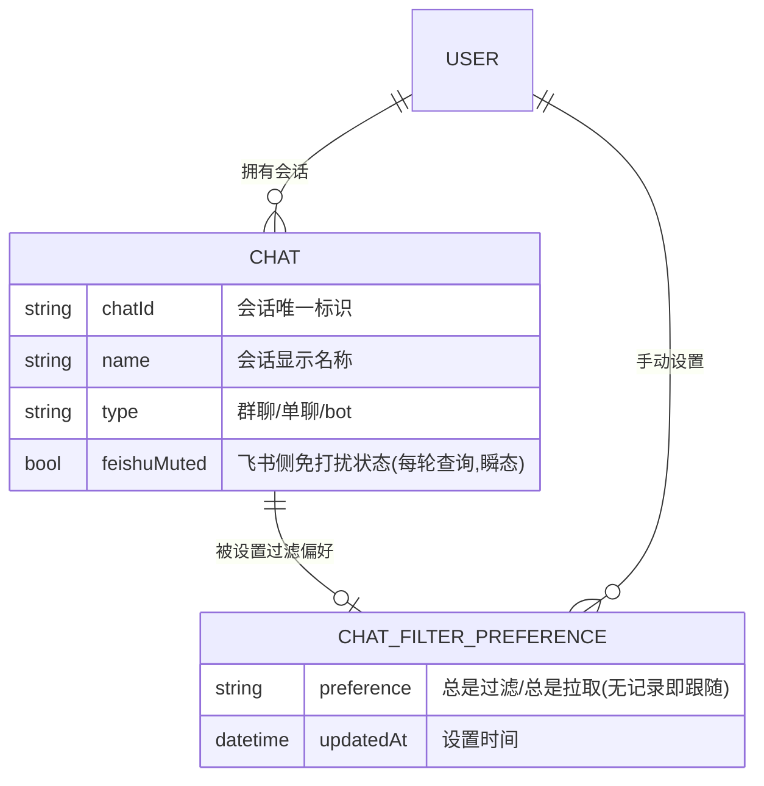
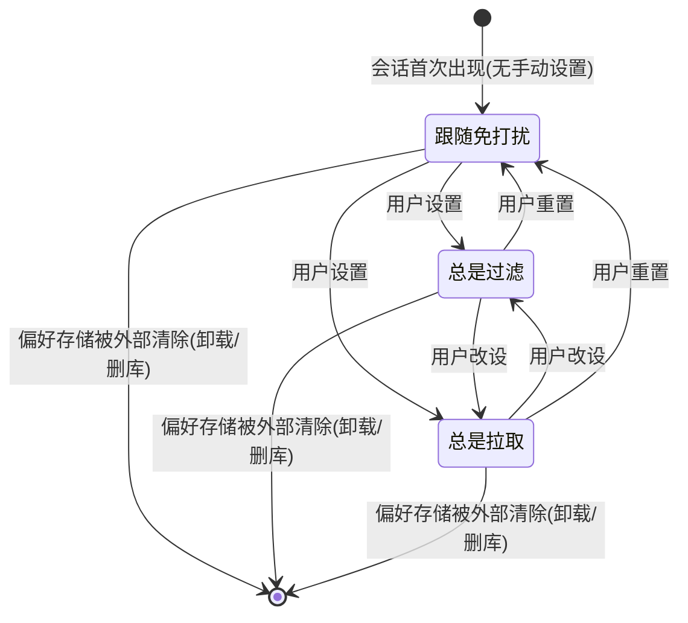

# 飞书会话过滤偏好 SDD（免打扰降级为默认值）

> 依据 `specs/feishu-chat-filter/design.md` 已定方向细化：**跟随 + 手动覆盖**语义，管理范围**所有会话**（群聊 + 单聊 + bot 会话，不特判类型）。
> 修订记录：已按隔离 sdd-reviewer 初审修复 1 High / 3 Medium；就地决策项见 §2。

## 1. 需求理解

飞书消息拉取目前把「飞书免打扰」当作唯一过滤依据（免打扰会话整会话跳过）。本需求把免打扰降级为**默认值/跟随源**：用户可在本应用内逐会话设置过滤偏好（跟随免打扰（默认）/ 总是过滤 / 总是拉取），手动设置后本应用偏好完全接管该会话的过滤决策。核心边界：只改「哪些会话参与拉取」的决策权归属，不改变拉取、AI 判定、任务流转等既有管线。

## 2. 已决策事项与待确认问题

### 已就地决策（随批量关卡一并确认）

- [x] **免打扰查询失败的降级语义**：维持现状「降级为不过滤」（warn 日志，不阻断拉取）。手动覆盖态不依赖该查询，不受影响。
- [x] **降级粒度：按会话，不按轮**。现状免打扰查询按 10 会话/批、批间独立成败，同轮内部分会话降级是常态；降级语义按会话粒度定义（失败批覆盖的会话降级为不过滤）。
- [x] **解除过滤后不回补历史**：被过滤期间的消息不自动回补（与全局游标增量机制冲突）；解除后从下一个轮询窗口起接收新消息。「立即拉取一次」可提前触发下一窗口，同样不追溯。
- [x] **「总是过滤」只停新拉、不追溯**：设置生效前已入库的消息、已生成的待办不自动清理，走既有 60 天清理与用户手动分诊。
- [x] **退群/会话消失的孤儿偏好**：偏好记录不自动清理；会话从飞书侧消失后，管理界面随之隐藏该会话，偏好沉睡；同一 chat_id 重新出现（如重新入群）时原偏好继续生效。
- [x] **生效状态展示数据源**：以**最近一轮拉取快照**为准（会话列表 + 该轮免打扰查询结果 + 偏好合并后的生效状态）。快照陈旧度容忍一个完整退避周期（默认轮询 120s，退避上限下最长约 16 分钟）；上一轮某会话免打扰查询失败时，该会话标示「跟随（查询失败降级）」。
- [x] **会话列表规模**：接受现状 `chats()` 的 500 会话硬上限（超出部分本就不可见，与本需求无关，言明边界）。

### 待确认（不阻断，批量关卡时定夺）

- [ ] **会话名进入大模型的现状是否收紧**：既有假名化只覆盖发送者与消息内容，**会话名现状即拼入 AI 分类 prompt**（`chat_label`）。本需求不改变该现状（新增的偏好/会话列表数据不进大模型）；若要将会话名也假名化，另立需求。
- [ ] **「总是过滤」后残留旧消息是否可接受**（当前决策：可接受，自然衰减）。

## 3. 示意图

### 3.1 业务流程图（含异常分支）

```mermaid
flowchart TD
    A([每轮拉取开始]) --> B[获取会话列表]
    B --> C{应用内存在该会话的手动偏好？}
    C -->|总是过滤| D[跳过该会话，不拉取]
    C -->|总是拉取| E[参与拉取]
    C -->|无偏好·跟随| F["按批查询飞书免打扰<br/>(10 会话/批, 批间独立成败)"]
    F --> G{该会话所在批次查询成功？}
    G -->|成功| H{飞书免打扰？}
    H -->|是| D
    H -->|否| E
    G -->|失败/降级| E
    D --> I([本轮拉取结束, 落快照])
    E --> I

    U([用户在应用内管理过滤]) --> V[查看会话列表与生效状态<br/>(最近一轮拉取快照)]
    V --> W{设置偏好}
    W -->|总是拉取| X[该会话后续轮询始终参与拉取]
    W -->|总是过滤| Y[该会话后续轮询始终跳过]
    W -->|恢复跟随| Z[该会话回到免打扰跟随决策]
    X --> V
    Y --> V
    Z --> V
```

### 3.2 概念 ER 图



| 业务实体 | 属性 | 属性的业务含义 |
|----------|------|----------------|
| 用户 | 飞书账号 | 单机单用户，经 lark-cli 授权；拥有全部会话与偏好 |
| 会话 | chatId / name / type / feishuMuted | 一个飞书会话（群聊/单聊/bot）；feishuMuted 是瞬态查询结果，不持久化为决策依据，仅用于跟随态推导与展示 |
| 会话过滤偏好 | preference / updatedAt | 用户对单个会话的手动覆盖：总是过滤 / 总是拉取；**缺省（无记录）= 跟随**。偏好记录不自动清理，会话消失后沉睡，同 chat_id 重现时继续生效 |
| 生效过滤状态（派生） | 状态 / 来源 | 最近一轮拉取快照中的决策结果：拉取 或 过滤；来源：手动设置 / 跟随推导（含「查询失败降级」子情形） |

### 3.3 状态图（会话过滤偏好）



> 「跟随免打扰」态的实际效果（拉取/跳过）由每轮查询的免打扰结果实时推导，可随飞书侧设置变化而变化；两个覆盖态效果恒定，飞书侧变化不影响。会话从飞书侧消失（退群等）时偏好沉睡但不删除。

## 4. 用户故事

| 优先级 | 角色 | 行为 | 价值 |
|--------|------|------|------|
| P0 | 用户 | 我希望在本应用内看到所有会话及其**当前生效的过滤状态与来源**（跟随免打扰推导出的拉/不拉，或我的手动覆盖） | 以便知道哪些会话的消息会被拉取，不再需要去飞书客户端对照免打扰设置 |
| P0 | 用户 | 我希望把某个被免打扰「误杀」的会话（群或单聊）设为**总是拉取** | 以便重要会话的消息不再静默消失（哪怕我在飞书对它免打扰） |
| P0 | 用户 | 我希望把某个会话设为**总是过滤** | 以便飞书侧没设免打扰的噪音会话也能在本应用屏蔽 |
| P1 | 用户 | 我希望把手动设置过的会话**恢复为跟随免打扰** | 以便交还决策权，回到默认行为 |
| P1 | 用户 | 我希望免打扰查询失败时行为可预期 | 以便网络/API 故障不会导致跟随态会话消息异常消失（逐会话降级为不过滤，与现状一致） |
| P2 | 用户 | 我希望解除过滤后从下一个轮询窗口起正常收到该会话新消息 | 以便及时恢复接收，且明确知道历史消息不自动回补 |

## 5. 验收标准（Gherkin）

### 故事: 会话列表与生效状态可见 (P0)

```gherkin
Scenario: 查看所有会话的生效过滤状态
  Given 飞书集成已启用且至少完成过一轮成功拉取
  When 用户打开会话过滤管理界面
  Then 能看到最近一轮拉取快照中的每个会话的名称、类型（群聊/单聊/bot）
  And 每个会话显示当前生效状态：拉取 或 过滤
  And 每个会话显示状态来源：手动设置 或 跟随免打扰（飞书推导）

Scenario: 生效状态以上一轮拉取快照推导（跟随态）
  Given 会话「团队群」无手动偏好
  And 上一轮拉取时「团队群」在飞书侧未设免打扰
  When 用户查看会话过滤管理界面
  Then 「团队群」显示为 拉取（来源：跟随免打扰）

Scenario: 飞书集成未启用或从未成功拉取时的空态
  Given 应用已启动但飞书拉取从未成功完成（或集成未启用）
  When 用户打开会话过滤管理界面
  Then 界面呈现可理解的空态引导，而非空白或报错
  And 打开界面本身不触发任何飞书 API 调用
```

### 故事: 总是拉取——拯救被免打扰误杀的会话 (P0)

```gherkin
Scenario: 免打扰会话被设为总是拉取
  Given 会话「重要项目群」在飞书侧已设免打扰
  And 该会话无手动偏好，当前被整会话跳过
  When 用户将其设置为「总是拉取」
  Then 下一轮拉取起「重要项目群」参与拉取
  And 其消息进入既有的判重、AI 判定与展示管线
  And 飞书侧此后修改该群免打扰状态不再影响本应用的拉取决策

Scenario: 单聊同样可设为总是拉取
  Given 单聊会话「张三」在飞书侧已设免打扰而被跳过
  When 用户将其设置为「总是拉取」
  Then 下一轮拉取起「张三」的消息被正常拉取

Scenario: bot 会话同样可设置三态偏好
  Given bot 会话「告警机器人」出现在会话列表
  When 用户将其设置为「总是过滤」
  Then 下一轮拉取起「告警机器人」整会话跳过
```

### 故事: 总是过滤——屏蔽未免打扰的噪音会话 (P0)

```gherkin
Scenario: 未免打扰会话被设为总是过滤
  Given 会话「灌水群」在飞书侧未设免打扰，当前正常拉取
  When 用户将其设置为「总是过滤」
  Then 下一轮拉取起「灌水群」整会话跳过，一条消息不拉
  And 飞书侧此后修改该群免打扰状态不再影响本应用的拉取决策
  And 设置生效前已入库的「灌水群」消息不被自动清理（走既有清理与分诊）

Scenario: 总是过滤不追溯已生成待办
  Given 会话「灌水群」已有一条由历史消息生成的待办任务
  When 用户将「灌水群」设置为「总是过滤」
  Then 该既有待办任务保持原状（不自动删除、不自动完成）
```

### 故事: 恢复跟随 (P1)

```gherkin
Scenario: 重置手动覆盖后回到跟随语义
  Given 会话「灌水群」被手动设置为「总是过滤」
  And 飞书侧「灌水群」未设免打扰
  When 用户将其重置为「跟随免打扰」
  Then 该会话的手动偏好被清除
  And 下一轮拉取起按飞书免打扰推导（本例：未免打扰 → 恢复拉取）

Scenario: 跟随态随飞书侧设置变化
  Given 会话「团队群」无手动偏好且当前正常拉取
  When 用户在飞书侧将「团队群」设为免打扰
  And 本应用后台轮询完成下一轮拉取
  Then 「团队群」被整会话跳过

Scenario: 退群后会话隐藏、偏好沉睡后可复活
  Given 会话「旧项目群」被手动设置为「总是过滤」
  When 用户在飞书侧退出该群，且本应用完成下一轮拉取
  Then 「旧项目群」不再出现在管理界面（偏好记录保留、沉睡）
  When 用户重新加入该群且本应用完成后续拉取
  Then 「旧项目群」重新出现在管理界面，且仍为「总是过滤」
```

### 故事: 异常降级可预期 (P1)

```gherkin
Scenario: 免打扰查询部分批次失败时的逐会话降级
  Given 会话 A 与会话 B 均无手动偏好且飞书侧均已设免打扰
  And 本轮拉取中 A 所在查询批次失败、B 所在批次成功
  When 本轮拉取完成
  Then B 被整会话跳过
  And A 降级为不过滤并参与拉取
  And 管理界面 A 的状态标示「跟随（查询失败降级）」而非「跟随（未免打扰）」
  And 拉取流程不因查询失败而中断

Scenario: 手动覆盖不受查询失败影响
  Given 会话 B 被手动设置为「总是过滤」
  And 某轮拉取时免打扰查询全部批次失败
  When 本轮拉取完成
  Then 会话 B 仍被过滤
```

### 故事: 解除过滤后的消息窗口 (P2)

```gherkin
Scenario: 解除过滤后只收新消息不回补历史
  Given 会话「重要项目群」此前被手动设置为「总是过滤」
  And 过滤期间该群产生了消息 M1
  When 用户改为「总是拉取」
  And 后台轮询完成下一轮拉取
  Then 过滤解除后产生的新消息被正常拉取
  And 消息 M1 不被自动回补
```

## 6. 领域名词与数据实体

| 名词 | 说明 | 主要属性（仅业务含义） |
|------|------|------------------------|
| 会话（Chat） | 一个飞书会话：群聊 / 单聊 / bot 会话 | chatId：唯一标识；name：显示名；type：会话类型 |
| 飞书免打扰状态（瞬态） | 每轮拉取时按 10 会话/批查询飞书 API 获得的 `is_muted`，只作跟随态推导输入与展示，不是持久决策依据 | chatId → 是否免打扰（含「该批查询失败」三值态） |
| 会话过滤偏好（ChatFilterPreference） | 用户对单个会话的手动覆盖：总是过滤 / 总是拉取；**缺省（无记录）= 跟随** | 偏好值；设置时间 |
| 拉取快照（派生） | 最近一轮拉取结束时定格的：会话列表 + 各会话免打扰查询结果 + 偏好合并后的生效状态，供管理界面展示 | 会话 → {生效状态, 来源} |
| 跟随（follow） | 非存储记录的默认语义：按当轮免打扰查询结果决定拉取/跳过；查询失败降级为不过滤 | — |

## 7. 非功能需求 (NFR)

- 性能：过滤偏好的读取为本地操作，不得显著增加单轮拉取耗时；管理界面消费**最近一轮拉取快照**，打开界面不触发新的飞书 API 调用。
- 安全/隐私：会话过滤偏好与拉取快照仅本地持久化，**不进入任何大模型请求**（新增数据面）；既有假名化（发送者/内容）不回退。会话名进入 AI prompt 属既有现状，本需求不改变、不收紧（如需收紧另立需求）。
- 可用性：三态设置后**立即生效于下一轮拉取**，无需重启应用；跨窗口（主窗口/桌宠）状态一致；界面注明生效状态以最近一轮拉取为准。
- 兼容/迁移：既有用户升级后无任何偏好记录 → 全部会话表现为跟随态，行为与升级前完全一致，无需数据迁移。
- 国际化：管理界面文案 zh-Hans / zh-Hant / en 三语同步。
- 可测试性：延续假 lark-cli 脚本 + 固定 JSON 的测试手法，覆盖三态 × 免打扰状态（含分批部分失败）的组合。

## 8. 变更影响简述

- **拉取管线**（`feishu.rs`）：过滤决策点从「免打扰单因素」变为「手动偏好优先、无偏好跟随免打扰」的两级合并；每轮落一份拉取快照供管理界面消费。
- **新增契约面**：会话列表（含生效状态）暴露与偏好读写，属新增 Tauri command（具体归 AD）。
- **前端**：设置页新增会话过滤管理 UI；i18n 三语新增键。
- **文档**：`USER_GUIDE.md` 的「去飞书设免打扰」引导需改写；`ROADMAP.md` 与 `proposals/FEISHU_MESSAGE_ANALYSIS.md` §9.2/§9.3 的规划项落地后更新。
- **不受影响**：`chat_messages` / `chat_feedback` 数据结构、AI 判定与任务流转管线（含会话名进 prompt 的现状）、飞书游标机制、`chats()` 500 会话上限。

---

## 附：评审记录

- 初审：隔离 sdd-reviewer（2026-09-23），结论「需修改」：1 High（NFR 隐私断言与会话名进 prompt 的现状相反）+ 3 Medium（分批降级粒度、快照数据源与新鲜度、孤儿偏好规则）。
- 修复：NFR 改写为「新增数据面不进大模型 + 会话名现状另立需求」；降级粒度按会话并补 Gherkin；生效状态定义为最近一轮拉取快照（含失败降级标示、空态、陈旧度容忍）；孤儿偏好沉睡/复活规则入 §2 与 Gherkin。另采纳 Low 级建议补 bot 场景。未复审（按流程不进行第二轮）；遗留 2 项〔待确认〕见 §2。
