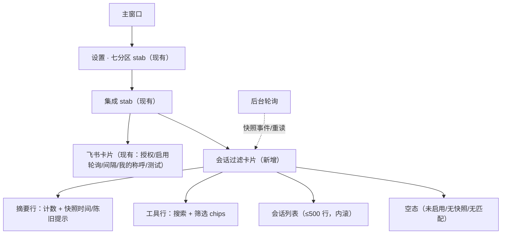
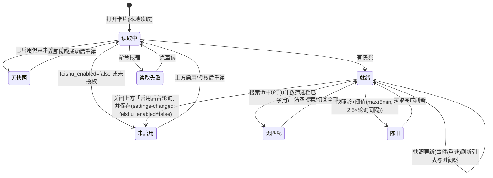

# 飞书会话过滤偏好 UIUX 设计

> 依据 `specs/feishu-chat-filter/requirements.md`（SDD，已完成隔离评审）与 `specs/feishu-chat-filter/design.md`（已定方向）产出。
> 视觉层约束（主会话给定）：**沿用应用既有设计体系**（`docs/design/DESIGN_SYSTEM.md` 图鉴复古风、Dex 组件、既有色板与字体），不另起视觉方向。
> 文案约束：`docs/design/COPYWRITING.md`——集成与诊断类设置保持**工具语气、精确信息，不做世界观化**。
> 规模：L 级（新视图 + 新契约面 + 跨窗口一致性）→ 产出第 11 章视觉保真原型 `uiux-prototype.html`。

---

## 1. UIUX 影响评估

| 维度 | 评估问题 | 本功能结论 |
|------|---------|-----------|
| 展示 | 数据/结果用户需要看到吗？在哪看？ | **有影响**。全部会话（最多 500，含被过滤会话）的生效过滤状态与来源（P0 故事）需要一个新的管理视图；现有任何界面都不展示该信息（收音机页只展示已入库消息，被过滤会话一条消息都没有，不可见）。 |
| 触发 | 用户如何发起？入口在哪？ | **有影响**。逐会话设置三态偏好（跟随/总是拉取/总是过滤）需要新入口；现有界面无此能力。 |
| 反馈 | 进行中/完成后如何感知？ | **有影响**。偏好写入需要即时反馈（乐观 UI）；「下一轮拉取起生效」的时点语义、快照陈旧度需要可见。 |
| 异常 | 出错时用户如何知道并处理？ | **有影响**。免打扰查询失败的降级态（SDD 明确要求标示「跟随（查询失败降级）」）、读取/写入失败、未启用/无快照空态都需要界面处理。 |
| 变更 | 是否动到现有界面/导航/已有交互？ | **有影响**。设置页「集成」stab 飞书卡片下方新增管理卡片；i18n 三语新增键；`docs/USER_GUIDE.md`「去飞书设免打扰」引导改指向本界面（SDD 变更影响已列）。 |

**评估结论**：需要 UIUX 设计（五维度全部命中）。

**理由**：本功能核心交付物之一就是「会话过滤管理界面」本身（SDD P0 故事第一条即「看到所有会话及其当前生效的过滤状态与来源」）；且引入了与设置页既有「点保存才落库」模式不同的即时生效语义，需要显式的界面沟通。

---

## 契约需求面（必选）

> UIUX → AD 的单向契约需求传递面。**UIUX 只定义「对 API 的需求」，不定义 API 结构**。command 名为期望语义名，最终命名归 AD。

| 表 | 内容概要 |
|----|---------|
| 触发入口表 | 3 个入口：读取会话过滤总览（本地读）、写入单会话偏好、触发一轮拉取（复用既有） |
| 反馈通道表 | 偏好写入同步反馈（乐观 UI）；快照更新期望事件推送（**新事件通道，轻回流**，退化方案见反馈通道表注） |
| 展示字段表 | 列表/筛选视图 7 个字段（会话名/类型/偏好/生效状态/来源/快照时间/计数） |
| 交互状态表 | 空×4 变体、loading、失败×2、异常×2（降级标注/陈旧横幅）、权限（并入空-未启用） |

### 触发入口表

| 入口名 | 用户操作 | 调用能力 | 期望端点动词 |
|--------|---------|---------|-------------|
| 会话过滤卡片（设置·集成 stab） | 打开/切到集成 stab、或写操作与拉取完成后重读 | 读取会话列表 + 各会话「偏好 × 快照」合并后的生效状态（**纯本地读，不触发任何飞书 API**） | command `get_feishu_chat_filter_overview`（GET 语义；**终名，已与 AD 收敛**，返回 chats + counts + snapshotAt） |
| 行内三段选择器 | 点击 跟随 / 拉取 / 过滤 | 写入单会话偏好；`follow` = 清除手动记录；**返回该会话合并后的最新行状态**（前端用其更新行，保证合并规则单一实现） | command `set_feishu_chat_filter(chatId, preference)`（PUT 语义，同步本地写；**终名，已与 AD 收敛**） |
| 空态与陈旧横幅内「立即拉取一次」按钮 | 点击 | 触发一轮拉取（提前进入下一窗口） | 复用既有 command `trigger_feishu_poll` |

### 反馈通道表

| 场景 | 机制 | UI 状态 |
|------|------|---------|
| 偏好写入 | 同步 command（本地写，应当 ms 级） | 乐观 UI：三段选中态即时切换 → 成功后按返回值刷新行与计数；失败回滚 + 错误 toast |
| 快照更新（后台轮询完成）/ 偏好写入 | **新事件 `feishu-chat-filter-changed`**（每轮拉取落快照后 + 偏好 set 成功后广播，无 payload；**已与 AD 收敛**，UIUX 建议名 `feishu-pull-snapshot-changed` 并入该单一事件） | 卡片可见时刷新列表、计数与快照时间戳（**保留当前搜索词与筛选档**——事件刷新只重算数据，不重置工具行状态） |
| 立即拉取 | 同步 command（既有） | 按钮禁用防抖 → 完成后重读总览 + 既有结果文案；卡内按钮与飞书卡同名按钮 busy 态**不联动**（各自独立防抖，规格言明），并发触发由后端 `trigger_feishu_poll` **in-flight 守卫**兜底（AD §6 并发设计，既有缺口随本特性顺带修） |

> **收敛结果（2026-09-23，主会话契约收敛）**：采纳事件通道，终名 `feishu-chat-filter-changed`（单一事件覆盖「快照写入后」与「偏好 set 后」两个触发点），退化方案作废；`feedbackChannels[1].mechanism` 的 SSE 枚举实际为 Tauri event 广播。

### 展示字段表

| 视图 | 字段名 | 来源实体.属性 | 格式约束 |
|------|--------|--------------|---------|
| 列表 | 会话名 | Chat.name | text，行内 ellipsis |
| 列表 | 会话类型 | Chat.type（group/p2p/bot） | 枚举徽章，文案复用 `im.type.*`（群聊/私聊/机器人） |
| 列表 | 手动偏好 | ChatFilterPreference.preference（无记录 = follow） | 三态：follow / always_pull / always_filter（三段选择器选中态） |
| 列表 | 生效状态（派生） | 偏好 × 拉取快照合并 | 枚举 chip：pull / filter |
| 列表 | 状态来源（派生） | manual / follow / followDegraded（序列化值 camelCase；followDegraded = 跟随态且该会话免打扰查询批次失败） | chip 后缀 + 降级 title 说明 |
| 列表/摘要 | 快照时间 | 拉取快照.takenAt | datetime（复用 `fmtDateTime`） |
| 摘要/筛选 | 计数 | 派生 | total / pulling / filtered / manual 四个整数 |

### 交互状态表

| 状态 | 触发条件 | 期望错误码 |
|------|---------|-----------|
| 空·未启用 | `feishu_enabled=false` 或 lark-cli 未授权 | 无（引导态，指向卡内上方的启用开关/授权按钮） |
| 空·无快照 | 已启用但从未成功拉取（无快照记录） | 无（引导 + 「立即拉取一次」） |
| 空·无匹配 | 搜索词命中 0 行（计数为 0 的筛选 chip 已禁用，不构成触发源，见 §3.2） | 无 |
| loading | 总览首次读取中（本地读，瞬时） | 无 |
| 失败·读取 | `get_feishu_chat_filter_overview` 报错 | 任意 → 错误行 + 重试按钮（错误文案两层结构：前缀 + 技术原文） |
| 失败·写入 | `set_feishu_chat_filter` 报错 | 任意 → 回滚该行三段态 + 错误 toast |
| 异常·降级 | 快照中该会话免打扰查询失败（非界面错误，展示层标注） | 无（数据态：来源 = followDegraded） |
| 异常·陈旧 | 快照龄 > 阈值（`max(5 分钟, 2.5 × feishu_poll_interval)`，推导与论证见 §3.2） | 无（⚠ 横幅 + 立即拉取） |
| 权限 | 未授权（lark-cli 无凭证） | 无（并入空·未启用变体，文案指向授权按钮） |

```json
{
  "entryPoints": [
    {
      "name": "会话过滤卡片（设置·集成 stab）",
      "userAction": "打开/切到集成 stab，或写操作与拉取完成后重读",
      "capability": "get_feishu_chat_filter_overview",
      "endpointVerb": "command:get_feishu_chat_filter_overview (GET 语义, 本地读)"
    },
    {
      "name": "行内三段选择器",
      "userAction": "点击 跟随/拉取/过滤",
      "capability": "set_feishu_chat_filter(chatId, preference: follow|always_pull|always_filter)，follow=清除记录，返回该行合并后状态",
      "endpointVerb": "command:set_feishu_chat_filter (PUT 语义, 同步本地写)"
    },
    {
      "name": "空态/陈旧横幅「立即拉取一次」按钮",
      "userAction": "点击",
      "capability": "trigger_feishu_poll（复用既有）",
      "endpointVerb": "command:trigger_feishu_poll"
    }
  ],
  "feedbackChannels": [
    {
      "scenario": "偏好写入",
      "mechanism": "同步",
      "uiState": "乐观切换 → 成功刷新行+计数；失败回滚 + 错误 toast"
    },
    {
      "scenario": "快照更新（后台轮询完成）/ 偏好写入",
      "mechanism": "SSE",
      "uiState": "卡片可见时刷新列表/计数/快照时间戳（事件 feishu-chat-filter-changed，Tauri event 广播；快照写入后 + set 后两触发点；保留当前搜索词与筛选档）"
    },
    {
      "scenario": "立即拉取",
      "mechanism": "同步",
      "uiState": "按钮禁用防抖 → 完成后重读总览 + 既有结果文案；与飞书卡同名按钮 busy 态不联动（并发由后端 trigger_feishu_poll in-flight 守卫兜底，AD §6）"
    }
  ],
  "displayFields": [
    { "view": "列表", "fieldName": "会话名", "source": "Chat.name", "format": "text/ellipsis" },
    { "view": "列表", "fieldName": "会话类型", "source": "Chat.type", "format": "enum badge (group/p2p/bot, 文案复用 im.type.*)" },
    { "view": "列表", "fieldName": "手动偏好", "source": "ChatFilterPreference.preference", "format": "enum follow/always_pull/always_filter（无记录=follow）" },
    { "view": "列表", "fieldName": "生效状态", "source": "派生(偏好×快照)", "format": "enum chip pull/filter" },
    { "view": "列表", "fieldName": "状态来源", "source": "派生", "format": "enum manual/follow/followDegraded (camelCase 序列化值)" },
    { "view": "列表", "fieldName": "快照时间", "source": "拉取快照.takenAt", "format": "datetime" },
    { "view": "筛选", "fieldName": "计数", "source": "派生", "format": "int total/pulling/filtered/manual" }
  ],
  "interactionStates": [
    { "state": "空", "trigger": "feishu_enabled=false 或未授权", "expectedErrorCode": null },
    { "state": "空", "trigger": "已启用但从未成功拉取（无快照）", "expectedErrorCode": null },
    { "state": "空", "trigger": "快照存在但会话为空（snapshotAt≠null ∧ chats=[]）", "expectedErrorCode": null },
    { "state": "空", "trigger": "搜索命中 0 行（0 计数筛选 chip 已禁用）", "expectedErrorCode": null },
    { "state": "loading", "trigger": "总览首次读取中（本地读）", "expectedErrorCode": null },
    { "state": "失败", "trigger": "get_feishu_chat_filter_overview 报错", "expectedErrorCode": "任意→错误行+重试" },
    { "state": "失败", "trigger": "set_feishu_chat_filter 报错", "expectedErrorCode": "任意→回滚+toast" },
    { "state": "异常", "trigger": "快照中该会话免打扰查询失败", "expectedErrorCode": null },
    { "state": "异常", "trigger": "快照龄>阈值(max(5min, 2.5×feishu_poll_interval), 见§3.2)", "expectedErrorCode": null },
    { "state": "权限", "trigger": "lark-cli 未授权", "expectedErrorCode": null }
  ]
}
```

> 注：`feedbackChannels[1].mechanism` 按 schema 枚举暂记 `SSE`，实际期望是 **Tauri event 广播**（`emit` → 前端 `listen`，与既有 `settings-changed` 同机制）；机制枚举映射由 AD 契约收敛时归一。

---

## 2. 信息架构

### 2.1 页面与导航结构



不新增导航层级、不新增 tab/stab：管理面板是「集成」stab 内的一张新 `set-card`，紧邻飞书配置卡（在其正下方）——过滤偏好语义上属于飞书集成的子配置。

### 2.2 入口可达性

- **唯一入口**：主窗口 → 设置 → 集成 stab → 「会话过滤」卡片（二级菜单内，与飞书授权/轮询同区）。
- **不可达性说明（关键设计理由）**：收音机页**不做**快捷开关入口（SDD 开放项 1 的推荐决策，〔待确认〕见 §12）：
  1. 收音机频道分组数据源是 `chat_messages`，被过滤会话**一条消息都不入库**——收音机页根本看不到它们，无法承载 P0「查看所有会话」；
  2. 收音机页是消息分诊工作区（键盘流 ↑↓/J/K/C/X/F），嵌入逐会话三态控件会污染其交互密度；
  3. 会话过滤是低频管理操作（设一次长期有效），不值得高频界面常驻入口。
- 桌宠窗口（PetApp）不展示聊天消息，本功能对其无 UI 影响；偏好经拉取管线生效，天然跨窗口一致。
- 发现性补偿：设置卡片 hint 文案 + `docs/USER_GUIDE.md`「去飞书设免打扰」引导改写指向本卡片（SDD 变更影响已列）。

---

## 3. 页面与组件

### 3.1 组件树

```
SettingsTab（integrations stab）
├── 飞书 set-card（现有，不动）
└── ChatFilterCard set-card [新增]
    ├── 卡片头：h3「会话过滤」+ set-sub hint（一句话交代三态语义）
    ├── FilterSummary 摘要行 [新增]
    │   ├── 计数（共 N · X 拉取 · Y 过滤 · 手动 M）
    │   └── 快照时间戳（新鲜：普通灰字 ⋅ 陈旧：⚠ warn 横幅 + 「立即拉取一次」）
    ├── FilterToolbar 工具行 [新增]
    │   ├── 搜索输入（会话名子串，本地过滤，即时生效）
    │   └── 筛选 chips ×3（全部 N / 被过滤 N / 手动设置 N）
    ├── ChatFilterList 列表容器 [新增]（max-height 内部滚动）
    │   └── ChatFilterRow ×N [新增]
    │       ├── 类型徽章（群聊/私聊/机器人，小件级 2px）
    │       ├── 会话名（13px/700，ellipsis）
    │       ├── 生效 chip（📡 拉取 / 🔇 过滤 + · 手动/跟随/降级）
    │       └── TriStateSeg 三段选择器（跟随 / 拉取 / 过滤）
    ├── 空态区（4 变体，见 §4.2）
    └── set-foot 脚注 ×2（即时生效语义 / 不回补·不追溯）
```

### 3.2 关键组件说明

| 组件 | 职责 | 关键交互 | 状态数 |
|------|------|---------|--------|
| ChatFilterCard | 承载全部管理面板；打开时本地读取总览 | 挂载/可见时 `get_feishu_chat_filter_overview`；监听 `feishu-chat-filter-changed` 刷新（**保留当前搜索词与筛选档**，仅重算数据不重置工具行）；监听既有 `settings-changed`（`feishu_enabled` 键）实现启停联动（§4.1） | 4 空态 + loading + 失败 + 就绪 |
| FilterSummary | 总览计数 + 快照新鲜度 | 时间戳随快照刷新；>阈值（max(5min, 2.5×轮询间隔)，见陈旧度呈现）转 ⚠ 横幅 | 2（新鲜/陈旧） |
| FilterToolbar | 名称搜索 + 状态筛选（前端本地过滤，无需后端参数） | 输入即时过滤；chip 单选切换 | 2（有/无筛选条件） |
| ChatFilterRow | 单会话：身份 + 生效状态 + 偏好设置 | 行 hover 高亮；三段点击乐观切换 | 5（三偏好 × 生效来源组合，见下表） |
| TriStateSeg | 三态偏好选择器（radiogroup 语义） | 点击/方向键即写（roving tabindex 键盘处方，见 §6.2）；写入中防连点；失败回滚（焦点回到回滚后选中段） | 3 + writing + error |
| 生效 chip | 展示「下一轮拉取会怎样 + 为什么」 | title 悬浮完整解释（鼠标通道）；降级细节另经同行三段选择器 `aria-describedby` 关联（键盘/读屏通道，见 §6.2） | 5（见下矩阵） |

**行内两元素的信息分工（本设计核心）**：
- **三段选择器 = 用户意图**（你设置了什么）：跟随（默认）/ 拉取 / 过滤；
- **生效 chip = 系统决策**（下一轮会发生什么 + 依据）：拉取/过滤 × 手动/跟随/降级。

**生效 chip 完整矩阵**（= 拉取管线下一轮的决策预演，合并规则单一实现归后端）：

| 偏好 | 快照免打扰查询结果 | 生效 chip | 视觉 |
|------|------------------|----------|------|
| 总是拉取 | 任意 | 📡 拉取 · 手动 | ok-soft 底 + ok-ink 字 |
| 总是过滤 | 任意 | 🔇 过滤 · 手动 | conf-low-soft 底 + ink-soft 字 |
| 跟随 | 成功 · 未免打扰 | 📡 拉取 · 跟随 | ok 系 |
| 跟随 | 成功 · 已免打扰 | 🔇 过滤 · 跟随 | conf-low 系 |
| 跟随 | 查询失败 | 📡 拉取 · 降级 ⚠ | warn-soft 底 + warn-ink 字，title：「免打扰查询失败，本轮降级为不过滤」 |

**即时生效语义（与设置页保存模式的关系，SDD 开放项 5，契约收敛点）**：

- **偏好设置点击即写库、立即生效，不随设置页「保存设置」按钮**。理由：
  1. SDD NFR：「三态设置后立即生效于下一轮拉取，无需重启应用」——保存缓冲模式无法保证（用户可能设完不点保存就离开，而保存按钮在 App 壳标题行、与本卡片心理距离远）；
  2. 应用内已有先例：主宝可梦 picker 即「选中即存」（SettingsTab L423 注释），授权/测试/立即拉取同为即时动作；
  3. 数据形态是逐会话记录（最多 500 条），不适配 settings 键值字符串表；
  4. 直接操作心智：点哪行改哪行，改错再点一下即回，无需全局保存仪式。
- **界面必须显式沟通该差异**（防「我改完了还要不要点保存」的困惑）：卡片脚注第一条明示「此处的更改立即生效（无需点『保存设置』），下一轮拉取起作用」；三段切换即时反馈本身就是可感知证据。
- 此决策意味着**偏好数据不走 `settings.values` 缓冲、不进 `SETTING_KEYS`**，走独立 command——具体归 AD，UIUX 只声明需求面。

**会话列表组织（SDD 开放项 2）**：

- **搜索**：会话名子串匹配，前端本地过滤（数据已在内存，500 项内即时；无需 debounce，输入逐键生效）。
- **筛选 chips（单选三档）**：`全部 N`（默认）/ `被过滤 N` / `手动设置 N`。「被过滤」覆盖手动+跟随两种过滤来源——服务「拯救被免打扰误杀会话」的 P0 旅程（用户直觉：我想看看现在哪些会话收不到）。
- **计数为 0 的 chip 禁用**（chip-only 零命中处理，二选一决策）：chip 文案自带计数，「手动设置 0」/「被过滤 0」禁用即自解释「没有此类会话」，避免进入必然空结果的路径，也免为 chip-only 形态新增一条空态文案与三语键；「全部 0」不会出现（无会话时走 空·快照为空 态）。因此 `emptySearch` 文案只需覆盖 `{q}`（搜索词）形态——chip 档位不再是零命中触发源。
- **选中档计数动态降 0 的处置**：当前选中的筛选档，其计数因偏好写入或事件刷新降为 0 时（如筛选停在「被过滤」，最后一个被过滤会话被改设「拉取」），该档随之禁用——**自动回退到「全部」档**（列表非空、无空态文案介入），避免出现「选中且禁用的 chip + 空列表且无文案」的破窗状态。
- **排序**：手动设置的会话置顶（用户的主动编辑最相关）→ 其余按类型（群聊 → 私聊 → 机器人）→ 名称。搜索/筛选命中时保持此序。
- **不做**：类型分组折叠（搜索+筛选已覆盖找会话的需求，分组折叠在 500 项下增加层级噪音）；类型筛选 chip（类型是次要注意力，徽章展示即可）。
- **长列表性能**：行高紧凑（约 44px），容器 `max-height: 420px` 内部滚动（与收音机列表同模式）；500 行简单行**直接渲染、不虚拟化**（与 `RadioTab` 全量渲染策略一致，本地快照数据量级可接受）；若实测滚动卡顿，实施期再加虚拟化（记入 NFR 注记，不进本期规格）。

**陈旧度呈现（SDD 开放项 6）**：

- 摘要行常驻显示快照时间：「以上一轮拉取为准（09-23 14:32）」。
- 阈值随轮询间隔推导（就地决策，可调）：**`阈值 = max(5 分钟, 2.5 × feishu_poll_interval)`**，快照龄超阈值 → 时间戳升级为 ⚠ warn 横幅：「距上一轮拉取已 X 分钟，状态可能不是最新」+ 「立即拉取一次」按钮。按设置页四档轮询间隔（1/2/5/15 分钟）推算：1 分钟档 → 5 分钟；2 分钟档（默认）→ 5 分钟；5 分钟档 → 12.5 分钟；15 分钟档 → 37.5 分钟。
- 设计理由（覆盖各档论证）：SDD 容忍语义 = 一个完整退避周期（默认 120s 轮询下最长约 16 分钟）——默认 2 分钟档取 5 分钟阈值位于容忍上限之内（横幅先于数据失效出现，提示保守侧安全）；**15 分钟档**下健康快照本身间隔即 15 分钟，若沿用固定 5 分钟阈值则健康态横幅常驻且文案失实——按 2.5×（37.5 分钟）推导后容忍连续两轮未落快照加余量，健康态永不误报；**5 分钟档**取 12.5 分钟，避免固定 5 分钟阈值恰好落在该档健康快照龄区间内导致的横幅在阈值附近逐轮抖动闪烁；1 分钟档由下限 5 分钟兜底（避免阈值过小对拉取执行时长过敏）。横幅出现即说明拉取链路在退避或故障——与诊断页「集成健康」语义呼应，横幅文案点出「可到 诊断·集成健康 查看详情」。

---

## 4. 交互状态

### 4.1 数据/场景状态流转（面板级）



> **启停联动（就绪 → 停用转移）**：`feishu_enabled` 的双向转移适用于**任意当前态**（就绪 / 无匹配 / 陈旧 / 无快照，以及 loading / 读取失败等瞬间态——由同一监听机制自然覆盖）——图中以「就绪 → 未启用」为代表边。机制：卡片监听既有 `settings-changed` 事件中 `feishu_enabled` 键的变更（或父组件以响应式依赖传入，二选一由实施定），关闭轮询保存后立即转「空·未启用」态；停用态下的显隐规则（横幅停评、「立即拉取一次」不展示等）见 §4.2「停用联动显隐规则」。
>
> **选中筛选档降 0**：当前选中档计数因数据刷新降为 0 时自动回退「全部」档（规则见 §3.2 筛选 chips），不进入「无匹配」态。

### 4.2 数据场景状态（6 类齐全）

| 状态 | 展示内容 | 用户可执行操作 |
|------|---------|---------------|
| 空·未启用 | 「启用飞书后台轮询后，这里会列出你的全部会话。」（工具行控件隐藏或禁用） | 到上方卡片启用轮询/授权（同屏可见） |
| 空·无快照 | 「还没有拉取快照。等待下一轮轮询，或立即拉取一次。」+ 「立即拉取一次」按钮 | 点按钮触发拉取；或等待 |
| 空·快照为空（边界） | 「上一轮拉取未发现会话。」 | 「立即拉取一次」重试 |
| 空·无匹配 | 「没有匹配「关键词」的会话」 | 清空搜索框 / 切回「全部」 |
| Loading | 列表区单行占位「读取会话快照…」（本地读为瞬时，不做骨架屏） | — |
| 成功（就绪） | 摘要 + 工具行 + 列表（每行：徽章/名称/生效 chip/三段） | 搜索、筛选、逐会话设置三态 |
| 失败·读取 | 「会话列表读取失败：{技术原文}」+ 重试按钮 | 重试 |
| 失败·写入 | 该行三段回滚 + 错误 toast「设置未生效，请重试：{技术原文}」 | 重试点 |
| 异常·降级（数据态） | 该会话 chip = 「📡 拉取 · 降级」，title 完整说明 | 无需操作（下一轮自动恢复；持续降级看诊断） |
| 异常·陈旧 | ⚠ warn 横幅 + 分钟数 + 「立即拉取一次」 | 立即拉取；去诊断·集成健康 |
| 权限（未授权） | 并入空·未启用变体：文案指向上方「授权登录」按钮 | 点授权 |

**关键不变量**（对齐 SDD）：打开卡片/切 stab 只触发**本地读取**，不发起任何飞书 API 调用；「立即拉取一次」是唯一会触发飞书 API 的按钮，且必须由用户显式点击。

**停用联动显隐规则**（承接 §4.1 启停联动）：`feishu_enabled` 变 false 时，无论当前处于何种状态（就绪/陈旧/无匹配/无快照/loading/读取失败），卡片立即转「空·未启用」态——摘要与列表隐藏；工具行禁用（既有规则）；陈旧横幅**停止评估并隐藏**；「立即拉取一次」**不展示**（停用态为引导启用态，不提供手动拉取入口；空·未启用变体本就不含该按钮）。重新启用后经 `settings-changed` 重读总览回就绪。

### 4.3 组件交互状态

| 组件 | default | hover | focus | active | disabled | skeleton |
|------|---------|-------|-------|--------|----------|----------|
| TriStateSeg 段 | 白底 navy 字 | `--hover` 黄（仅未选中段） | 全局 3px `--poke-yellow` outline（键盘可见） | 位移 2px + 阴影减半（`--t-tap`） | 写入中三段全禁用（防连点） | N/A（行级无骨架） |
| 选中段 | `--poke-yellow` 底 navy 字 | 保持（唯一悬停黄规则） | 3px outline **改 navy 描边**（黄底上下文，§6.2 焦点环对比度注记） | 同上 | 同上 | N/A |
| 生效 chip | 各语义色浅底深字（§6.1 映射） | title 悬浮完整说明 | **不可聚焦**（纯展示 span；降级细节经同行三段选择器 `aria-describedby` 键盘可达，见 §6.2） | — | N/A | N/A |
| ChatFilterRow | 白底 | `--hover` 背景 | — | — | N/A | N/A |
| 筛选 chip | 小件级 2px 描边白底 | `--hover`（禁用档除外） | outline 可见 | 按压位移 | 空态·未启用时整组禁用；就绪态下**计数为 0 的档位禁用**（文案自带计数，自解释）；选中档计数降 0 时自动回退「全部」（§3.2）；实现层选中态补 `aria-pressed` | N/A |
| 搜索输入 | 控件级 3px 描边（全局输入样式） | — | outline 可见 | — | 空态·未启用时禁用 | N/A |
| 立即拉取按钮 | `btn ghost`（既有类） | 既有 | 既有 | 既有 | 拉取进行中 disabled（**仅本按钮**，与飞书卡同名按钮 busy 态不联动——各自独立防抖，并发触发由后端 `trigger_feishu_poll` in-flight 守卫兜底，AD §6） | N/A |

> 面板无骨架屏需求（本地读取瞬时），6 类中的 loading 用单行占位文字覆盖，见 §4.2。

---

## 5. 组件级微交互

| 元素 | hover | press/active | focus | disabled | 动效意图 | reduced-motion 降级 |
|------|-------|--------------|-------|----------|---------|---------------------|
| 三段选择器段 | 未选中段 `--hover` 底色（150ms `--t-pop`） | 位移 2px/阴影减半（`--t-tap` 80ms，全局按压实律） | 3px `--poke-yellow` outline（选中段黄底上下文改 navy 描边，§6.2 注记） | 降透明度 0.55 + cursor:default | 按压位移表达「按下即触发」的即时生效语义 | 位移由全局 `reduce-motion` 通道关闭，仅剩底色变化（语义不丢） |
| 生效 chip（写入成功后刷新） | — | — | — | — | 底色切换 150ms 过渡，表达状态归属变化 | 色变本身非动效，无需降级 |
| 失败回滚 | — | — | — | — | 直接回到原段（不弹跳、不闪烁——错误反馈走 toast，行内不二次打扰） | 同左（本就无动效） |
| 筛选 chip / 列表重排 | — | 按压位移 | outline | — | 列表过滤即时重排，**不加过渡动画**（500 项重排动画是反模式） | 本就无动画 |
| 错误 toast | — | 按钮按压 | — | — | 复用全局 toast 模式（右下角，5s 自动消失）；toast 容器补 `role="status"`（全局既有顺带修，读屏经隐式 aria-live 自动播报） | 复用全局 |

动效总原则：本面板只允许**按压反馈**（80ms）与**选中态色变**（150ms）两类微交互，无循环动画、无入场演出——与设计系统「动效即信息、永不主动索要注意力」一致；reduced-motion 双通道（系统偏好 + 应用内开关）由 `dex.css` 全局处理，按压位移自动关闭、色变语义保留。

---

## 6. 视觉风格

### 6.1 视觉方向（既有体系延展决策，非新起方向）

> 本任务约束「视觉层沿用既有设计体系，不另起视觉方向」。本应用已有**单一源、已实装**的设计系统文档（`docs/design/DESIGN_SYSTEM.md` 图鉴复古风 + `src/dex.css` token），本功能的视觉工作因此不是「发明方向」而是「**既有方向在新视图上的刻意映射决策**」——以下是全部刻意决策（非沿用默认的逃避：每项都有明确的 token 选择理由，并在第 11 章原型中渲染验证）。

- **风格定位**：图鉴复古风的「图鉴条目行」模式延展——每行会话像一条图鉴条目（徽章 + 名称 + 状态 + 控件），工具语气、精确信息（COPYWRITING：集成类设置不做世界观化）。理由：管理面板属设置区信息型界面，低密度大目标 + 粗描边硬阴影的既有质感直接复用。
- **palette 映射决策（本功能真正的视觉决策——状态语义 → 既有 token）**：
  - **拉取 = ok 系**：`--ok-soft` 底 + `--ok-ink` 字（有消息流入 = 健康/正向）；
  - **过滤 = 中性弱化系**：`--conf-low-soft` 底 + `--ink-soft` 字——**刻意不用红色**：过滤是用户/免打扰的主动「安静」决策，不是错误或危险；中性弱化与「已逃走」卡片的语义色一致；
  - **降级/陈旧 = warn 系**：`--warn-soft` 底 + `--warn-ink` 字（不确定态，需要注意但非故障）；
  - **三段选中 = `--poke-yellow`**（全局唯一选中黄，与 stab/视图切换一致）；
  - **全部复用既有 CSS 变量，不新造 token**。
- **semantic token 命名约定**（供 AD/实现层对齐，值为既有变量引用）：
  - `filter/status-pull` → `--ok-soft` / `--ok-ink`
  - `filter/status-mute` → `--conf-low-soft` / `--ink-soft`
  - `filter/status-degraded` / `filter/stale-banner` → `--warn-soft` / `--warn-ink`
  - `filter/seg-selected` → `--poke-yellow`
- **字体配对**：沿用全局字体栈，无新字体决策——正文/会话名 13px、辅助文字（hint/摘要/脚注）12px、chip 与徽章 11px/800，均走 Noto Sans CJK 系；像素字（`.px`）与中文像素风（`.px-cn`）**不用于本面板**——本面板无编号/分数等像素字装饰位，快照时间戳走 `fmtDateTime` 正文字排版，卡片标题区亦无需像素装饰。
- **signature 元素**：不新增（约束不另起方向）。本视图的记忆点 = 「生效 chip × 三段选择器」的**双信息行**——一眼区分「我设置的」与「实际会发生的」，这是纯信息设计而非装饰。
- **反 AI 模板自检**（基于第 11 章原型截图确认，见原型 checklist）：3px navy 硬描边、`Npx Npx 0` 硬阴影、无 blur、无渐变、无大圆角软卡片——与 AI 生成界面的「软阴影圆角 SaaS 卡片 + 默认蓝」模板完全相反；状态色浅底深字徽章遵循「徽章浅底一律深字」红线。
- **文案/动效意图**：工具语气精确信息（「拉取」「过滤」「降级」直说，不比喻）；动效只服务按压确认与状态切换可感知，无装饰动效。

### 6.2 设计系统与实现规则（引用 `docs/design/DESIGN_SYSTEM.md`，不新造）

> 本应用的设计系统文档即实现层规范（已实装于 `src/dex.css`），等效于实现层 token 委托产出——以下为对本视图适用的摘录与落点，不重复全文。

- **质感档位**：列表容器/卡片 = 卡片级（3px 描边 / 4px 硬阴影 / 12px 圆角）；三段选择器、搜索输入、chips = 控件级（3px/3px/8px）与小件级（徽章、chip：2px/2px/2px~4px）。红线：禁止 blur 阴影、禁止渐变阴影。
- **尺寸**：控件统一 38px 高（三段每段最小命中 ≥38px）；行高约 44px（38 控件 + 上下 padding）；字号 13px 标签 / 12px 名称辅助 / 11px chip；间距走 4px 基准网格（行间 6px、区块间 10px，与收音机列表一致）。
- **可访问性**：
  - 信息文字只用 `--ink` / `--ink-soft`；chip 浅底深字组合全部 ≥4.5:1（ok-ink on ok-soft、ink-soft on conf-low-soft、warn-ink on warn-soft 均为设计系统已验证组合）；
  - 键盘可达（三段选择器**明确处方 = roving tabindex + JS 按键处理**）：容器 `role="radiogroup"` + `aria-label`（含会话名与「过滤偏好」上下文，键 `prefGroupLabel`），每段 `role="radio"` `aria-checked`；仅当前选中段 `tabindex="0"`、其余段 `tabindex="-1"`（Tab 单停点进出组）；组容器 keydown 处理 **ArrowLeft/ArrowUp = 上一段、ArrowRight/ArrowDown = 下一段（循环）、Home = 首段、End = 末段**——方向键/Home/End 移动焦点**并立即选中**（ARIA radio 模式：方向键即提交，与「点击即写」共用同一条写入路径，无需 Enter/Space 二次确认）；Enter/Space 激活聚焦段（原生 button 默认行为，幂等）。**注意：原生 `<button>` + `role="radio"` 不自带任何方向键行为**（Tab 会逐段进入而非单停点），必须实现上述 JS 处理（替代方案为原生 `<input type="radio">` 换取免费 radiogroup 键盘语义，但本设计保持 Dex 按钮质感自绘，取 roving tabindex）；搜索/chips/按钮全键盘可用（搜索输入带显式 `aria-label`，键 `searchLabel`；筛选 chips 容器带 `aria-label`，键 `chipsLabel`）；
  - **降级说明键盘可达通道**：降级细节不能只存于 chip 的 title（鼠标独占）——降级行将 `srcDegradedTitle` 文本渲染为 visually-hidden 节点，同行三段选择器（radiogroup）以 `aria-describedby` 指向它，读屏聚焦三段时播报降级说明；
  - **焦点环对比度注记（全局既有顺带修）**：3px `--poke-yellow` 焦点环在白底对比度 1.52:1 < 3:1（WCAG 1.4.11 非文本对比），在黄底上下文（三段选中段/选中 chip/stab active）上更近乎不可见——本视图内**黄底控件的焦点环改用 navy 描边**（`outline-color: var(--dex-navy)`）；白底上下文暂随全局黄环，全局 token 层面的调整另行统一（顺带修注记，不阻断本功能）；
  - 降级 chip 不只靠颜色：文字「降级」+ ⚠ 符号双通道；
  - emoji 徽标语义沿用既有 i18n 用法（`im.viewChannel: "📡 按频道"`、`im.groupNoise: "🔇 无信号"`）：📡 = 会话/频道、🔇 = 无信号/噪音。
- **栈实现指南**：Vue3 `<script setup>` + scoped CSS（应用无组件库，全部自绘，与 DexSelect/DexToggle 同模式）；数据经 Pinia 或组件局部均可（数据量小、生命周期=卡片挂载，倾向组件局部 + 事件监听）；i18n 键挂 `feishu.filter.*` 命名空间（三语键位对齐测试既有约束）。

---

## 7. 响应式与断点

桌面 Tauri 应用（主窗口可缩放），无移动端/横竖屏适配需求（N/A——本面板不在桌宠 300px 快捷屏出现）。断点针对主窗口宽度：

- **栅格**：设置区既有 920px 限宽单列；卡片内部无栅格，行为纵向 flex 流。
- **断点（就地决策）**：
  - **≥640px（常规）**：行内四元素一行排布：`[徽章] [名称 …flex] [生效 chip] [三段]`；
  - **<640px（窄窗）**：行折两行——第一行 `徽章 + 名称 + 生效 chip`，第二行右对齐 `三段选择器`（名称行让位，控件不缩小以保 38px 命中）；
  - **<480px（极窄窗）**：工具行搜索输入与筛选 chips 各占整行（chips 换行 flex-wrap）；摘要行计数允许折行。
- **横向滚动禁止**：任何宽度不出现横向滚动条（名称 ellipsis 截断 + title 全名）。
- 原型含 375px 预览切换，验证上述折行规则（非移动端适配承诺）。

---

## 8. 文案规格

> 工具语气（集成设置不做世界观化）；真实文案，三语同步（键位结构一致，沿用 `src/i18n/{zh-Hans,zh-Hant,en}.ts` 的 `feishu` 命名空间，新增 `feishu.filter.*` 子对象）。类型徽章文案复用既有 `im.type.*`（群聊/私聊/机器人）。

| 场景 | 位置 | zh-Hans | zh-Hant | en | i18n 键 |
|------|------|---------|---------|-----|---------|
| 卡片标题 | set-card h3 | 会话过滤 | 會話過濾 | Chat filters | `feishu.filter.title` |
| 卡片副标题 | set-sub | 逐会话决定哪些飞书消息参与拉取；跟随免打扰为默认，手动设置后以本应用为准。 | 逐會話決定哪些飛書訊息參與拉取；跟隨免打擾為預設，手動設定後以本應用為準。 | Choose which Feishu chats get pulled. Follow mute is the default; manual choices override it. | `feishu.filter.hint` |
| 摘要·计数 | 摘要行 | 共 {total} 个会话：{pulling} 拉取 · {filtered} 过滤 · 手动 {manual} | 共 {total} 個會話：{pulling} 拉取 · {filtered} 過濾 · 手動 {manual} | {total} chats: {pulling} pulling · {filtered} filtered · {manual} manual | `feishu.filter.summary` |
| 摘要·新鲜时间戳 | 摘要行右侧 | 以上一轮拉取为准（{time}） | 以上一輪拉取為準（{time}） | Based on the last pull ({time}) | `feishu.filter.staleOk` |
| 陈旧横幅 | ⚠ warn 行 | ⚠ 距上一轮拉取已 {min} 分钟，状态可能不是最新。可在「诊断 · 集成健康」查看详情。 | ⚠ 距上一輪拉取已 {min} 分鐘，狀態可能不是最新。可在「診斷 · 整合健康」查看詳情。 | ⚠ Last pull was {min} min ago; status may be outdated. Check Diagnostics · Integration health. | `feishu.filter.staleWarn` |
| 搜索占位 | 搜索输入 | 搜索会话名 | 搜尋會話名稱 | Search chats | `feishu.filter.searchPh` |
| 搜索 aria-label | 搜索输入（无障碍名） | 按会话名称搜索 | 按會話名稱搜尋 | Search chats by name | `feishu.filter.searchLabel` |
| 筛选容器 aria-label | 工具行 chips 容器（无障碍名） | 筛选会话列表 | 篩選會話列表 | Filter the chat list | `feishu.filter.chipsLabel` |
| 三段组 aria-label | 行内 radiogroup（无障碍名） | {name}：过滤偏好 | {name}：過濾偏好 | {name}: chat filter preference | `feishu.filter.prefGroupLabel` |
| 筛选 chip | 工具行 | 全部 {n} / 被过滤 {n} / 手动设置 {n} | 全部 {n} / 被過濾 {n} / 手動設定 {n} | All {n} / Filtered {n} / Manual {n} | `feishu.filter.fAll` / `fFiltered` / `fManual` |
| 三段·跟随 | 段按钮 + title | 跟随（title：跟随免打扰（默认）：按飞书侧免打扰决定） | 跟隨（title：跟隨免打擾（預設）：按飛書側免打擾決定） | Follow (title: Follow Feishu mute (default)) | `feishu.filter.prefFollow` / `prefFollowTitle` |
| 三段·拉取 | 段按钮 + title | 拉取（title：总是拉取：无论飞书是否免打扰都拉取） | 拉取（title：總是拉取：無論飛書是否免打擾都拉取） | Pull (title: Always pull, regardless of Feishu mute) | `feishu.filter.prefPull` / `prefPullTitle` |
| 三段·过滤 | 段按钮 + title | 过滤（title：总是过滤：整会话跳过，一条消息都不拉） | 過濾（title：總是過濾：整會話跳過，一條訊息都不拉） | Filter (title: Always filter: skip the whole chat) | `feishu.filter.prefFilter` / `prefFilterTitle` |
| 生效 chip·拉取 | 行内 chip | 📡 拉取 | 📡 拉取 | 📡 Pull | `feishu.filter.effPull` |
| 生效 chip·过滤 | 行内 chip | 🔇 过滤 | 🔇 過濾 | 🔇 Filter | `feishu.filter.effFilter` |
| 来源·手动 | chip 后缀 | 手动 | 手動 | manual | `feishu.filter.srcManual` |
| 来源·跟随 | chip 后缀 | 跟随 | 跟隨 | follow | `feishu.filter.srcFollow` |
| 来源·降级 | chip 后缀 + title | 降级（title：免打扰查询失败，本轮降级为不过滤；下一轮恢复后按免打扰推导） | 降級（title：免打擾查詢失敗，本輪降級為不過濾；下一輪恢復後按免打擾推導） | degraded (title: Mute lookup failed this round; degraded to not filtered) | `feishu.filter.srcDegraded` / `srcDegradedTitle` |
| 空·未启用 | 空态区 | 启用飞书后台轮询后，这里会列出你的全部会话。 | 啟用飛書背景輪詢後，這裡會列出你的全部會話。 | Enable Feishu background polling to list your chats here. | `feishu.filter.emptyDisabled` |
| 空·无快照 | 空态区 + 按钮 | 还没有拉取快照。等待下一轮轮询，或立即拉取一次。 | 還沒有拉取快照。等待下一輪輪詢，或立即拉取一次。 | No pull snapshot yet. Wait for the next poll, or pull now. | `feishu.filter.emptyNoSnap` |
| 空·快照为空 | 空态区 | 上一轮拉取未发现会话。 | 上一輪拉取未發現會話。 | The last pull found no chats. | `feishu.filter.emptySnapEmpty` |
| 空·无匹配 | 空态区 | 没有匹配「{q}」的会话 | 沒有符合「{q}」的會話 | No chats match "{q}" | `feishu.filter.emptySearch` |
| loading | 列表区 | 读取会话快照… | 讀取會話快照… | Loading chat snapshot… | `feishu.filter.loading` |
| 失败·读取 | 错误行 + 按钮 | 会话列表读取失败：{err} · 重试 | 會話列表讀取失敗：{err} · 重試 | Failed to load chats: {err} · Retry | `feishu.filter.loadFail`（重试复用全局 retry 键，如无则新增） |
| 失败·写入 | toast | ❌ 设置未生效，请重试：{err} | ❌ 設定未生效，請重試：{err} | ❌ Change not applied, retry: {err} | `feishu.filter.writeFail` |
| 脚注 1（即时生效） | set-foot | 此处的更改立即生效（无需点「保存设置」），下一轮拉取起作用。 | 此處的更改立即生效（無需點「儲存設定」），下一輪拉取起作用。 | Changes here apply immediately (no Save needed) and take effect on the next pull. | `feishu.filter.footImmediate` |
| 脚注 2（不回补/不追溯） | set-foot | 解除过滤只收新消息，不回补历史；设置过滤前的消息与待办保持原样。 | 解除過濾只收新訊息，不回補歷史；設定過濾前的訊息與待辦保持原樣。 | Unfiltering only receives new messages (no backfill); existing messages and todos are kept as-is. | `feishu.filter.footNoBackfill` |
| 立即拉取按钮 | 空态/横幅 | 立即拉取一次 | 立即拉取一次 | Pull now | 复用 `feishu.pollNow` |
| 类型徽章 | 行内 | 群聊 / 私聊 / 机器人 | 群聊 / 私聊 / 機器人 | Group / Direct / Bot | 复用 `im.type.*` |

> 文案层两条硬规则：错误文案两层结构（图鉴机前缀句式「……失败：{技术原文}」，技术原文不吞）；P0 故事里的「跟随（查询失败降级）」在 chip 上收敛为短词「降级」+ title 完整说明（11px chip 放不下长句，title 承载细节——符合设计系统「写不下的下沉，不硬塞」；title 是鼠标通道，键盘/读屏通道经同行三段选择器 `aria-describedby` 关联同一文本，见 §6.2）。

---

## 9. UIUX 验收（Gherkin）

> 聚焦交互体验可观察点；业务行为验收（拉取管线合并、不回补等）归 SDD，不重复。

```gherkin
Scenario: 打开管理面板不触发飞书 API
  Given 飞书集成已启用且存在拉取快照
  When 用户切到设置·集成 stab 打开会话过滤卡片
  Then 列表展示且 mock 的飞书 API 调用计数为 0（仅本地读取命令被调用）

Scenario: 行内双信息呈现——意图与结果分离
  Given 会话「团队群」无手动偏好，且快照中其免打扰查询成功、未设免打扰
  When 用户查看列表
  Then 该行三段选择器选中「跟随」，生效 chip 为「📡 拉取 · 跟随」

Scenario: 手动偏好即时反馈（乐观 UI + 立即生效语义）
  Given 会话「重要项目群」当前为跟随态且被过滤
  When 用户点击该行三段「拉取」
  Then 三段选中态立即切换为「拉取」（不等命令返回）
  And 写入成功后该行生效 chip 立即变为「📡 拉取 · 手动」且摘要计数同步 +1
  And 用户未点击 App 壳的「保存设置」按钮，该偏好在下一次读取时仍然存在

Scenario: 写入失败回滚
  Given mock 的偏好写入命令返回错误
  When 用户点击某行三段「过滤」
  Then 该行三段回滚为原选中态
  And 出现错误 toast「设置未生效，请重试：…」

Scenario: 查询失败降级的标注
  Given 快照中会话 A 的免打扰查询批次失败
  When 用户查看列表
  Then A 行生效 chip 为「📡 拉取 · 降级」且带 ⚠ 视觉（warn 色）
  And chip 的 title 含「免打扰查询失败」说明

Scenario: 三种空态可区分
  Given 分别处于 集成未启用 / 已启用但无快照 / 搜索无匹配 三种场景
  When 用户打开会话过滤卡片
  Then 三种场景分别显示 §8 对应的不同空态文案
  And 仅「无快照」变体带「立即拉取一次」按钮

Scenario: 搜索与筛选
  Given 列表含 500 个 mock 会话
  When 用户在搜索框输入「项目」并点选「被过滤」chip
  Then 列表即时只显示名称含「项目」且生效状态为过滤的会话
  And 摘要计数保持全量统计不变（筛选只影响列表，不重算摘要）

Scenario: 陈旧度提示（默认 2 分钟档）
  Given 轮询间隔为默认 2 分钟（阈值 = max(5 分钟, 2.5×2) = 5 分钟）且 mock 快照时间被置为 8 分钟前
  When 用户打开会话过滤卡片
  Then 摘要行显示 ⚠ 陈旧横幅（含分钟数）且提供「立即拉取一次」按钮

Scenario: 陈旧阈值随轮询间隔推导（15 分钟档不误报）
  Given feishu_poll_interval = 15 分钟（阈值 = max(5 分钟, 2.5×15) = 37.5 分钟）
  When 快照龄为 20 分钟时用户查看会话过滤卡片
  Then 摘要行保持普通时间戳（健康态不出现陈旧横幅）
  When 快照龄达到 40 分钟
  Then 摘要行升级为 ⚠ 陈旧横幅（含分钟数）

Scenario: 键盘可达的三态选择（roving tabindex）
  Given 列表就绪
  When 用户用 Tab 聚焦到某行三段选择器（单停点，落在当前选中段）
  And 按 ArrowRight（或 ArrowDown）
  Then 焦点移到相邻段且该段被选中并走与点击相同的写入路径（无需再按 Enter/Space 二次确认）
  And Home / End 可跳选首段 / 末段，全程焦点环可见，无需鼠标

Scenario: 未匹配搜索的名称完整可见
  Given 某会话名称超长被 ellipsis 截断
  When 用户悬浮该行名称
  Then title 显示完整会话名

Scenario: 三语文案与键位对齐
  When 运行既有 i18n 键位对齐测试
  Then zh-Hans / zh-Hant / en 三文件 feishu.filter.* 键结构一致

Scenario: 窄窗折行不出现横向滚动
  Given 主窗口宽度缩至 480px
  When 用户查看会话过滤卡片
  Then 行内控件按 §7 断点规则折行，无横向滚动条，三段选择器命中区仍 ≥38px
```

---

## 10. 变更影响

- **改动点 1**：设置页「集成」stab 在飞书配置卡下方新增「会话过滤」`set-card`（`src/views/SettingsTab.vue`，或抽出独立子组件挂载）；飞书卡片本身**不动**。
- **改动点 2**：i18n 三文件 `feishu` 命名空间新增 `filter` 子对象 **33 键**（§8 清单 30 键 + 无障碍名 3 键：`searchLabel` / `chipsLabel` / `prefGroupLabel`；zh-Hans / zh-Hant / en 同步；键位对齐测试自动覆盖新键）。
- **改动点 3**：`docs/USER_GUIDE.md`「去飞书设免打扰」引导改写为指向本卡片（SDD 变更影响已列，文档义务）。
- **不改**：收音机页（RadioTab）零改动；桌宠窗口零改动；设置页保存按钮/App 壳行为不变（本卡片数据不进保存缓冲）。
- **行为变更说明**：设置页首次出现「即时生效」区块（主宝可梦 picker 已有先例但无显式文案），以脚注显式沟通，防止与保存按钮的心智冲突。

---

## 11. 规格可视化 HTML

产出文件：`specs/feishu-chat-filter/uiux-prototype.html`（L 级视觉保真原型，单文件、mock 数据、不连 API）。

**覆盖内容 checklist**：

- **覆盖页面/视图**：会话过滤卡片全态（就绪 default / 空·未启用 / 空·无快照 / 空·无匹配 / loading / 读取失败）+ 陈旧横幅开关 + 降级行样例。空·快照为空变体为极边界态（snapshotAt≠null ∧ chats=[]），文案已定义（§8 `emptySnapEmpty`），原型不单列演示开关。
- **可切换状态**：状态切换器（default / empty-disabled / empty-nosnapshot / empty-search / loading / error）+ 陈旧度开关（fresh/stale，mock 快照龄随「轮询间隔」选择推导——阈值 = max(5 分钟, 2.5×interval)，间隔可选 1/2/5/15 分钟，对齐设置页档位，验证 §3.2 推导）。
- **可点交互**：三段选择器可点**且键盘可用**（roving tabindex：Tab 单停点、方向键/Home/End 即选即写，§6.2 处方；mock 乐观切换 + chip/计数即时刷新）、搜索与筛选 chips 可用（mock 500 行中的样例子集）、筛选 chip 单选、计数为 0 的 chip 禁用。
- **原型语义补齐**：上下文 stab 以 `aria-current` 标记当前分区；搜索输入与筛选 chips 容器带无障碍名（`searchLabel` / `chipsLabel`）；三段 radiogroup `aria-label` 含会话名 + 「过滤偏好」上下文（`prefGroupLabel`）；降级行的降级说明经 visually-hidden 节点 + 同行三段 `aria-describedby` 键盘可达；toast 容器 `role="status"`；黄底控件（选中段/选中 chip/stab active）焦点环改 navy 描边。
- **断点预览**：桌面 / 640px 以下折行 / 375px 预览切换（验证 §7 规则）。
- **真实文案**：全部使用 §8 三语文案（原型内置 zh-Hans 默认 + 简易语言切换演示 i18n 键覆盖）。
- **真实数据结构**：mock 行字段与 `contract.json` displayFields 一一对应（name/type/preference/effectiveStatus/source/snapshotAt/counts）。

**L 级额外 checklist（视觉保真）**：

- [x] 真实 palette 已渲染：`--dex-navy #1A1B25`、`--poke-yellow #FFCB05`、ok/warn/conf-low 状态组、`--hover` —— 直接取自 `src/dex.css` / DESIGN_SYSTEM.md token，非灰盒占位。
- [x] 字体层级落地：正文 Noto Sans CJK 系统栈 13/12/11px 层级；像素字（Press Start 2P 本地打包字体无法在单文件原型内引用）以等宽栈近似且仅装饰位使用，实现以 `dex.css` 实装为准。
- [x] signature（双信息行）可见可识别：每行「三段意图 × 生效 chip」结构一眼可辨。
- [x] 间距体系按 §6.2：4px 基准网格、38px 控件高、44px 行高。
- [x] 反 AI 模板自检基于原型截图确认（§6.1 声明的硬描边/硬阴影/无渐变在原型中实际渲染）。

---

## 12. ⚠️ 需求边界漂移（回流触发）与就地决策

### 轻回流（契约层增量，交主会话契约收敛处理，不回 SDD）

| # | 漂移类型 | 位置 | 内容与建议 |
|---|---------|------|-----------|
| 1 | 新异步通道 | 反馈通道表 | **已收敛（2026-09-23）**：采纳事件通道，终名 `feishu-chat-filter-changed`（每轮拉取落快照后 + 偏好 set 成功后两触发点，无 payload）；events.rs / events.ts / events.spec.ts 契约测试三处同步，见 AD §4.2。 |
| 2 | 展示规则细化 | §3.2 生效 chip 矩阵 | **已收敛（2026-09-23）**：合并规则单一实现归后端——读命令 `get_feishu_chat_filter_overview` 与写命令 `set_feishu_chat_filter` 均返回后端合并后的状态（`source` 三值 manual/follow/followDegraded 直出），前端零合并逻辑，见 AD §4.1。 |

无重回流：无新用户故事/新能力/核心流程变更（「立即拉取一次」复用既有 `trigger_feishu_poll`；管理入口在 SDD 变更影响「设置页新增会话过滤管理 UI」范围内）。

### 就地决策清单（批量关卡一并定夺）

| # | 决策 | 内容 | 理由 |
|---|------|------|------|
| 1 | 管理入口（SDD 开放项 1） | **设置页·集成 stab 单入口**（新卡片），收音机页 v1 不做快捷开关（列为未来增强方向，不进本期规格） | 被过滤会话在收音机页不可见（无消息入库）无法承载 P0；保护收音机键盘流；低频管理不值常驻入口（详见 §2.2） |
| 2 | 生效语义（SDD 开放项 5） | 偏好**点击即写库即时生效**，不随「保存设置」按钮；脚注显式沟通 | SDD NFR「立即生效于下一轮拉取」；主宝可梦 picker 已有「选中即存」先例；逐会话记录不适配 K-V settings 缓冲 |
| 3 | 陈旧阈值 | 阈值随 `feishu_poll_interval` 推导：**`max(5 分钟, 2.5 × interval)`**（四档：1 分钟→5 / 2 分钟（默认）→5 / 5 分钟→12.5 / 15 分钟→37.5） | 对齐 SDD「容忍一个完整退避周期」（默认档 5 分钟位于 ~16 分钟容忍上限内）；覆盖 15 分钟档——固定 5 分钟在该档健康态横幅常驻且文案失实；5 分钟档取 12.5 分钟避免阈值附近逐轮抖动闪烁（论证见 §3.2）；数值可调，交关卡确认 |
| 4 | 筛选 chip 集合 | 全部 / 被过滤 / 手动设置 三档；不做类型筛选与类型分组折叠 | 「被过滤」服务拯救误杀旅程；类型是次要注意力 |
| 5 | 列表渲染 | 500 行直接渲染 + 容器内滚（max-height 420px），不虚拟化 | 与收音机全量渲染策略一致；实测卡顿再虚拟化（实施期兜底） |
| 6 | 排序 | 手动设置置顶 → 类型（群→私聊→机器人）→ 名称 | 用户主动编辑最相关 |

### 对 AD 的契约收敛点汇总（主会话汇合用）

1. 新 command ×2（**已收敛终名**）：`get_feishu_chat_filter_overview`（本地读，返回 chats + counts + snapshotAt）、`set_feishu_chat_filter`（写 + 返回该行合并视图）；`follow` 值 = 清除手动记录。
2. 事件 ×1（**已收敛**）：`feishu-chat-filter-changed`（快照写入后 + set 后两触发点，无 payload）。
3. 合并规则单一实现（**已收敛**）：读/写命令均返回后端合并结果（生效状态 + 来源枚举 manual/follow/followDegraded），前端不重复实现合并逻辑。
4. 数据面：偏好不进 settings 键值表、不进 `SETTING_KEYS`、不触发 `settings-changed`（即时生效，独立通道）。
5. 隐私对齐 SDD：会话名/偏好/快照仅本地；不进大模型（无新增 AI 请求面，UIUX 无新增需求）。
