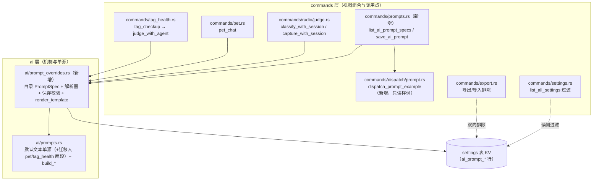
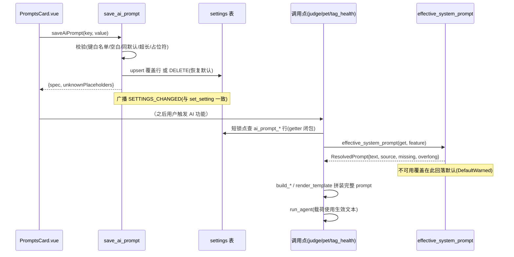
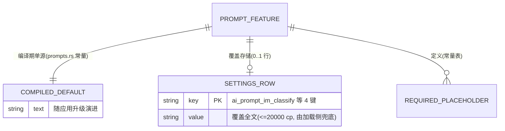

# editable-prompts 架构设计文档 (AD)

> 依据 `specs/editable-prompts/requirements.md`（SDD r2，验收与 NFR 权威）与
> `design.md` 方案 A（settings KV 覆盖 + 设置页内嵌编辑器）细化。
> 本文是 API 契约与数据模型的单一事实源 owner；编辑器布局与文案归 UIUX。
> 代码现状均已只读核实（行号为本文写作时点）。

## 1. 架构决策概要

核心决策：**不引入新表、不做缓存，提示词覆盖复用 settings KV（每功能一键，
`ai_prompt_*` 前缀），由 `ai/` 层新增的统一「目录 + 解析器」在每次 AI 调用点
现场解析（读覆盖 → 可用性校验 → 回落编译默认），编译常量保持默认文本唯一单源；
设置页经 2 个专用 Tauri command 查看/保存，校验（占位符/长度/与默认逐字一致）
单源在后端，前端仅做体验增强。**

理由：与 `ai_agents` 的 JSON-in-KV 先例同构（design.md 已选型方案 A）；解析器
无缓存直接保证 SDR「保存后下一次调用 100% 生效」的生效时延 NFR；默认文本仍为
编译常量，`prompts.rs` 现有内容断言测试零改动（测试锚点不丢）。

**架构特性排序（冲突时按序取舍）：健壮性 > 简单性 > 可测试性**
- 健壮性：坏覆盖（空白/缺占位符/超长/与默认一致）永不挂判定管道，一律回落内置默认（NFR 健壮性 100%）。
- 简单性：单用户本地应用，无缓存、无事件补偿、无新表无迁移；getter 闭包沿用既有约定，不顺势抽象。
- 可测试性：默认单源可编程断言；解析/校验是纯函数（getter 注入），覆盖/回落矩阵可穷举测试。

**design.md ④ 待落地清单的 AD 侧落点**：

| 待落地项 | 本文章节 |
|---|---|
| [AD] 存储契约（键命名/空值语义/上限/坏覆盖回落） | §4.3、§5 |
| [AD] 后端统一加载层（build_* 演进、getter 传入各调用链） | §3.1、§4.3.3 |
| [AD] 桌宠对话占位符改造（无覆盖行为逐字节不变） | §4.3.2 |
| [SDD/AD] 长度上限与校验 | §4.3.4 |
| 诊断导出排除提示词键 | §4.5、§7 |

## 2. 技术栈选择

完全沿用项目现有技术栈（Tauri 2 + Rust/rusqlite + Vue 3 + Pinia + vue-i18n +
Vitest；无新依赖、无新构建件）。无新增选型，故无备选对比项。

## 3. 系统模块与组件树

### 3.1 后端模块划分

按「机制归 ai 层、视图组合归 commands 层、安全结构原地不动」切分：



- **ai/prompt_overrides.rs（新增）**：提示词目录（4 个可编辑功能的 `PromptSpec`
  常量表）、运行时解析器 `effective_system_prompt`、保存校验、占位符单遍渲染
  `render_template`、占位符 token 扫描。纯函数为主（settings 经 getter 闭包
  注入，与 `ai/config.rs` 的 `load_agents(get)` 同一模式），不持连接不持锁。
- **ai/prompts.rs**：默认文本唯一单源。现有 `TOOLS_SYSTEM_PROMPT` /
  `CAPTURE_SYSTEM_PROMPT` 逐字节不动；`pet.rs` / `tag_health.rs` 的内联提示词
  文本迁入为 `PET_CHAT_SYSTEM_PROMPT` / `TAG_HEALTH_SYSTEM_PROMPT`（文案逐字节
  不变，仅落点移动——统一管理是本功能的直接依赖，非顺手重构）。`build_tools_prompt`
  / `build_capture_prompt` 增加 `system: &str` 参数（见 §4.3.3）。
- **commands/prompts.rs（新增）**：2 个 Tauri command 薄壳，组合 ai 目录 +
  dispatch 只读样例成前端视图模型。
- **commands/dispatch/prompt.rs**：拼装/laundering 逻辑零改动，仅新增
  `dispatch_prompt_example()`（复用真实 `dispatch_prompt` + 代表性示例字段，
  无第二模板、无漂移）。
- **不切分理由**：为什么不把目录放进 prompts.rs——prompts.rs 的既有身份是判定
  管线提示词 + 消息渲染，覆盖机制横跨 ai/ 与 commands/ 多调用点，独立模块边界
  清晰、测试面独立；为什么不把 pet/tag_health 默认文本留在原文件——ai 层引用
  commands 层是错误依赖方向，目录必须能引用全部默认文本。

### 3.2 前端组件树

```
SettingsTab.vue（既有）
└── SectionAgents.vue（既有 Agent 分区，卡片插位与折叠形态归 UIUX）
    └── PromptsCard.vue（新增：「提示词」卡）
        ├── 常驻警示条（协议句/出口门禁风险提示，i18n 静态文案）
        └── PromptFeaturePanel.vue × 5（每功能一折叠面板，props: spec）
            ├── 状态徽标：内置默认 / 自定义 / 内置默认·警示（source 字段驱动）
            ├── 生效文本区（default_warned 时附「已按内置默认生效」警示条）
            ├── textarea 编辑器 + 必要占位符清单提示（editable=false 时只读展示 + 原因说明）
            ├── 内置默认对照（defaultText，自定义状态下可展开）
            └── 操作行：保存 / 恢复默认（二次确认归 UIUX）；校验反馈条
                （缺失占位符 / 超长 / 未知占位符警告，同界面即时呈现）
        └── composables/usePromptEditor.ts（specs 加载、编辑缓冲、前端预校验、
            保存/重置状态机）＋ __tests__/usePromptEditor.spec.ts（src/AGENTS.md 铁律）
```

组件树要点：遵循 `src/AGENTS.md`——新领域卡照 `components/settings/` 既有形态
（如 `TagDispatchCard.vue`：**即时落库** + `ACTION_TOAST` 反馈，不走「保存设置」
缓冲；SDD 的逐卡「点击保存」交互与之匹配）；composable 必配测试；`src/api.ts`
加 2 个薄封装。

## 4. 关键接口定义

### 4.1 功能目录与存储键（权威常量表）

| 功能 id | 存储键（settings 表 key） | 可编辑 | 必要占位符（字面 token） |
|---|---|---|---|
| `im_classify` | `ai_prompt_im_classify` | 是 | `<AGENT_ID>` |
| `capture` | `ai_prompt_capture` | 是 | `<AGENT_ID>` |
| `pet_chat` | `ai_prompt_pet_chat` | 是 | `<CONTEXT>`、`<QUESTION>` |
| `tag_health` | `ai_prompt_tag_health` | 是 | （空集——词表与候选对由应用追加，见 §4.3.2） |
| `dispatch` | （无存储键） | **否（只读展示）** | 不适用 |

- 长度上限：`PROMPT_MAX_CHARS = 20_000`，单位统一 **Unicode code point**
  （Rust `chars().count()`；前端用 `[...str].length` 对齐，后端为最终权威）。
- `<AGENT_ID>` 为既有 token，沿用不改（改动它即改默认文本，破坏单源锚点）；
  pet_chat 新 token 采用同一 `<UPPER_SNAKE>` 风格，全功能一套占位符语法。
- 替换语义：`<AGENT_ID>` 沿用 `String::replace`（**全部出现**都替换）；必要占位符
  校验只要求「至少出现一次」。

### 4.2 Tauri command 契约

#### 4.2.1 `list_ai_prompt_specs`

查看面唯一入口（含派发只读项），一个命令满足 P95 < 300ms 的查看 NFR。

```ts
// 无参数
// 响应：PromptSpecInfo[]（固定 5 项，顺序即目录顺序）
{
  id: "im_classify",              // 功能标识（前端据此映射 i18n 名称）
  storageKey: "ai_prompt_im_classify" | null,  // dispatch 为 null
  editable: true,                 // dispatch 为 false
  defaultText: "...",             // 当前版本编译内置默认全文（dispatch = 示例渲染，见 §4.2.3）
  requiredPlaceholders: ["<AGENT_ID>"],
  lengthLimit: 20000,
  overrideText: "用户已存覆盖原文" | null,  // default_warned 时也返回原文（供修复），未存为 null
  source: "default" | "custom" | "default_warned",  // 生效来源（与运行时解析器同一函数产出）
  missingPlaceholders: ["<AGENT_ID>"],    // 仅 default_warned 时非空
  overlong: false                        // 仅 default_warned 时可能为 true
}
```

`source` 语义（与 SDD 状态图一一对应）：
- `default`：无行 / 值空白 / 值与默认逐字一致 → 生效文本 = 内置默认，无警示。
- `custom`：覆盖可用（非空白、非与默认逐字一致、≤上限、必要占位符齐全）。
- `default_warned`：行存在且非空白但不可用（缺占位符 / 超长）→ 生效文本 =
  内置默认 + 警示（「覆盖缺少当前版本要求的占位符，当前已按内置默认生效」由
  前端据 `missingPlaceholders` / `overlong` 渲染）。

#### 4.2.2 `save_ai_prompt`

保存与恢复默认的统一入口（恢复默认 = 保存空白，语义同 SDD 流程图 O2 合流）。

```ts
// 请求
{ key: "ai_prompt_pet_chat", value: "用户编辑文本" }
// 响应（成功）——主会话契约收敛定稿：返回该功能保存后的完整最新状态，
// 前端直接替换面板数据、零推导（吸收 UIUX「保存与恢复返回同一份状态结构」契约需求）
{ spec: PromptSpecInfo, unknownPlaceholders: ["<FOO>"] }  // 未知占位符警告非阻断
// 错误（AppError::Invalid，前端按文案呈现）
// - key 不在 4 个可编辑键集合（含 dispatch）→ "该提示词不支持编辑"
// - 非空白且 chars().count() > 20000 → 提示上限值
// - 非空白且缺失必要占位符 → 文案明确列出缺失的占位符名
```

处理规则（后端唯一权威，顺序即判定顺序）：
1. key 非可编辑 → `Invalid`；
2. `value.trim()` 空白 → **DELETE 该行**，响应 `spec.source = "default"`（等同恢复默认）；
3. `value == defaultText`（逐字节） → **DELETE 该行**，响应 `spec.source = "default"`
   （避免幻影自定义状态与默认演进后被旧文本钉死）；
4. 超长 → `Invalid`；缺必要占位符 → `Invalid`（列出缺失项）；
5. 通过 → upsert（`INSERT ... ON CONFLICT(key) DO UPDATE`，与 `set_setting` 同式），
   扫描未知占位符随响应返回警告；
6. 成功后 `events::broadcast(SETTINGS_CHANGED)`（与 `set_setting` 一致）。

未知占位符定义（保存时警告、运行时字面保留）：匹配 `<[A-Z][A-Z0-9_]*>` 的 token
且不在该功能已知占位符集合（= 必要占位符集合，现无可选占位符）——**仅匹配
`<UPPER_SNAKE>` 样式**，小写/混合大小写 token（如 `<agent_id>`）不告警、运行时
按普通文本字面保留。扫描器为手写
单遍匹配（不引入 regex 依赖），**仅后端实现**——前端只展示后端返回的警告清单，
避免扫描规则双端实现漂移；前端预校验仅做 spec 字段可直接推导的项（长度、必要
占位符包含、与默认一致提示），作为防呆体验增强。

#### 4.2.3 派发只读展示

`defaultText`（dispatch 项）= `dispatch_prompt_example()`：调用真实
`dispatch_prompt(1, "示例：整理周会纪要", Some("…"), &["…"], Some("…"))` 的渲染
结果——含数据声明、定界块与要求段的完整结构，单一模板零漂移；前端 UIUX 标注
「示例渲染」。dispatch 项其余字段为**固定值**：`storageKey=null`、`editable=false`、
`requiredPlaceholders=[]`、`overrideText=null`、`source` 恒 `"default"`、
`missingPlaceholders` 恒空、`overlong` 恒 `false`（无存储行，状态机不入态）。
保存派发键被 §4.2.2 规则 1 拒绝（安全结构不可编辑，NFR 安全项）。

#### 4.2.4 前端 api.ts 薄封装

```ts
listAiPromptSpecs: () => call<PromptSpecInfo[]>("list_ai_prompt_specs"),
saveAiPrompt: (key: string, value: string) => call<SavePromptResult>("save_ai_prompt", { key, value }),
// SavePromptResult = { spec: PromptSpecInfo, unknownPlaceholders: string[] }
```

前端设置协议（`SETTING_DEFAULTS` / `SETTING_KEYS`）**不加入** `ai_prompt_*` 键：
提示词文本只经专用命令进出，不经通用设置保存环（`SettingsTab.save` 的键清单
不含它们，杜绝通用保存环覆写路径）。

### 4.3 统一加载层与占位符协议

#### 4.3.1 解析器（ai/prompt_overrides.rs）

```rust
pub fn effective_system_prompt(
    get: &dyn Fn(&str) -> Option<String>,
    feature: PromptFeature,
) -> ResolvedPrompt            // { text: String, source, missing: Vec<&'static str>, overlong: bool }
```

运行时判定按**固定优先顺序**执行（与 §4.2.2 保存规则同序，消除「与默认一致但
缺占位符」类变体的歧义）：
1. 无行 / 空白 / **与默认逐字一致 → `Default`（无警示）**——逐字一致判定优先于
   缺占位符/超长判定（目录自检保证默认必含全部必要占位符，该变体实际不可达；
   顺序显式化以定分止争）；
2. 行存在且非空白，但不满足（≤20000 code points && 必要占位符全部字面包含）
   → 文本回落默认 + `DefaultWarned`（携带 `missing` / `overlong`）；
3. 其余（非空白、≠默认逐字、≤上限、占位符齐全）→ `Custom`，文本 = 覆盖原文。

**调用侧每次现场解析、无缓存**——这是「保存后下一次调用
100% 生效」NFR 的机制保证；代价评估见 §6。

保存 → 下一次调用生效的跨层时序（保存即时落库，调用点现场解析，中间无缓存）：



#### 4.3.2 桌宠对话与标签治理的拼装协议（无覆盖时逐字节不变）

- **pet_chat**（现 `pet.rs:135` format! 直拼）：默认文本迁入 prompts.rs 时把
  `{ctx}`/`{q}` 换为 `<CONTEXT>`/`<QUESTION>` token，其余文案逐字节保留；
  拼装改用 `render_template(template, &[("<CONTEXT>", ctx), ("<QUESTION>", q)])`。
  `render_template` 为**单遍扫描模板**的渲染（匹配到 token 输出替换值并跳过，
  替换值永不被二次扫描）——与 format! 语义一致，默认模板输出与今日逐字节相同。
- **tag_health**（现 `tag_health.rs:224` 词表追加）：指令文本（含尾部「词表：\n」
  框架）迁入 prompts.rs 逐字节不动；拼装 = `String::from(resolved.text)` 后照旧
  追加词表与候选对——追加结构由代码控制，必要占位符为空集。
- **im_classify / capture**：`build_*` 内部仍 `format!("{system}\n\n{rendered}")
  .replace("<AGENT_ID>", &agent.id)`——替换在拼接后的整串上做（保留现状语义
  含边界行为），默认路径输出与今日逐字节相同。与 pet 的单遍渲染存在有意的
  不对称：前者为兼容既有行为，后者为新协议按 format! 语义设计；差异与理由在
  两个函数的 doc comment 里注明。
- **dispatch**：拼装/laundering 零改动（安全红线）。

#### 4.3.3 build_* 签名演进与 getter 传入各调用链

```rust
// prompts.rs：默认文本成为参数（调用方先解析），渲染逻辑不变
pub(crate) fn build_tools_prompt(system: &str, agent: &AgentConfig, batch: &[AiMessage]) -> String
pub(crate) fn build_capture_prompt(system: &str, agent: &AgentConfig, input: &AiMessage) -> String
```

| 调用链 | 传入方式 |
|---|---|
| `judge.rs classify_with_session` / `capture_with_session` | 函数体内短锁取 conn → 本地 getter 闭包（与仓内既有重复小闭包约定一致，不顺势抽公共函数）→ `effective_system_prompt` → 释锁 → `build_*(&resolved.text, ...)`。锁窗口为微秒级点查，不跨 await |
| `pet.rs pet_chat` | 既有锁内已有 `get` 闭包（读 agent 配置同一窗口）→ 原地解析，锁外 `render_template` |
| `tag_health.rs tag_checkup` | 既有锁内（读 agent 同窗口）解析，把 `String` 传入 `judge_with_agent(agent, system, tags, report)`（签名加参） |
| dispatch（exec.rs / headless.rs） | 不改（只读展示走 §4.2.3） |

日志纪律（隐私 NFR）：`judge.rs` 现有 `log::debug!` 回显 prompt 前 500 字符——
`source == Custom` 时改为回显「[自定义覆盖 N 字符，内容不回显]」，default 来源
维持今日回显（默认文本是编译常量，非用户输入）。解析器在解析点以
`log::debug!` 记 feature/来源/长度（不记内容）。

#### 4.3.4 双重校验矩阵（保存阻断 vs 运行时回落）

| 条件 | 保存（save_ai_prompt） | 运行时（effective_system_prompt） |
|---|---|---|
| 空白 | 等同恢复默认（删行） | 回落默认，无警示 |
| 与默认逐字一致 | 等同恢复默认（删行） | 视为无覆盖（回落默认，无警示） |
| 超长（>20000 cp） | 阻断 `Invalid` | 回落默认 + `default_warned(overlong)` |
| 缺必要占位符 | 阻断 `Invalid`（列名） | 回落默认 + `default_warned(missing)` |
| 未知占位符 | 放行 + 响应警告 | 字面保留发给 agent |

注（边界差异显式化）：**空白行**仅可能经 `set_setting` 通用原语旁路产生（save
路径空白即删行，正常流程不落空白行）——运行时按无覆盖处理（`Default` 无警示），
与 SDD「坏覆盖兜底」场景（缺占位符/超长的 `DefaultWarned` 态）是两类不同状态；
矩阵运行时列的「空白 → 无警示」即此旁路路径的语义。

### 4.4 事件

| 事件名 | 发布者 | 消费者 | 数据结构 |
|---|---|---|---|
| `settings-changed`（复用既有 `SETTINGS_CHANGED`） | `save_ai_prompt` 成功后 | 既有监听者：桌宠窗口（去抖重载 settings store，见 `__tests__/PetApp.spec.ts:436`）与 `FeishuChatFilterManager.vue:317`（自刷新、不动 store）——对提示词保存**当前无害**：`ai_prompt_*` 已被 `list_all_settings` 过滤，触发的重拉不含提示词文本、成本为一次廉价全量设置点查；与 `set_setting` 语义一致保持广播 | 无 payload（沿用 events::broadcast 现状） |

### 4.5 契约面汇总（供主会话与 UIUX 收敛对齐）

1. 查看数据：`list_ai_prompt_specs` → 5 项 `PromptSpecInfo`（id / storageKey /
   editable / defaultText / requiredPlaceholders / lengthLimit / overrideText /
   source / missingPlaceholders / overlong），camelCase。
2. 保存与恢复：`saveAiPrompt(key, value)`；空白 = 恢复默认；错误文案（超长/缺
   占位符/不可编辑）由后端返回，前端原样呈现 + i18n 包装；未知占位符为成功响应
   内的警告清单。
3. 状态徽标三态：`default` / `custom` / `default_warned`（后者附
   `missingPlaceholders` / `overlong` 与「已按内置默认生效」警示、编辑器展示
   `overrideText` 原文供修复）。
4. 内置默认对照：`defaultText` 恒在载荷中（含 custom 状态）。
5. 派发：`editable=false` + `defaultText` 为示例渲染，无编辑入口。
6. 保存时机：**逐卡即时落库**（同 `TagDispatchCard` 模式，非「保存设置」缓冲）；
   操作按钮为每卡「保存 / 恢复默认」。反馈形态归 UIUX 定稿：卡内 4s 自隐提示行
   （不强制 ACTION_TOAST）。
7. i18n：后端只回 `id`；功能名/警示/按钮文案键命名空间定稿 `prompts.*`
   （zh-Hans / zh-Hant / en，键清单见 UIUX §8——UIUX 为文案 owner）。
8. 前端不感知存储键命名与解析规则（全部经 spec 载荷），`SETTING_DEFAULTS` /
   `SETTING_KEYS` 不含提示词键。

## 5. 数据模型

### 5.1 ER 图



### 5.2 Schema

**无新表、无迁移**（SQLite 迁移只追加红线——本功能零迁移，`ai_prompt_*` 行即用
即生；升级兼容性 NFR 由「无行 = 默认」天然满足）。复用既有表：

```sql
settings (key TEXT PRIMARY KEY, value TEXT NOT NULL)  -- 既有，不动
```

行生命周期：保存合规覆盖 → upsert；空白/与默认一致保存或恢复默认 → DELETE
（`save_ai_prompt` 内直接执行，不经 `set_setting`——后者只 upsert 无删除语义）。

### 5.3 事务边界与一致性策略

单行 KV 写（upsert 或 delete），无跨实体写入、无事件补偿；`Db(Mutex<Connection>)`
互斥锁天然串行化（单用户单进程）。读侧无缓存每次解析 → 保存与下一次调用之间
不存在staleness窗口；查看面与调用面共用同一解析函数，状态展示与实际生效
**按构造一致**。

### 5.4 隐私排除面（应用日志与导出）

自定义提示词明文（用户手输、可能含个人信息）不得出现在：

| 面 | 具体改法 |
|---|---|
| 应用日志 | 解析点只记 feature/来源/长度；`judge.rs` debug 回显对 custom 来源屏蔽内容（§4.3.3） |
| 全量 JSON 导出/导入（`export.rs`） | **导出侧**：`export_json_to` 的 settings 行过滤链（现 `is_secret_key` + `is_internal_setting_key`）追加 `!key.starts_with("ai_prompt_")`——覆盖文本不落导出文件。**导入侧**：`import_json_from` 是整体替换（DELETE 全表重灌，现仅秘钥行 stash-and-restore）——对本机 `ai_prompt_*` 行**复用秘钥的 stash-and-restore 模式**（导入前暂存、重灌后放回），文件内该前缀行照旧按同谓词过滤不导入。**主会话契约收敛定稿（原【待确认】）**：排除面限定为「随文件出机」的 JSON 导出通道（与秘钥排除同链）；净效果——同机 JSON 导入（含回滚旧 JSON 备份）不清空本机覆盖、每日自动备份是 VACUUM INTO 整库快照天然保留，**损失面仅剩跨机 JSON 迁移通道**（目标机导入后无这些行、回落默认，安全、可重录） |
| `list_all_settings` | 过滤 `ai_prompt_*` 前缀——通用设置存储不携带提示词文本，专用命令是**唯一受校验的读写口**（`get_setting`/`set_setting` 通用原语仍可旁路读写，运行时解析校验是兜底防线） |
| 支持报告（`diagnostics.rs`） | 现不倾印 settings 表；日志面经上述日志纪律收敛后无明文来源，无需改动 |

出机通道结论：自定义提示词发给 agent 的通道与既有提示词同链——远程 SSH 模式经
ssh stdin、`{prompt}`-in-argv 模式经进程 argv 出机；该通道为**既有事实**，非本
功能新增排除义务（排除面限于上表落盘/导出面）。

## 6. 非功能性设计 (NFR)

- **性能（查看 P95 < 300ms）**：`list_ai_prompt_specs` = 1 次 IPC + 4 次 settings
  主键点查（微秒级）+ 5 段编译常量序列化（约 10KB），本地路径总耗 < 10ms，预算
  充裕。
- **生效时延（下一次调用 100% 生效）**：调用侧每次读库无缓存。代价评估：每次
  AI 调用新增 1 次主键点查 + ≤20KB 文本的占位符包含检查（微秒~数十微秒），
  相对 agent 子进程 spawn + 推理（秒级）占比 < 0.01%，且省去缓存失效/广播机制
  （简单性排序的取含）。
- **安全**：派发定界块与数据声明零改动（只读展示）；`save_ai_prompt` 键白名单
  校验拒绝任意键写入；prompt 文本经 textarea（Vue 转义）呈现无 XSS 面；自定义
  提示词与今日消息正文走同一 stdin/{prompt} 通道，无新增注入面。
- **隐私**：§5.4 四面排除 + `ai_prompt_*` 键前缀单源谓词（`is_prompt_override_key`，
  供 export/list 共用，放 `ai/prompt_overrides.rs`）。
- **健壮性**：坏覆盖回落矩阵（§4.3.4）——判定管道只因覆盖选择不同文本，不新增
  任何失败路径；解析器为纯函数无 I/O 错误面。
- **兼容性 / 演进可预期性**：无迁移、无行即默认；升级后默认演进——未自定义者
  100% 用新默认（常量单源），已自定义者保持用户文本、缺新占位符时警示 + 回落
  （运行时校验天然覆盖，SDD 状态图「内置默认兼警示」态）。
- **可恢复性**：恢复默认 = 删行 → 生效文本 = 当前版本编译默认（逐字）。
- **可观测性**：保存/删除记 `log::info`（键 + 长度，无内容）；解析记 `log::debug`
  （feature + 来源 + 长度）；既有 AI 链路健康与会话记录不受影响。
  **可选增强【待确认】**（uiux-reviewer 建议）：支持报告 AI 链路段附一行「各功能
  当前提示词来源（内置默认/自定义）」——生成时对 4 个可编辑功能各跑一次
  `effective_system_prompt`（4 次主键点查 + 一行格式化，成本可忽略；只输出来源
  不输出内容、无隐私面新增），闭环 P2「自定义提示词致调用失败」的自助排障定位；
  一期不做，批量关卡时定夺。

## 7. 变更影响评估

**新增**：
- `src-tauri/src/ai/prompt_overrides.rs`（目录 + 解析 + 校验 + `render_template` + token 扫描 + 测试）
- `src-tauri/src/commands/prompts.rs`（2 command + 测试）＋ `lib.rs` 注册
- `src/components/settings/PromptsCard.vue`、`PromptFeaturePanel.vue`
- `src/composables/usePromptEditor.ts` + `src/composables/__tests__/usePromptEditor.spec.ts`
- 三语言 i18n 文案（键清单归 UIUX 定稿）

**修改**：
- `ai/prompts.rs`：迁入 `PET_CHAT_SYSTEM_PROMPT` / `TAG_HEALTH_SYSTEM_PROMPT`
  （文案逐字节不变）；`build_tools_prompt` / `build_capture_prompt` 加 `system` 参
  （波及调用方 `judge.rs` 与 `runner.rs` 测试内的一次调用点，按新签名传默认常量）
- `ai/mod.rs`：挂载 + re-export `prompt_overrides`
- `commands/radio/judge.rs`：两处 `*_with_session` 锁内解析；debug 日志按来源收敛
- `commands/pet.rs`：format! → `render_template`（锁内解析，锁外渲染）
- `commands/tag_health.rs`：指令文本迁出；`judge_with_agent` 加 `system` 参
- `commands/dispatch/prompt.rs`：新增 `dispatch_prompt_example`（拼装逻辑零改动）
- `commands/settings.rs`：`list_all_settings` 过滤 `ai_prompt_*`
- `commands/export.rs`：导出过滤 `ai_prompt_*`；导入对本机该前缀行 stash-and-restore
  （与秘钥同款，整体替换导入不清空本机覆盖，§5.4）
- `src/api.ts`：2 封装

**不改**：`db.rs`（零迁移）、`AgentConfig`/agents store、pk 出口协议、判定结果
落库链路、dispatch 定界块与 laundering、`src/stores/settings.ts`（提示词键不入
通用协议）。`runner.rs`/`invocation.rs` 等无关模块不顺势清理（改动范围铁律）。

## 8. 契约映射表（主会话收敛后）

> uiux-design.md 契约需求面已对表；原 4 条「待主会话收敛」已由 UIUX 文档定稿
> （见收敛记录 §9）。

| UIUX 契约需求面条目 | AD 对应契约 | 覆盖状态 |
|---|---|---|
| 五功能当前生效文本 + 来源标识（P0 查看） | `list_ai_prompt_specs` 的 `source` + `defaultText`/`overrideText` | 已覆盖 |
| 编辑保存与阻断反馈（缺占位符/超长，P0/P1） | 前端预校验拦截常态路径 + `save_ai_prompt` 的 `Invalid` 错误文案兜底（含占位符名/上限值；前端原样呈现文案，不解析结构化错误码） | 已覆盖 |
| 保存空白/与默认一致 = 恢复默认（防幻影自定义，P0） | `save_ai_prompt` 规则 2/3（删行，`spec.source:"default"`） | 已覆盖 |
| 一键恢复默认（P0） | `saveAiPrompt(key, "")`（同一入口；按钮交互/二次确认归 UIUX） | 已覆盖 |
| 保存/恢复返回同一份最新状态结构（前端零推导） | `save_ai_prompt` 成功响应含完整 `spec: PromptSpecInfo`（收敛定稿） | 已覆盖 |
| 内置默认对照（P1） | `defaultText` 恒在载荷 | 已覆盖 |
| 派发只读 + 原因说明（P1） | `editable:false` + 示例渲染 `defaultText` | 已覆盖 |
| 升级后缺新占位符的警示态与修复（P1） | `source:"default_warned"` + `missingPlaceholders`/`overlong` + `overrideText` 原文回填编辑器 | 已覆盖 |
| 未知占位符警告不阻断（P1） | `SavePromptResult.unknownPlaceholders` | 已覆盖 |
| 占位符清单展示位置与文案 | UIUX 定稿：占位符行 chips（「必要占位符」标签，点击插入光标处；空集不渲染） | 已收敛 |
| 常驻警示（协议句/出口门禁风险，P1） | UIUX 定稿：纯前端 i18n 静态文案（编辑器上方不可关闭警示条），无后端契约 | 已收敛 |
| 未配置 agent 也可查看（P2） | `list_ai_prompt_specs` 不依赖 agent 配置（仅读 settings 行） | 已覆盖 |
| 自定义提示词致调用失败的呈现（P2） | 复用既有 AI 判定失败路径 + 诊断面（无新契约） | 已覆盖 |
| 三语言文案键清单 | UIUX 定稿：`prompts.*` 命名空间（§8 全量键清单在 uiux-design.md §8） | 已收敛 |
| 逐卡即时保存 vs「保存设置」缓冲 | UIUX 复核一致：逐卡即时落库（QuotesEditorCard/AgentConfigCard/TagDispatchCard 同构先例） | 已收敛 |

## 9. 主会话契约收敛记录（2026-09-29）

UIUX 契约需求面与 AD 契约面的分歧裁决（AD 为 API 契约单一事实源 owner，UIUX 为
交互与文案 owner）：

1. **命令数定稿**：UIUX 语义占位 3 命令（list_ai_prompt_states /
   save_ai_prompt_override / clear_ai_prompt_override）收敛为 AD 的 2 命令——
   `list_ai_prompt_specs` + `save_ai_prompt`；恢复默认 = `saveAiPrompt(key, "")`。
2. **保存返回结构**：由 `{source, unknownPlaceholders}` 升级为
   `{spec: PromptSpecInfo, unknownPlaceholders}`（吸收 UIUX「同一份状态结构、前端
   不自行推导」诉求，省一次重拉往返）。
3. **错误呈现**：不引入结构化错误码（UIUX 原期望 PROMPT_MISSING_PLACEHOLDER /
   PROMPT_TOO_LONG 取消）——前端预校验拦截常态路径，后端 `Invalid` 文案兜底并
   原样呈现；与「扫描规则单端实现（仅后端）」的防漂移原则一致。
4. **功能 id 定稿**：`im_classify` / `capture` / `pet_chat` / `tag_health` /
   `dispatch`（UIUX 旧占位 quick_capture / todo_dispatch 作废）。
5. **组件命名定稿**：`PromptsCard.vue` + `PromptFeaturePanel.vue` +
   `usePromptEditor.ts`（UIUX 原占位 PromptManagerCard/PromptPanel/usePromptStates
   作废）。
6. **i18n 命名空间定稿**：`prompts.*`（UIUX 为文案 owner；AD 原 aiPrompt.* 建议
   作废）。
7. **UIUX 轻回流 1 条（批量读取端点 + 保存返回状态结构）**：由本 AD 吸收
   （§4.2.1 / §4.2.2），不回 SDD。
8. **export.rs 排除面**：维持双向排除（文件不含、文件内该前缀行不导入），语义限定为
   「随文件出机的 JSON 通道」；导入侧对本机 `ai_prompt_*` 行按秘钥同款
   stash-and-restore 保留——整体替换导入（含回滚旧 JSON 备份）不清空本机覆盖；
   每日 VACUUM INTO 备份天然保留提示词（§5.4 已更新表述，吸收 ad-reviewer M-1）。
9. **保存反馈形态**：卡内 4s 自隐提示行（UIUX 定稿），不强制 ACTION_TOAST。

## 附：测试策略（映射验收与 NFR）

1. **默认单源不破坏**：`prompts.rs` / `dispatch/prompt.rs` 现有内容断言测试零
   改动全绿（默认文本逐字节不变的直接证据）；`runner.rs` 测试中的
   `build_tools_prompt` 调用点按新签名传默认常量。
2. **解析/校验矩阵（prompt_overrides 单测，纯函数穷举）**：resolve 六分支
   （无行/空白/同默认/缺占位符/超长/合法），**含优先级用例**（与默认逐字一致的
   输入恒归 `Default` 无警示，不因其他条件进 `Warned` 分支——L-2 顺序锚定）；
   save 六分支（非法键/空白删行/同默认
   删行/超长/缺占位符列名/合法+未知占位符警告）；`render_template` 单遍不重扫
   （替换值含另一 token 字面量不被二次替换）与 format! 语义对拍；**目录自检**
   （每个可编辑 spec 的默认文本包含其全部必要占位符、4 键唯一、上限常量一致）。
3. **调用链集成（既有 fake-agent / stdin 落盘测试装置）**：pet_chat 自定义覆盖
   进 stdin 载荷、缺占位符覆盖回落默认载荷；pet 默认模板输出与改前逐字节一致
   （既有 `pet_chat_sends_context_and_trims_reply` 断言即锚点）；classify 覆盖
   生效；judge debug 日志 custom 来源不含内容（日志断言）。
4. **命令层（commands/prompts.rs）**：`list` 三态（含 default_warned 的
   overrideText 回传）；`save` 错误分支文案；dispatch 键拒绝。
5. **隐私面**：export.rs 导出文件不含 `ai_prompt_*` 行；**导入（整体替换）后本机
   `ai_prompt_*` 覆盖行原样保留**（stash-and-restore 断言，覆盖「同机回滚旧 JSON
   备份不清空提示词覆盖」场景——ad-reviewer M-1 回归）；`list_all_settings` 过滤。
6. **前端（Vitest）**：`usePromptEditor.spec.ts`——specs 载荷 → 三态映射、编辑
   缓冲与脏检查、前端预校验（长度/必要占位符/与默认一致提示）、保存/恢复状态机、
   后端错误与未知占位符警告的呈现转换。
7. **E2E（e2e-acceptance 阶段）**：设置页提示词卡用户场景（查看/编辑/阻断警示/
   恢复默认/派发只读），以 agent 调用载荷核对生效断言（SDD §5 观察点约定）。
