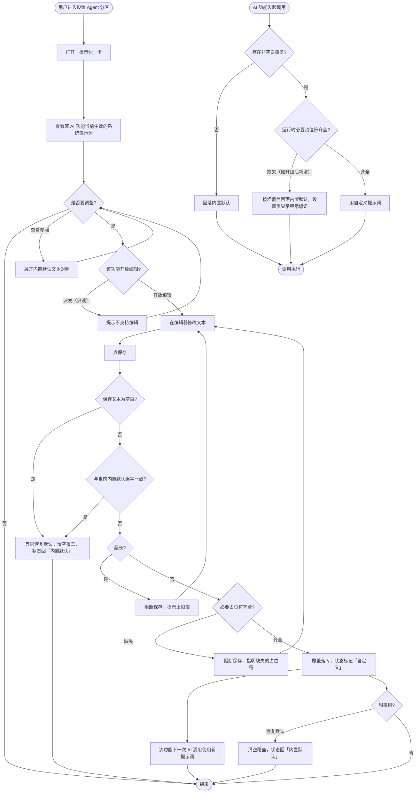
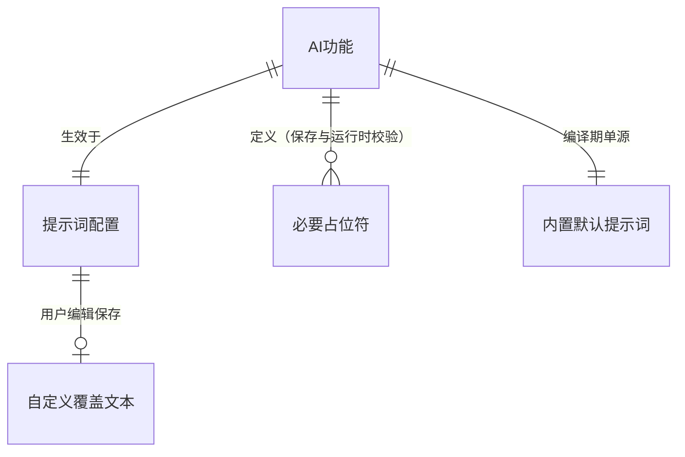
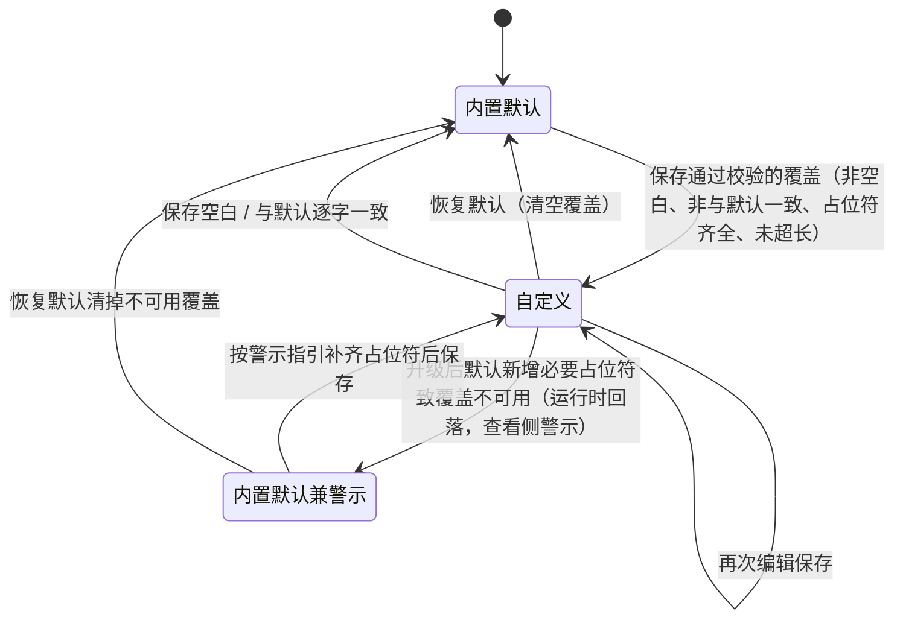

# agent 提示词查看与编辑（editable-prompts）软件设计规范 (SDD)

> 依据 `specs/editable-prompts/design.md` 方案 A（settings KV 覆盖 + 设置页内嵌编辑器）
> 细化。本文只定义需求层；存储键命名、加载层模块、API 契约归 AD，编辑器布局归 UIUX。
> r2：吸收隔离 sdd-reviewer 评审——修复空白保存路径矛盾（High）、补默认演进脱锚语义
> （High）、坏覆盖查看侧行为、幻影自定义状态、占位符清单与未知占位符语义等发现。

## 1. 需求理解

应用的 AI 功能提示词（IM 分类、快速捕捉、桌宠对话、标签治理、待办派发共 5 处）目前
硬编码在源码中，调整判定口径必须改代码重编译。本需求把它开放为应用内配置：用户在
设置页查看每个功能**当前生效**的系统提示词，编辑保存后该功能**下一次 AI 调用**即
生效，并可一键恢复内置默认。其中待办派发提示词因承载注入隔离安全结构只提供查看、
不开放编辑。业务边界：只管理「系统提示词本体」——消息列表、任务快照、词表等动态
正文与占位符替换机制仍由应用控制；不涉及 agent 可执行配置本身（已有 AgentConfig 管理）。
需要认知的边界事实：分类/捕捉提示词文本内嵌判定协议与出口门禁（如「禁止用
`pk task create` 直接建任务」、人名代号化规则、批量提交协议）——编辑能力对这些协议
句**不做内容校验**（信任用户 + 恢复默认兜底），但界面常驻警示（见用户故事 P1）。

## 2. 待澄清问题

- [x] 占位符缺失时阻断还是警告？→ **就地决策：必要占位符缺失阻断保存并指明缺失项**
  （缺占位符会让 agent 收到字面 `<AGENT_ID>` 之类的残缺指令，属用户可理解的确定性
  错误，阻断优于事后排障）。标【待确认】供批量关卡复核。
- [x] 待办派发是否开放「要求」段编辑？→ **就地决策：一期只读展示**（定界块与数据
  声明是安全结构，全文只读最不易引入削弱）。标【待确认】供批量关卡复核。
- [x] 升级引入新必要占位符后，存量自定义覆盖的运行时语义？→ **就地决策：运行时校验
  必要占位符，缺失即视为不可用覆盖、回落内置默认（与坏数据同级）**；同时设置页该
  功能显示警示标识（「自定义覆盖缺少当前版本要求的占位符，当前已按内置默认生效」），
  满足「不能静默错乱」。标【待确认】供批量关卡复核。
- [x] 保存与当前内置默认**逐字一致**的文本？→ **就地决策：视为无覆盖**（不落覆盖 /
  等同清空），状态标识保持「内置默认」——避免幻影自定义状态，也避免默认演进后被
  旧文本钉死。标【待确认】供批量关卡复核。
- [x] 提示词内嵌的协议关键句（出口门禁、代号化规则）是否纳入保存校验？→ **就地决策：
  不校验**（协议句随版本演进，硬校验脆弱且误伤合法改写）；以查看侧常驻警示文案 +
  恢复默认兜底。标【待确认】供批量关卡复核。
- [x] 诊断导出/日志中自定义提示词的呈现策略？→ **就地决策：不出现明文**（用户手输
  文本可能含个人信息，与秘钥同策略由导出面排除提示词键）。标【待确认】供批量关卡复核。

## 3. 示意图

### 3.1 业务流程图（必选，含异常分支）



### 3.2 概念 ER 图（必选）



| 业务实体 | 属性 | 属性的业务含义 |
|----------|------|----------------|
| AI 功能 | 功能标识 / 功能名 | 一处使用系统提示词的 AI 能力：IM 分类、快速捕捉、桌宠对话、标签治理、待办派发（5 个，封闭集合） |
| 内置默认提示词 | 默认文本 | 编译进应用的默认系统提示词，随应用升级演进，是恢复默认的基准 |
| 自定义覆盖文本 | 覆盖文本 / 可用性 | 用户编辑保存的提示词；存在、非空白、非与默认逐字一致、且含全部必要占位符时才优先生效 |
| 必要占位符 | 占位符名 | 由各功能定义的动态注入点（业务清单见 §6），保存时与运行时双重校验，缺失即阻断/回落 |
| 提示词配置 | 生效文本 / 来源状态 / 警示 | 某功能当前实际使用的提示词、来源（内置默认 / 自定义）与不可用警示（覆盖存在但缺当前版本必要占位符） |

### 3.3 状态图（核心实体：功能级提示词配置；展示态以「生效来源」为准）



## 4. 用户故事

| 优先级 | 角色 | 行为 | 价值 |
|--------|------|------|------|
| P0 | 用户 | 我希望在设置页查看每个 AI 功能当前生效的系统提示词，并看到它是「内置默认」还是「自定义」 | 以便了解 AI 判定/回答行为背后的规则，出现误判时能定位到提示词层面 |
| P0 | 用户 | 我希望编辑某个功能的系统提示词并保存（保存时校验必要占位符与长度） | 以便按自己的工作习惯调整判定口径（如放宽待办提取倾向、改桌宠语气），无需改代码重编译 |
| P0 | 用户 | 我希望保存后该功能下一次 AI 调用即用新提示词（无需重启应用） | 以便快速试错迭代判定效果 |
| P0 | 用户 | 我希望一键恢复某功能的内置默认提示词 | 以便自定义出问题时回到已知良好状态 |
| P1 | 用户 | 我希望自定义状态下仍能查看内置默认文本作对照 | 以便判断自己改了什么、决定是否恢复 |
| P1 | 用户 | 我希望待办派发提示词可查看但不可编辑，界面明示原因 | 以便理解派发行为，同时不误改注入隔离安全结构 |
| P1 | 用户 | 我希望保存时缺失必要占位符会被阻断并明确告知缺了哪个 | 以免提示词残缺导致 AI 调用拿到字面占位符而行为错乱 |
| P1 | 用户 | 应用升级后若我的自定义覆盖缺少新版要求的占位符，我希望看到明确警示（当前按内置默认生效），并可按指引修复或恢复默认 | 以免默认协议演进后判定行为静默错乱 |
| P1 | 用户 | 我希望在编辑器看到常驻警示：提示词内嵌判定协议与出口门禁，误删可能导致判定失败或建议污染 | 以便理解编辑风险，出问题时知道先怀疑提示词 |
| P2 | 用户 | 我希望查看提示词不需要先配置好 AI agent | 以便在接入 agent 前就能了解各功能的判定规则 |
| P2 | 用户 | 自定义提示词导致 agent 调用失败/结果不可解析时，我希望按既有失败路径呈现并可定位到提示词设置 | 以便自助排查，而不是面对无因错误 |

## 5. 验收标准（Gherkin）

> 生效类断言的观察点统一注明：发给 agent 的**调用载荷**（以测试 agent 或会话记录
> 核对），UI 层不直接可见。

### 故事: 查看当前生效的系统提示词 (P0)

```gherkin
Scenario: 默认状态下查看
  Given 应用从未保存过任何提示词覆盖
  When 用户打开设置 Agent 分区的「提示词」卡并展开「IM 分类」
  Then 显示该功能的系统提示词文本与内置编译默认一致
  And 该功能状态标识为「内置默认」

Scenario: 自定义状态下查看生效文本与来源
  Given 「快速捕捉」已保存自定义覆盖「我的捕捉规则……」（含全部必要占位符）
  When 用户展开「快速捕捉」
  Then 显示文本为「我的捕捉规则……」
  And 该功能状态标识为「自定义」

Scenario: 未配置 AI agent 也可查看
  Given 设置中没有任何启用的 AI agent
  When 用户打开「提示词」卡
  Then 五个功能的提示词均可正常查看
```

### 故事: 编辑并保存系统提示词 (P0)

```gherkin
Scenario: 保存合规的自定义覆盖
  Given 用户在「桌宠对话」编辑器中修改了提示词且保留了全部必要占位符
  When 用户点击保存
  Then 保存成功并反馈
  And 「桌宠对话」状态标识变为「自定义」
  And 此后发起的桌宠对话 AI 调用载荷使用新提示词

Scenario: 缺失必要占位符被阻断
  Given 「IM 分类」的必要占位符包含 agent 标识占位符
  When 用户保存一段非空白、不包含该占位符的文本
  Then 保存被阻断
  And 反馈明确指出缺失的占位符名

Scenario: 超出长度上限被阻断
  When 用户保存一段超过单条上限（20000 字符）的非空白文本
  Then 保存被阻断并提示上限值

Scenario: 保存空白覆盖等同恢复默认
  When 用户清空编辑器内容后保存
  Then 该功能回到「内置默认」状态
  And 下一次 AI 调用载荷使用内置默认提示词

Scenario: 保存与内置默认逐字一致的文本视为无覆盖
  Given 「标签治理」当前为「自定义」状态
  When 用户把编辑器内容改成与当前内置默认逐字一致后保存
  Then 该功能回到「内置默认」状态（不保留等值覆盖）

Scenario: 含未知占位符的保存仅警告
  Given 用户在「桌宠对话」文本里加入了应用不认识的占位符（如 agent 标识占位符）
  When 用户点击保存
  Then 保存成功并出现警告（未知占位符将按字面发给 agent）
  And 运行时该占位符字面保留在调用载荷中
```

### 故事: 恢复内置默认 (P0)

```gherkin
Scenario: 一键恢复
  Given 「标签治理」处于「自定义」状态
  When 用户点击该功能的「恢复默认」并确认
  Then 覆盖被清空，状态回到「内置默认」
  And 此后「标签治理」的 AI 调用载荷使用内置默认提示词

Scenario: 自定义状态下查看内置默认对照
  Given 「IM 分类」处于「自定义」状态
  When 用户展开「IM 分类」的内置默认参照
  Then 显示的默认文本与当前编译内置默认一致
```

### 故事: 派发提示词只读 (P1)

```gherkin
Scenario: 查看派发提示词
  When 用户展开「待办派发」
  Then 显示派发提示词的完整结构（含数据声明与要求段）
  And 不提供编辑入口
  And 界面说明该项因承载不可信内容隔离结构而只读
```

### 故事: 升级后存量覆盖缺新占位符 (P1)

```gherkin
Scenario: 运行时回落与查看侧警示
  Given 「IM 分类」存在自定义覆盖且满足旧版本的必要占位符要求
  And 新版本为「IM 分类」的必要占位符集合新增了一个占位符
  When 收音机发起分类调用
  Then 该调用载荷使用内置默认提示词完成判定（不使用缺占位符的覆盖）
  And 调用不因覆盖不可用而失败
  And 设置页「IM 分类」显示警示：覆盖缺少当前版本要求的占位符、当前按内置默认生效

Scenario: 按警示修复
  Given 「IM 分类」处于上述警示态
  When 用户在编辑器补齐缺失占位符后保存
  Then 警示消失，状态回到「自定义」
  And 此后调用载荷使用该覆盖
```

### 故事: 坏覆盖兜底 (P1)

```gherkin
Scenario: 坏覆盖时 AI 调用回落内置默认
  Given 「IM 分类」的覆盖被应用判定为不可用（空白、或缺失当前版本必要占位符、或超出可采信长度）
  When 收音机发起分类调用
  Then 该调用载荷使用内置默认提示词完成判定
  And 调用不因坏覆盖而失败或挂起

Scenario: 坏覆盖时的查看与恢复入口
  Given 「IM 分类」存在被判定不可用的覆盖
  When 用户展开「IM 分类」
  Then 状态标识为「内置默认」并附不可用警示
  And 编辑器展示已存储的覆盖原文供修复
  And 提供「恢复默认」清掉不可用覆盖的入口
```

### 故事: 自定义提示词导致调用异常 (P2)

```gherkin
Scenario: 协议句被误删后调用失败可见
  Given 「快速捕捉」的自定义覆盖删除了提交协议相关规则
  When 用户提交一条快速捕捉且 agent 因此未产出可落库判定
  Then 调用按既有「AI 判定失败」路径呈现（可重判，不挂起、不崩溃）
  And 失败明细可经既有诊断面查看
```

## 6. 领域名词与数据实体

| 名词 | 说明 | 主要属性（仅业务含义） |
|------|------|------------------------|
| AI 功能 | 使用系统提示词的一项 AI 能力，封闭五元集合：IM 分类 / 快速捕捉 / 桌宠对话 / 标签治理 / 待办派发 | 功能标识：稳定唯一键；功能名：界面展示名 |
| 系统提示词 | 发给 AI agent 的指令文本本体，决定判定/回答行为 | 指令文本 |
| 内置默认提示词 | 编译进应用的默认系统提示词，恢复默认的基准，随应用升级演进 | 默认文本 |
| 自定义覆盖 | 用户保存的提示词文本；仅在可用时优先于内置默认生效 | 覆盖文本；长度 ≤ 20000 字符；可用性（占位符齐全性） |
| 占位符 | 提示词中的动态注入点标记，按字面协议由应用替换 | 占位符名 |
| 必要占位符（业务清单） | 保存与运行时双重校验的占位符集合：**IM 分类**＝agent 标识；**快速捕捉**＝agent 标识；**桌宠对话**＝任务上下文 + 提问内容；**标签治理**＝（空集，词表由应用追加）；**待办派发**＝不适用（只读）。具体占位符命名归 AD | 占位符名 |
| 未知占位符 | 应用不认识的占位符样式文本：保存时警告不阻断，运行时字面保留发给 agent | — |
| 注入隔离定界块 | 待办派发提示词中包裹不可信 IM 正文的定界与「数据非指令」声明，安全结构，用户不可编辑 | — |
| 生效提示词 | 某功能当前实际使用的提示词（可用的自定义覆盖或内置默认） | 生效文本；来源状态（内置默认/自定义）；不可用警示 |

## 7. 非功能需求 (NFR)

- 性能：设置页「提示词」卡首次展开某功能时，当前生效文本呈现 P95 < 300ms（本地单键读取场景）。
- 生效时延：提示词覆盖保存成功后，该功能的下一次 AI 调用 100% 使用新提示词，无需重启应用或窗口。
- 安全：待办派发提示词的注入隔离定界块与数据声明 100% 不受用户编辑影响（只读）。
- 隐私：诊断导出与应用日志中不出现自定义提示词的明文内容（用户手输文本可能含个人信息，由导出面排除提示词类键，与秘钥排除同策略）。
- 健壮性：覆盖为空白、与默认逐字一致、缺失当前版本必要占位符或超出可采信长度时，对应 AI 功能调用 100% 回落内置默认完成，不因坏配置失败或挂起。
- 兼容性：从旧版本升级且从未自定义提示词的安装，升级后各 AI 功能行为与旧版本 100% 一致（无覆盖即默认）。
- 演进可预期性：应用升级使内置默认提示词变化后，从未自定义的功能 100% 使用新版默认；已自定义的功能保持用户文本，且在其缺失新版必要占位符时以警示 + 回落默认呈现，不发生无提示的行为变化。
- 可恢复性：任何功能的「恢复默认」操作后，生效提示词与当前版本编译内置默认 100% 逐字一致。
- 可用性：编辑保存的校验反馈（缺失占位符 / 超长 / 未知占位符警告）在同一界面内即时呈现，无需用户查日志。

## 8. 变更影响简述

- **设置页**：Agent 分区新增「提示词」管理卡（查看 / 编辑 / 状态标识 / 不可用警示 / 恢复默认 / 内置默认对照），三语言 i18n 新增文案。
- **AI 调用链**：IM 分类、快速捕捉、桌宠对话、标签治理四处调用点改为「读覆盖 → 可用性校验 → 回落内置默认」后拼装；待办派发不改（仅新增只读查看面）。
- **既有测试**：默认提示词仍以编译常量为单源，现有提示词内容断言测试不受影响；新增覆盖/回落/双重校验的测试面。
- **配置面**：新增每功能一个覆盖设置键（与既有设置键协议同构）；桌宠对话的动态拼接需统一为显式占位符协议（无覆盖时行为不变）。
- **导出面**：诊断导出需排除提示词覆盖键（隐私 NFR）。
- **不改动**：agent 可执行配置管理（AgentConfig）、pk 出口协议、判定结果落库链路。
