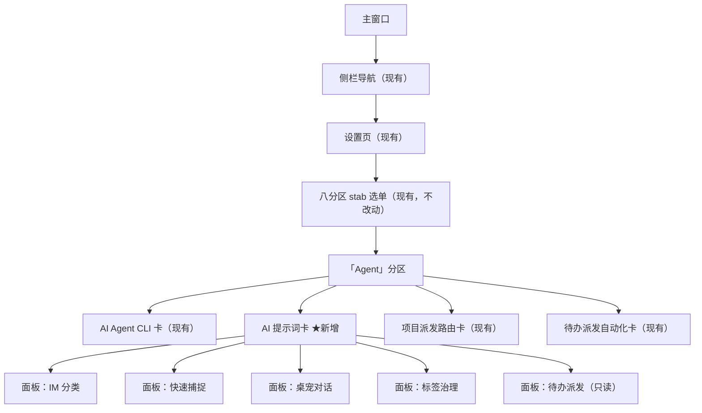
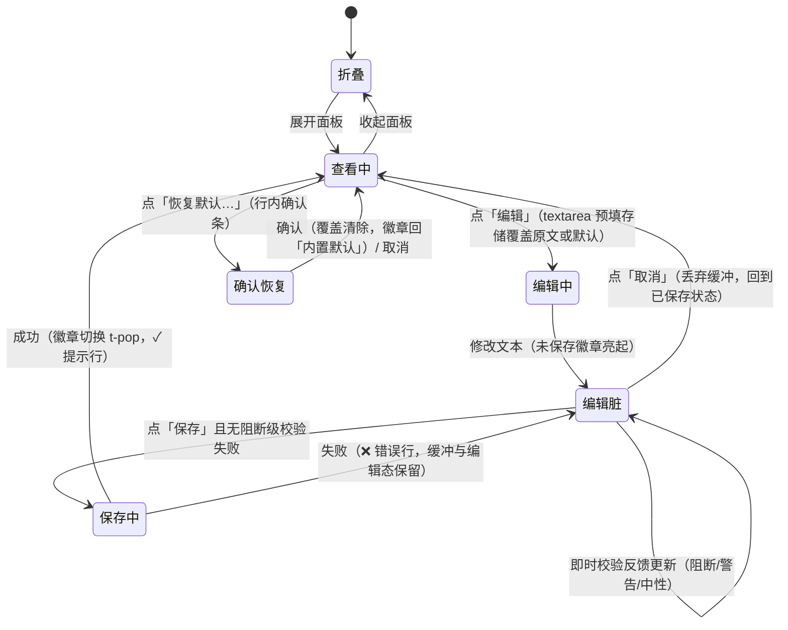

# agent 提示词查看与编辑（editable-prompts）UIUX 设计文档

> 依据 `specs/editable-prompts/requirements.md`（SDD r2）产出；规模分级 **L**（同 design.md）。
> 本文不重复 SDD 的业务验收（占位符阻断语义、生效载荷、回落语义以 SDD 为权威），
> 聚焦：信息架构、交互状态覆盖、可访问性、边缘 case、视觉方向与 token 委托、契约需求面。
>
> **纪律偏差声明**：本会话可用技能列表无 `frontend-design` / `ui-ux-pro-max`（宿主侧软链分发
> 未覆盖本 ZCode 会话，与 design.md 对 brainstorming 的偏差同例）。§6.1 视觉方向按其纪律
> 手动行使、§6.2 实现规则以项目自有设计系统单源 `docs/design/DESIGN_SYSTEM.md` + `src/dex.css`
> 为 token 权威替代；§11 原型由本技能直接产出（本应解封 frontend-design build）。
> 「反 AI 模板自检」基于原型渲染结构 + 既有系统实测 token 自检，**截图级复核移交
> uiux-reviewer 复评轮**（reviewer 以 Playwright 打开原型截图评估）。标【待确认】。

## 1. UIUX 影响评估

| 维度 | 评估问题 | 本功能结论 |
|------|---------|-----------|
| 展示 | 数据/结果用户需要看到吗？在哪看？ | **有影响**。5 处 AI 功能的系统提示词首次对用户可见：当前生效文本、来源状态（内置默认/自定义）、内置默认对照、不可用警示，全部在设置页 Agent 分区新增「AI 提示词」卡内呈现（长文本 ~2000+ 字符，需专用查看/编辑视图） |
| 触发 | 用户如何发起？入口在哪？ | **有影响**。查看/编辑/恢复默认的入口在设置页 Agent 分区；每功能一个可折叠面板 + 卡内独立保存按钮（不走页面级「保存设置」） |
| 反馈 | 进行中/完成后如何感知？ | **有影响**。保存成功/失败、校验反馈（缺失占位符/超长/未知占位符/空白/与默认一致）需同界面即时呈现（SDD NFR「可用性」）；状态徽章（内置默认→自定义）随保存切换 |
| 异常 | 出错时如何知道并处理？ | **有影响**。读取失败、保存失败、升级后覆盖缺新占位符的警示态、坏覆盖修复入口——每个异常都有专属 UI 态与出路（重试/修复/恢复默认） |
| 变更 | 是否动到现有界面/导航/已有交互？ | **有影响**。Agent 分区在 AI Agent CLI 卡之后插入一张新卡（现有卡顺序、stab 导航、全局保存链路均不动）；三语言 i18n 新增 `prompts.*` 命名空间 |

**评估结论**：**需要 UIUX 设计**（五维度全部有影响）。

**理由**：本功能把 5 处不可见策略文本变成用户可运营配置，核心交付物就是一组新视图（查看屏 + 编辑器 + 状态徽章 + 警示态）；且长文本编辑、双重校验反馈、升级脱锚警示等边缘态密度高于一般设置项，必须完整设计交互状态。

## 契约需求面（必选）

> UIUX → AD 单向契约需求传递。**UIUX 不定义 API 结构，只定义对 API 的需求**。
> 本项目为 Tauri 桌面应用，端点动词以 `invoke <command>` 表达；命令命名与载荷结构归 AD 定夺。
> **主会话契约收敛注记（r2）**：下表命令名为本技能的语义占位，已由 AD 定稿收敛为
> `list_ai_prompt_specs`（查看面唯一入口）与 `save_ai_prompt(key, value)`（保存与
> 恢复默认统一入口，恢复默认 = 保存空白，成功响应含该功能完整最新状态结构）——
> 见 architecture.md §9 收敛记录；功能 id 定稿 `im_classify` / `capture` / `pet_chat`
> / `tag_health` / `dispatch`（本文旧占位 quick_capture / todo_dispatch 作废）。
> 语义内容（一次拉取 5 功能视图数据等）不变，以下表格按语义占位保留原状。

### 触发入口表

| 入口名 | 用户操作 | 调用能力 | 期望端点动词 |
|--------|---------|---------|-------------|
| 提示词卡装载 | 进入设置 Agent 分区（自动，与 agentsStore.load 并行） | 一次拉取 5 功能的提示词视图数据（生效文本、来源状态、内置默认文本、必要占位符集合、长度上限、只读标志、不可用警示+缺失占位符） | `invoke list_ai_prompt_states`（读，全量单次） |
| 保存覆盖（每面板） | 编辑态点「保存」 | 前端即时校验后提交覆盖文本；后端**兜底复验**（必要占位符/长度），通过则落库并返回最新状态 | `invoke save_ai_prompt_override` |
| 恢复默认（每面板） | 查看态点「恢复默认」→ 行内确认 | 清除该功能覆盖，返回最新状态 | `invoke clear_ai_prompt_override` |
| 占位符插入（增强） | 点击必要占位符 chip | 纯前端（光标处插入），无后端调用 | N/A |

> 保存语义需求：空白文本 / 与当前内置默认逐字一致的文本，后端等同「清除覆盖」处理并返回
> 「内置默认」状态（SDD §2 就地决策）；保存与恢复默认返回**同一份状态结构**（徽章、警示、
> 生效文本），前端不自行推导。

### 反馈通道表

| 场景 | 机制 | UI 状态 |
|------|------|--------|
| 装载提示词视图 | 同步 invoke（本地 SQLite，毫秒级） | LCD 查看屏骨架（「读取中…」+ 扫描线）→ 就绪渲染；失败显示错误行 + 重试 |
| 保存覆盖 | 同步 invoke | 保存按钮 busy（禁用 + 「保存中…」）→ 成功：卡内 ✓ 提示行 + 徽章切换 t-pop；失败：卡内 ❌ 错误行，编辑态与缓冲保留 |
| 恢复默认 | 同步 invoke | 确认按钮 busy → 成功：徽章回「内置默认」+ ✓ 提示行 |
| 校验反馈（缺失占位符/超长/未知占位符/空白/同默认） | 纯前端即时（输入 debounce ~200ms） | 编辑器下方校验区分级着色（阻断红/警告黄/中性灰），`aria-live` 播报 | 
| 生效确认 | 无推送 | 「下一次调用即生效」文案承载（SDD 生效语义：下一次调用，无热重载广播） |

> 无异步任务、无轮询/推送需求。

### 展示字段表

| 视图 | 字段名 | 来源实体.属性 | 格式约束 |
|------|--------|--------------|---------|
| 面板折叠头 | 功能名 | AI功能.功能名（i18n） | text |
| 面板折叠头 | 来源状态徽章 | 提示词配置.来源状态 | 枚举：内置默认 / 自定义 |
| 面板折叠头 | 不可用警示标志 | 提示词配置.警示 | boolean（渲染警示徽章 + 警示行） |
| 查看屏 | 当前生效文本 | 提示词配置.生效文本 | 长文本，等宽字体，只读 |
| 编辑器（初始值） | 已存储覆盖原文 | 自定义覆盖文本.覆盖文本 | 长文本（含不可用覆盖的原文，供修复）；无覆盖时 = 生效文本（即默认） |
| 对照区 | 内置默认文本 | 内置默认提示词.默认文本 | 长文本，只读（当前版本） |
| 占位符行 | 必要占位符集合 | 必要占位符.占位符名 | chip 列表（标签治理为空集时不渲染该行） |
| 校验区 | 长度上限 | 自定义覆盖文本.长度 ≤ 20000 | 计数器 `n / 20000` |
| 警示行 | 缺失占位符名单 | 提示词配置.警示.缺失占位符 | 逗号分隔占位符名 |
| 面板头 | 只读标志（派发） | AI功能.功能标识=todo_dispatch | 固定只读面板（无编辑入口） |

### 交互状态表

| 状态 | 触发条件 | 期望错误码 |
|------|---------|-----------|
| 空 | 从未保存覆盖（初始安装/升级） | — （非真空态：查看屏显示内置默认，徽章「内置默认」） |
| loading | 装载 invoke 进行中 | — |
| 成功 | 装载/保存/恢复默认返回 | — |
| 失败-读取 | 装载 invoke 抛错 | 通用 invoke 错误（UI 呈现 errorMessage 文本 + 重试） |
| 失败-保存 | 保存 invoke 抛错（含后端兜底复验不通过） | 后端 `Invalid` 兜底文案（含缺失占位符名/上限值；前端原样呈现，不解析结构化错误码——主会话收敛定稿，原 PROMPT_* 语义占位码作废）/ 通用 invoke 错误 |
| 异常-坏覆盖 | 存量覆盖缺失当前版本必要占位符（或超可采信长度） | — （非错误：状态数据内带警示标志，查看侧渲染警示态；调用链回落默认是后端行为） |
| 权限 | 无此场景（单用户本地应用） | N/A |

```json
// contract.json（机器可读，与上表一致；命令名与错误码为语义占位，最终归 AD）
{
  "entryPoints": [
    {"name": "提示词卡装载", "userAction": "进入设置 Agent 分区（自动）", "capability": "list_ai_prompt_states", "endpointVerb": "invoke list_ai_prompt_states"},
    {"name": "保存覆盖", "userAction": "编辑态点「保存」", "capability": "save_ai_prompt_override", "endpointVerb": "invoke save_ai_prompt_override"},
    {"name": "恢复默认", "userAction": "查看态点「恢复默认」并确认", "capability": "clear_ai_prompt_override", "endpointVerb": "invoke clear_ai_prompt_override"}
  ],
  "feedbackChannels": [
    {"scenario": "装载提示词视图", "mechanism": "同步", "uiState": "LCD 骨架「读取中…」→ 就绪 / 失败错误行 + 重试"},
    {"scenario": "保存覆盖", "mechanism": "同步", "uiState": "保存 busy → ✓ 提示行 + 徽章切换 / ❌ 错误行（编辑态保留）"},
    {"scenario": "恢复默认", "mechanism": "同步", "uiState": "确认 busy → 徽章回「内置默认」+ ✓ 提示行"},
    {"scenario": "编辑校验", "mechanism": "同步", "uiState": "校验区分级着色（阻断红/警告黄/中性灰），aria-live"}
  ],
  "displayFields": [
    {"view": "详情", "fieldName": "功能名", "source": "AI功能.功能名", "format": "text"},
    {"view": "详情", "fieldName": "来源状态徽章", "source": "提示词配置.来源状态", "format": "enum:default|custom"},
    {"view": "详情", "fieldName": "不可用警示标志", "source": "提示词配置.警示", "format": "boolean"},
    {"view": "详情", "fieldName": "当前生效文本", "source": "提示词配置.生效文本", "format": "longtext,readonly"},
    {"view": "详情", "fieldName": "已存储覆盖原文", "source": "自定义覆盖文本.覆盖文本", "format": "longtext"},
    {"view": "详情", "fieldName": "内置默认文本", "source": "内置默认提示词.默认文本", "format": "longtext,readonly"},
    {"view": "详情", "fieldName": "必要占位符集合", "source": "必要占位符.占位符名", "format": "chips[]"},
    {"view": "详情", "fieldName": "长度上限", "source": "自定义覆盖文本.长度", "format": "counter:n/20000"},
    {"view": "详情", "fieldName": "缺失占位符名单", "source": "提示词配置.警示.缺失占位符", "format": "csv"},
    {"view": "详情", "fieldName": "只读标志（派发）", "source": "AI功能.功能标识", "format": "readonly-panel"}
  ],
  "interactionStates": [
    {"state": "空", "trigger": "从未保存覆盖", "expectedErrorCode": null},
    {"state": "loading", "trigger": "装载 invoke 进行中", "expectedErrorCode": null},
    {"state": "成功", "trigger": "装载/保存/恢复默认返回", "expectedErrorCode": null},
    {"state": "失败", "trigger": "装载 invoke 抛错", "expectedErrorCode": "invoke:generic"},
    {"state": "失败", "trigger": "保存时后端兜底复验缺失必要占位符", "expectedErrorCode": "Invalid（后端兜底文案，含占位符名；主会话收敛：无结构化错误码）"},
    {"state": "失败", "trigger": "保存时超长度上限", "expectedErrorCode": "Invalid（后端兜底文案，含上限值；主会话收敛：无结构化错误码）"},
    {"state": "异常", "trigger": "存量覆盖缺失当前版本必要占位符", "expectedErrorCode": null},
    {"state": "权限", "trigger": "无此场景（单用户本地应用）", "expectedErrorCode": null}
  ]
}
```

---

## 2. 信息架构

### 2.1 页面与导航结构



### 2.2 入口可达性

- 唯一入口：设置页 →「Agent」stab → 分区第 2 张卡。不动主导航、不动 stab 集合与顺序。
- 分区叙事顺序 = 先「谁执行」（agent CLI）→ 再「怎么判」（提示词）→ 后「怎么派」（派发路由/自动化），
  提示词卡插在 Agent CLI 卡之后、项目派发路由卡之前【就地决策，待确认】。
- 提示词卡数据自独立装载（不依赖 agentsStore / 主 agent 选择）——满足 SDD P2「未配置 agent 也可查看」，
  卡内不出现任何「先去配置 agent」的门槛或引导。
- SDD P2「自定义提示词导致调用失败可定位到提示词设置」：**不改现有 AI 判定失败路径 UI**（SDD 明确按既有
  路径呈现），定位性由用户指南排查条目承载（文档层，§10）。

## 3. 页面与组件

### 3.1 组件树

```
SettingsTab（现有）
└── SectionAgents（现有分区）
    ├── AI Agent CLI 卡（现有，不动）
    ├── PromptManagerCard ★新增（set-card 壳，920px 限宽）
    │   ├── 卡头：标题「AI 提示词」 + 副标题 sub（生效语义一句话）
    │   ├── 装载失败行（条件）：错误文本 + [重试]
    │   └── PromptPanel × 5（v-for 功能封闭集合，独立折叠）
    │       ├── 折叠头（button，aria-expanded）
    │       │   ├── ▼ 展开指示 + 功能名
    │       │   └── 状态徽章组：来源徽章（内置默认/自定义）｜⚠ 不可用警示徽章｜🔒 只读徽章｜「未保存」徽章
    │       ├── 查看屏（LCD）：生效标签（当前生效 / 当前生效 · 自定义）+ 当前生效文本（等宽、内部滚动、悬停复制钮）
    │       ├── 警示行（条件：不可用覆盖，warn 底）
    │       ├── 只读说明行（仅派发）
    │       ├── 占位符行（面板级常驻子节点：必要占位符 chips，点击插入；空集不渲染；查看态与编辑态都渲染，不随模式切换隐藏）
    │       ├── 操作行（查看态）：[编辑]（派发无此钮）[恢复默认…]（仅存在覆盖时）[内置默认对照 ▾]（仅非默认态）
    │       ├── 编辑态块（替换「查看屏 + 查看态操作行」的渲染位——占位符行不在替换范围）：
    │       │   ├── 常驻警示条（warn-soft 底，不可关闭）
    │       │   ├── textarea（等宽、resize vertical、min-height 240px）
    │       │   ├── 字符计数器（右下 n / 20000）
    │       │   ├── 校验反馈区（aria-live，阻断红/警告黄/中性灰，可多条并存）
    │       │   └── 操作行：[保存]（存在阻断级失败时禁用）[取消]
    │       └── 内置默认对照区（条件展开，LCD 只读 + 「当前版本」标注）
    ├── TagDispatchCard（现有，不动）
    └── 待办派发自动化卡（现有，不动）
```

### 3.2 关键页面/组件说明

| 页面/组件 | 职责 | 关键交互 | 状态数 |
|-----------|------|---------|--------|
| PromptManagerCard | 卡级壳与数据装载（一次拉 5 功能视图数据）；i18n sub/foot；装载失败聚合呈现 | 进入分区自动装载；失败重试 | 3（就绪/读取中/失败） |
| PromptPanel | 单功能的折叠面板：查看屏、徽章、编辑会话、恢复默认、默认对照 | 折叠展开；编辑/保存/取消；两步恢复确认；对照展开 | 折叠×{查看,编辑}×{默认,自定义,警示,只读} ≈ 9 有效组合 |
| 查看屏（LCD） | 带「生效标签」（当前生效 / 当前生效 · 自定义）的当前**生效**文本只读呈现（等宽 + 扫描线，LogViewer `.log-view.lcd` 同构先例）；与内置默认对照屏以标签区分（对照屏无标签、以区标题标识） | 悬停复制全文钮 | 2（文本/骨架） |
| 编辑器（textarea） | 编辑**存储覆盖原文**（无覆盖时预填默认文本）；与查看屏互斥渲染 | 即时校验（debounce）；占位符 chip 插入光标处；字符计数 | 3（干净/脏/阻断） |
| 状态徽章组 | 来源与异常的可扫读标识（小件级 badge） | 随保存/恢复切换，t-pop 弹现 | 4 种（内置默认/自定义/⚠ 不可用/🔒 只读）+ 未保存 |
| 校验反馈区 | 保存前校验结果的分级即时呈现 | 输入即时更新；aria-live 播报 | 4 级（阻断-缺失占位符/阻断-超长/警告-未知占位符/中性-空白或同默认） |

**编辑器初始值规则**（与查看屏展示对象不同，规格明确）：进入编辑态时 textarea 预填
**已存储的覆盖原文**（即便该覆盖当前被判定不可用——供修复）；无任何存储覆盖时预填当前生效
文本（= 内置默认）。警示态面板的查看屏显示的仍是**生效文本（默认）**，用户存的原文只在
编辑态可见——两屏对象差异由警示行文案点明（「当前已按内置默认生效」）。

**保存落库形态**：卡内独立保存（即时落库，下一次调用即生效），不走页面级「保存设置」——
与 QuotesEditorCard / AgentConfigCard 卡内保存先例一致【就地决策】；提示词键不加入
SETTAB 的「保存设置」批量链路（AD 落实）。

## 4. 交互状态

### 4.1 编辑会话状态流转（面板级）



> 「空白保存 = 恢复默认」「与默认逐字一致 = 视为无覆盖」不设独立状态：走正常保存路径，
> 由校验反馈区中性提示预告后果，保存成功后徽章自然回「内置默认」（SDD 就地决策的 UI 呈现）。
> 功能级「内置默认/自定义/内置默认兼警示」业务状态机以 SDD §3.3 为权威，此处不重复。

#### 焦点管理规格（模式/状态转换焦点不落 body）

- 进入编辑态（点「编辑」）→ 焦点移入 textarea，光标置文本尾。
- 确认条出现（点「恢复默认…」）→ 焦点移至主动作「确认恢复」；确认条容器 `role="group"` +
  `aria-label`（zh「恢复默认确认」/ en "Restore default confirmation"），屏幕阅读器可感知语境。
- 确认条收起：「取消」→ 焦点回「恢复默认…」；「确认恢复」执行后该钮消失 → 焦点回操作行
  首个可用钮（「编辑」）。
- 保存成功 / 取消编辑回查看态 → 焦点回该面板「编辑」钮。
- chip 插入后焦点保持 textarea（不抢焦，键盘用户可继续键入）。
- 折叠 / 展开 → 焦点留在折叠头（原生 button 天然满足）。

### 4.2 数据场景状态（6 类齐全）

| 状态 | 展示内容 | 用户可执行操作 |
|------|---------|---------------|
| 空（无覆盖初态） | 查看屏显示内置默认文本，徽章「内置默认」——**非真空态，无空态插画** | 编辑（默认态屏内即默认文本，不提供对照入口）；标签治理占位符行为空集不渲染该行 | 
| Loading（装载中） | 卡内 5 面板折叠头就位，展开的查看屏为 LCD 骨架（「读取中…」+ 扫描线），徽章区留白 | 等待；切走分区（装载结果丢弃，下次重进重拉） |
| 成功 | 查看屏 = 生效文本 + 徽章；保存/恢复成功后 ✓ 提示行（4s 自隐） | 继续 编辑/恢复默认/复制全文 |
| 失败（读取） | 卡头下方错误行「提示词读取失败：<err>」+ [重试] 按钮；面板内容不渲染残缺文本 | 重试；离开分区再回（等价重拉） |
| 失败（保存） | 编辑态保留 + 校验反馈区 ❌ 错误行（后端兜底错误码映射为同款校验文案）；缓冲不丢 | 修正后再存；取消 |
| 异常（坏覆盖警示态） | 徽章「内置默认」+ ⚠ 警示徽章；警示行：缺哪些占位符、当前按内置默认生效、指引修复；查看屏 = 默认（生效文本） | 编辑（预填存储原文供补占位符）；恢复默认（清掉不可用覆盖） |
| 权限不足 | N/A——单用户本地应用，无权限模型 | N/A |

### 4.3 组件交互状态

| 组件 | default | hover | focus | active | disabled | skeleton |
|------|---------|-------|-------|--------|----------|----------|
| 折叠头（button） | 白底 navy 描边 3px | `--hover` 黄底 | focus-visible 3px `--poke-yellow` outline | 位移 2px + 阴影减半（--t-tap） | — | — |
| 查看屏（LCD） | `--lcd` 底 + 扫描线 + 内滚动 | 悬停显复制钮（右上） | 复制钮 focus-visible 可见 | — | — | 骨架 = 同壳「读取中…」 |
| 编辑器 textarea | 白底 3px navy 描边、等宽 13px | — | focus-visible 3px yellow outline（描边不变色，避免与错误态混淆） | — | 保存中整域只读 | — |
| 保存按钮 | dex 按钮质感 38px | `--hover` | focus-visible outline | 按压位移 | 存在阻断级校验或保存中：opacity 0.55 + cursor default | — |
| 编辑/取消/恢复默认/重试 | 同上 | 同上 | 同上 | 同上 | 恢复默认在确认条期间隐藏；保存中禁用 | — |
| 状态徽章 | 小件级 2px/4px（浅底深字） | 非交互无 hover | 非交互（信息由警示行/校验区承载可达性） | — | — | — |
| 占位符 chip | 小件级 chip | `--hover` | focus-visible outline + 可回车插入 | 按压位移 | — | — |
| 确认条（恢复默认） | warn-soft 底展开行；主动作「确认恢复」黄底（--poke-yellow）强调、次动作「取消」常规白底（视觉权重分离，防误触反序） | 按钮各自 hover | focus-visible；出现时焦点移至「确认恢复」，容器 role="group" + aria-label | 按压 | — | — |

> 可达性要点：徽章为纯信息（非交互），其含义在展开后的警示行/校验区有完整文本冗余，
> 不做 title-only 信息；所有图标性按钮（复制钮）带 title + aria-label；警示徽章用带字徽章
> 「⚠ 不可用」（可见文本即可访问名，不依赖图形符号独自达意）；确认条容器 role="group" +
> aria-label，焦点管理规格见 §4.1 附注。

## 5. 组件级微交互

| 元素 | hover | press/active | focus | disabled | 动效意图 | reduced-motion 降级 |
|------|-------|--------------|-------|----------|---------|---------------------|
| 折叠头 | 背景黄 | 位移 2px/阴影减半（80ms） | 3px yellow outline | — | 表达可展开 | 无位移，仅背景色变 |
| 折叠展开 | — | — | — | — | 面板体 max-height 过渡 `--t-act` 300ms + `--e-snap` | 即时展开（无过渡） |
| 状态徽章切换（保存/恢复成功瞬间） | — | — | — | — | `--t-pop` 150ms 缩放 1→1.06→1 + 换色，状态变化可感 | 去缩放，仅换色 |
| 校验消息出现/升级 | — | — | — | — | `--t-pop` 150ms 淡入；**不闪烁、不抖动**（注意力红线） | 即时出现 |
| 保存按钮 | `--hover` | 按压位移 | outline | opacity 0.55 | 常规 dex 按钮 | 无位移仅色变 |
| 占位符 chip | `--hover` | 按压位移 | outline | — | 表达可点插入 | 无位移仅色变 |
| 查看屏复制钮 | opacity 0→0.85 | 反色 | 可见 | — | 悬停行级出现（LogViewer 先例） | 直接可见 |
| ✓ 提示行 | — | — | — | — | 淡入常驻 4s 后淡出 | 即时出现/消失 |

> 全部动效走 dex.css 既有令牌（`--t-tap`/`--t-pop`/`--t-act`），不新增档位；双通道减弱动效
> （系统偏好 + 应用内开关）由 `html.reduce-motion` 全局规则覆盖，本卡不自建降级逻辑。

## 6. 视觉风格

### 6.1 视觉方向（frontend-design 纪律手动行使，偏差见文档头声明）

- **风格定位**：完全在 dex 图鉴复古设计系统内行使——本卡的视觉命题是
  「**提示词 = 图鉴机里可翻阅的系统卡带**」：查看是「机器屏幕读文本」，编辑是「抽出来在纸上改」。
  一句话理由：设置页其余分区已建立稳定的图鉴机语言，新卡引入第二视觉语言会破坏机身一致性；
  本卡的表达空间在于**双材质隐喻**（LCD 屏 × 白纸编辑器），而非新风格。
- **palette 方向**（全部复用既有 token，不新增色）：
  - 结构：`--dex-navy`（描边/正文）/ `--dex-body`（机身底）/ 白（卡底）
  - 查看：LCD 三件套 `--lcd` / `--lcd-text` / `--lcd-dark` + 扫描线
  - 状态语义：内置默认 = 中性（白底 navy 字）；自定义 = `--poke-yellow` 底 navy 字（与「选中」
    同语言——用户主动设定的东西是黄的）；⚠ 警示 = `--warn-soft` 底 `--warn-ink` 字；
    🔒 只读 = `--ink-soft` 灰调；阻断 = `--danger`；成功 = `--ok-ink`
- **semantic token 命名约定**（intent 名，供 6.2 与 AD 契约同步对齐；值全部指向既有 dex 变量）：
  - `color/prompt-viewer/bg → --lcd`、`color/prompt-viewer/text → --lcd-text`
  - `color/badge/source-default → #fff + --dex-navy`、`color/badge/source-custom → --poke-yellow + --dex-navy`
  - `color/badge/warning → --warn-soft + --warn-ink`、`color/badge/readonly → --dex-body + --ink-soft`
  - `color/validation/bg → #fff`（纯白——评审修正：不引入非 token 软红底）、
    `color/validation/block → --dex-red-dark`（文字，白底 ≥6:1；描边/图形用 `--danger`）、
    `color/validation/warn → --warn-ink`（底 `--warn-soft`）、`color/validation/info → --ink-soft`
  - `font/prompt-text → monospace 13px / 1.7`（查看屏与编辑器同规格，等宽让占位符/定界块可辨）
- **字体配对方向**：展示层不动（`.px-cn` 24px 页面标题由设置页既有壳承载，卡内 h3 16px 正文族）；
  本卡新引入的层级是**提示词文本层**：中日韩正文走系统 Noto Sans CJK，提示词本体（查看屏与
  编辑器）用等宽 monospace——占位符 `<AGENT_ID>`、定界块、批量提交协议是文本协议，等宽是
  可辨性需求不是审美选择。
- **signature 元素**：**LCD 提示词屏 + 占位符 chips + 生效标签**。查看态的绿屏扫描线等宽文本（像图鉴机
  在显示系统内部数据）+ 「必要占位符」以图鉴属性徽章式 chip 呈现（缺失时变红可点击插入）+ 主查看屏
  顶部 mini「生效标签」（当前生效 / 当前生效 · 自定义，与内置默认对照屏形成主/参照的层级区分）——
  这是本卡被记住的元素，也直接服务核心任务（保住动态注入点、辨明生效来源）。
- **反 AI 模板自检**（对照三种 AI 默认长相）：无渐变、无 blur 阴影、无大圆角浅灰卡；粗描边
  (3px navy) + 硬阴影 (4px offset 0 blur) + LCD 材质 + 像素点缀是「通用 AI 生成界面」（白底/
  蓝主色/柔和阴影/Inter 圆角卡）的系统性反例；布局是「初代菜单折叠列表」而非 SaaS 手风琴
  （▶/▼ 光标、黄底 active、等宽屏）。自检基于第 11 章原型渲染结构与 dex.css 实测 token；
  截图级复核移交 uiux-reviewer 复评轮【待确认】。
- **文案/动效意图**：文案延续应用世界观（图鉴机/收音机语域，见 §8）；动效只用于状态传达
  （徽章弹现 = 状态切换可感；校验淡入 = 反馈到达），无装饰动效、无循环动画（LCD 呼吸/闪烁
  留给状态语义，本卡静态扫描线除外——扫描线是材质非动画）。

### 6.2 设计系统与实现规则（以项目单源 DESIGN_SYSTEM.md + dex.css 替代 ui-ux-pro-max，偏差见文档头）

- **具体 token**（引用 `docs/design/DESIGN_SYSTEM.md` §1/§3/§4，`src/dex.css` :root）：
  - 卡：卡片级 档——3px 描边 / 4px 4px 0 阴影 / 12px 圆角 / 白底 / 920px 限宽 / padding 14px 16px
  - 折叠头/按钮/输入：控件级——3px / 3px 3px 0 / 8px / 38px min-height；textarea 特例 min-height 240px
    （12 行 × 13px × 1.7）+ `resize: vertical` + 等宽 13px
  - 徽章/chip/计数器：小件级——2px / 2px 2px 0 / 4px；徽章浅底深字（对比度按 §1 表）
  - 查看屏：LCD 三件套 + 内阴影 `inset 3px 3px 0 --lcd-dark` + 扫描线叠加 + monospace 12-13px /
    line-height 1.7 + max-height ~320px 内滚动（LogViewer 同款）
  - 动效令牌：`--t-tap` 80ms / `--t-pop` 150ms / `--t-act` 300ms；缓动只用 `--e-snap`/`--e-pop`
  - 间距：4px 基准网格（DESIGN_SYSTEM §7）；行间距 10px（SettingRow 先例）
- **可访问性要点**（DESIGN_SYSTEM §8 底线）：
  - 信息文字只用 `--ink` / `--ink-soft`；校验阻断文字用 `--dex-red-dark`（白底 ≥6:1，描边用
    `--danger`），校验区与错误行底色纯白——评审修正：软红底（如 #fdeaea，非 token 破例）上
    `--danger` 文字仅 4.27:1 不达标；警告字 `--warn-ink`（warn-soft 底 ≥4.5:1）；LCD 文字
    `--lcd-text` 对 `--lcd` 5.8:1
  - 全部交互件键盘可达：折叠头/按钮/chip 为原生 button（Tab 天然可达），focus-visible 3px
    `--poke-yellow` outline + offset 2px；textarea 键盘编辑，chip 插入不抢焦点（插入后焦点留 textarea）
  - 触控/命中区 ≥38px（控件级）；复制钮 mini 档 32px + padding 补偿
  - 校验区 `aria-live="polite"` + `role="status"`；折叠头 `aria-expanded` + `aria-controls`；
    徽章用文本非纯色块（「自定义」「内置默认」字样即状态，色只是冗余编码）
  - 保存按钮禁用原因必须在校验区有文字（不靠 disabled 本身传达）
- **栈实现指南**（Vue 3 + 现有自绘组件约定，不引组件库）：
  - 折叠面板自绘（button + v-if 展开体 + aria-expanded），不用原生 details（键盘/样式控制弱，
    DexSelect 同理自绘先例）；不用 WebKitGTK 会裁剪弹层的方案（本卡无弹层，确认无此风险）
  - 卡壳样式沿用「共享壳样式 scoped 副本」既定做法（.set-card 等，SectionAgents 先例）
  - 状态数据建议独立 composable（`useXxx` 配套 `__tests__/` 测试——src/AGENTS.md 模块约定）；
    编辑缓冲与面板折叠互斥渲染用 v-if + 缓冲上提（见 §9/待确认 4）
  - i18n：三语言 `prompts.*` 命名空间新增（§8）；`{'{'}` 转义占位符字面量（vue-i18n 惯例，
    ai.argsPh 先例）

## 7. 响应式与断点

桌面 Tauri 应用，无移动端/横竖屏场景；「响应式」= 窗口宽度自适应（主窗口可自由缩放）。

- **栅格体系**：沿用设置页既有——内容列 920px 限宽居中，4px 基准网格；本卡不引入新栅格。
- **断点**（窗口宽度降级策略）：
  - ≥ 980px：全宽卡（≤920px 内容列），查看屏/编辑器单列满宽
  - 768–980px：卡随窗口收窄，编辑器与查看屏满宽（内容列 ≥ 720px 时等宽文本仍舒适）
  - < 768px（窄窗口）：折叠头内功能名换行、徽章组折行到第二行；操作行按钮允许换行堆叠；
    编辑器 min-width 0（flex 收缩）；占位符 chips flex-wrap
- **横竖屏**：N/A（桌面窗口）。
- **高度维度**：查看屏与编辑器是**卡内滚动**容器（max-height ~320px / 编辑器 240px 起步可拖），
  不把整页滚动条撑长——长文本阅读在「屏内」完成，符合图鉴机屏幕隐喻。

## 8. 文案规格

> zh-Hans 为基准；en 对照；zh-Hant 按项目繁化惯例转写（同键同义，落 `src/i18n/zh-Hant.ts`）。
> 提示词正文（默认文本）来自后端编译常量，不在 i18n 内——此处仅 UI 框架文案。
> `{name}` 等为 vue-i18n 插值；占位符字面量在文案中需 `{'<'}` 转义处按 vue-i18n 惯例处理。

| 场景 | 位置 | zh-Hans | en |
|------|------|---------|-----|
| 卡标题 | 卡头 h3 | AI 提示词 | AI Prompts |
| 卡副标题（sub） | 卡头 | 查看与自定义各 AI 功能的系统提示词，保存后下一次 AI 调用即生效。 | View and customize the system prompts behind each AI feature. Saved prompts take effect on the next AI call. |
| 卡脚注（foot） | 卡底（虚线上） | 内置默认随应用升级演进，恢复默认随时可回。自定义内容不会出现在诊断导出与日志中。 | Built-in defaults evolve with app updates; restore anytime. Custom text never appears in diagnostics export or logs. |
| 功能名（5 面板） | 折叠头 | IM 分类 / 快速捕捉 / 桌宠对话 / 标签治理 / 待办派发 | IM Classifier / Quick Capture / Pet Chat / Tag Triage / Todo Dispatch |
| 来源徽章 | 折叠头 | 内置默认 / 自定义 | Default / Custom |
| 生效标签 | 查看屏上方 | 当前生效 / 当前生效 · 自定义 | In effect / In effect · Custom |
| 警示徽章（带字） | 折叠头 | ⚠ 不可用 | ⚠ Inactive |
| 只读徽章 | 折叠头（派发） | 只读 | Read-only |
| 未保存徽章 | 折叠头（编辑脏） | 未保存 | Unsaved |
| 读取中 | 查看屏骨架 | 读取中… | Loading… |
| 读取失败 | 卡头下错误行 | 提示词读取失败：{err} | Failed to load prompts: {err} |
| 重试按钮 | 错误行尾 | 重试 | Retry |
| 编辑按钮 | 操作行（查看态） | 编辑 | Edit |
| 取消按钮 | 编辑态操作行 | 取消 | Cancel |
| 保存按钮 | 编辑态操作行（busy 态「保存中…」） | 保存 | Save |
| 恢复默认入口 | 操作行（存在覆盖时） | 恢复默认… | Restore Default… |
| 恢复确认条 | 操作行原位展开 | 将清除自定义内容，恢复为当前版本内置默认。 [确认恢复]（主动作，黄底强调）[取消] | This clears your custom text and restores the built-in default. [Confirm] (primary, yellow) [Cancel] |
| 对照开关 | 操作行（非默认态） | 内置默认对照 ▾ | Compare Default ▾ |
| 对照区标题 | 对照区头部 | 内置默认（当前版本） | Built-in Default (current version) |
| 常驻警示条 | 编辑器上方（不可关闭） | ⚠ 提示词内嵌判定协议与出口门禁，误删可能导致判定失败或建议污染——改动后若判定异常，先试恢复默认。 | ⚠ This prompt embeds decision protocols and output gates. Removing them may break judgments — if behavior goes wrong, restore the default first. |
| 占位符行标签 | 占位符行 | 必要占位符 | Required placeholders |
| 占位符行说明（desc） | 标签下 | 点击插入到光标处；缺失时无法保存 | Click to insert at cursor; saving is blocked while any is missing |
| 只读说明行 | 派发面板 | 此项承载不可信消息的隔离结构（数据定界与声明），为安全设计不支持编辑。 | This prompt carries the untrusted-content isolation structure and is read-only by design. |
| 警示行（不可用覆盖） | 查看屏上方 | ⚠ 自定义覆盖缺少当前版本要求的占位符（{names}），当前已按内置默认生效；点「编辑」补齐后保存即可恢复使用。 | ⚠ Your custom prompt is missing placeholders required by this version ({names}); the built-in default is in effect. Edit and add them to re-enable it. |
| 校验-缺失占位符（阻断） | 校验区 | 缺少必要占位符：{names}——点击占位符插入后即可保存。 | Missing required placeholders: {names} — click a placeholder chip to insert it, then save. |
| 校验-超长（阻断） | 校验区 + 计数器 | 超过长度上限（{n} / 20000 字符），请删减后再保存。 | Over the length limit ({n} / 20000 chars). Trim before saving. |
| 校验-未知占位符（警告） | 校验区 | 含应用不认识的占位符：{names}，将按字面发给 AI。 | Unknown placeholders: {names} — they will be sent to the AI verbatim. |
| 校验-空白（中性） | 校验区 | 内容为空：保存后将恢复使用内置默认。 | Empty content: saving restores the built-in default. |
| 校验-同默认（中性） | 校验区 | 与内置默认一致：保存后视为未自定义。 | Identical to the built-in default: saving counts as not customized. |
| 保存成功 | 校验区/hint 行（4s 自隐） | ✅ 已保存，下一次「{feature}」调用即生效。 | ✅ Saved. Takes effect on the next {feature} call. |
| 恢复成功 | hint 行（4s 自隐） | ✅ 已恢复内置默认。 | ✅ Restored to default. |
| 保存失败 | 校验区 | ❌ 保存失败：{err} | ❌ Save failed: {err} |
| 复制全文钮 | 查看屏右上（悬停显）title | 复制全文 | Copy all |
| 复制成功 toast | 底部状态条 | 已复制 | Copied |
| 确认条容器 aria-label | 确认条（role="group"，§4.1 焦点规格引用） | 恢复默认确认 | Restore default confirmation |
| 编辑器 aria-label | textarea（组合键，{feature} 取功能名） | 编辑{feature}提示词 | Edit {feature} prompt |

## 9. UIUX 验收（Gherkin）

> 聚焦交互体验可观察点；业务行为（生效载荷、回落语义）验收归 SDD §5，不重复。

```gherkin
Scenario: 展开面板呈现状态与生效文本
  Given 用户在设置 Agent 分区且提示词卡已就绪
  When 用户展开「IM 分类」面板
  Then 折叠头右侧显示来源徽章（「内置默认」或「自定义」文本之一）
  And 查看屏以等宽字体显示当前生效文本且可卡内滚动
  And 面板在 300ms 内完成呈现（P95，本地读取）

Scenario: 编辑会话的进入与退出
  Given 「桌宠对话」面板处于查看态
  When 用户点击「编辑」
  Then textarea 预填已存储覆盖原文（无覆盖时预填内置默认文本）
  And 编辑器上方显示不可关闭的常驻警示条
  And 操作行变为「保存」「取消」
  When 用户点击「取消」
  Then 返回查看态，缓冲丢弃，徽章回到已保存状态

Scenario: 未保存修改的可见性
  Given 用户在某面板编辑态修改了文本且未保存
  Then 该面板折叠头显示「未保存」徽章
  When 用户折叠面板再展开（不离开分区）
  Then 编辑缓冲与未保存徽章保留

Scenario: 校验即时呈现与保存阻断
  Given 用户在「IM 分类」编辑态删除了 agent 标识占位符
  And 占位符行保持可见（面板级常驻，编辑态不隐藏）
  Then 200ms 内校验区出现红色阻断文案并列出缺失占位符名
  And 「保存」按钮禁用（opacity 降低、不可聚焦点击）
  When 用户点击占位符行中的该占位符 chip
  Then 占位符插入 textarea 光标处，焦点保持在 textarea
  And 校验区更新为无阻断，「保存」恢复可用

Scenario: 超长输入的计数与阻断
  Given 用户粘贴一段超过 20000 字符的文本
  Then 计数器显示「{n} / 20000」并着警告色，校验区显示超长阻断文案
  And 「保存」按钮禁用

Scenario: 未知占位符仅警告
  Given 用户加入应用不认识的占位符样式文本
  Then 校验区显示黄色警告文案（不阻断），「保存」按钮可用

Scenario: 恢复默认两步确认
  Given 「标签治理」处于「自定义」状态
  When 用户点击「恢复默认…」
  Then 操作行原位展开确认条（含后果文案 +「确认恢复」「取消」）
  And 不出现模态弹窗
  When 用户点击「确认恢复」
  Then 徽章回到「内置默认」，显示「✅ 已恢复内置默认」

Scenario: 派发面板只读
  When 用户展开「待办派发」面板
  Then 查看屏显示完整结构文本且无「编辑」按钮
  And 折叠头带「只读」徽章
  And 面板显示只读说明行（提及不可信内容隔离结构）

Scenario: 不可用覆盖警示态
  Given 「IM 分类」存在缺失当前版本必要占位符的覆盖
  When 用户展开该面板
  Then 折叠头显示「内置默认」徽章与「⚠ 不可用」警示徽章
  And 警示行列出缺失占位符名并说明当前按内置默认生效
  And 「编辑」可用（预填存储原文）且「恢复默认…」可用

Scenario: 读取失败的出路
  Given 提示词视图装载失败
  Then 卡头下方显示错误行与「重试」按钮，面板不渲染残缺文本
  When 用户点击「重试」且成功
  Then 面板正常呈现

Scenario: 模式与状态转换的焦点管理
  Given 「桌宠对话」面板处于查看态
  When 用户点击「编辑」
  Then 焦点移入 textarea 且光标置于文本尾
  When 用户回查看态点击「恢复默认…」
  Then 焦点移至确认条的「确认恢复」按钮，确认条容器带 role="group" 与可读名称
  When 用户点击「取消」收起确认条
  Then 焦点回到「恢复默认…」按钮
  When 用户在编辑态点击「取消」回查看态
  Then 焦点回到「编辑」按钮

Scenario: 键盘可达性
  Given 用户仅用键盘操作
  Then 可依 Tab 顺序到达：折叠头 → 编辑 → textarea → 保存/取消 → 占位符 chips
  And 所有交互件 focus-visible 时显示 3px 黄色 outline
  And 校验区内容变化经 aria-live 对屏幕阅读器播报

Scenario: 无覆盖初态
  Given 应用从未保存过任何提示词覆盖且未配置任何 AI agent
  When 用户打开提示词卡
  Then 5 个面板均可展开查看内置默认文本（无任何 agent 配置门槛提示）

Scenario: 复制生效文本
  Given 某面板处于查看态
  When 用户悬停查看屏并点击「复制全文」
  Then 生效文本进入剪贴板并出现「已复制」反馈
```

## 10. 变更影响

- **改动点 1**：`src/components/settings/SectionAgents.vue` 在 AI Agent CLI 卡与项目派发路由卡之间
  插入新卡 `PromptManagerCard`（新增组件 + 面板子组件 + `usePromptStates` 类 composable，含配套测试）；
  现有卡与顺序不动。
- **改动点 2**：三语言 i18n（`src/i18n/zh-Hans.ts` / `zh-Hant.ts` / `en.ts`）新增 `prompts.*` 命名空间
  （§8 全量键）。
- **改动点 3**：设置 store 不接管提示词键（独立装载/保存，不进 `SETTING_KEYS` 批量保存链路、
  不进页面级「保存设置」）——遵循 QuotesEditorCard 卡内保存先例；具体 store/composable 归 AD。
- **无改动**：stab 导航集合与顺序、全局保存按钮、AgentConfigCard、TagDispatchCard、诊断页 UI、
  AI 判定失败路径 UI（SDD P2 按既有路径呈现；「定位到提示词设置」由用户指南文档承载）。
- **关联（非 UI）**：诊断导出排除提示词键（SDD 隐私 NFR，AD 面，无界面变化）。
- **并发编辑假设**：单用户本地应用，提示词编辑面仅设置页一处；若未来出现多窗口同时编辑，
  保存端点返回的完整最新状态即构成 last-write-wins 终裁（本期不做合并/冲突 UI）。

## 11. 规格可视化 HTML（L 级）

产出 `specs/editable-prompts/uiux-prototype.html`（视觉保真原型，单文件、纯 HTML/CSS/原生 JS、
mock 数据不连 API）。因 frontend-design 不可用，由本技能按 §6 方向 + §6.2 token 直接产出
（偏差声明见文档头）。

**覆盖视图**：设置页 Agent 分区上下文（stab 导航 + AI Agent CLI 卡占位）+ AI 提示词卡 + 5 面板
（IM 分类默认态展开、快速捕捉自定义编辑态含校验反馈、桌宠对话自定义查看态、标签治理折叠、
待办派发只读态展开、IM 分类警示态）。

**必含 checklist**：
- [x] 覆盖页面/视图：Agent 分区 + 提示词卡全部面板形态（default / 自定义查看 / 编辑+校验 / 警示态 / 只读）
- [x] 可切换状态：default / custom（自定义查看+对照）/ editing（含阻断+警告校验）/ warning / readonly / loading / error（右上状态切换器，`body[data-state]`）
- [x] 可点导航：stab 可点（切到 Agent 高亮）、面板折叠头可点展开收起、对照区可展开
- [x] 断点预览：920 / 720 两档宽度切换
- [x] 真实文案：全部取自 §8；提示词正文为形态真实的 mock 文本（含 `<AGENT_ID>` 占位符与协议句样例，非生产默认文案）
- [x] 视觉保真（L 级）：真实 palette（dex token 值内联） / 等宽字体层级 / signature（LCD 屏 + 占位符 chips） / 间距节奏 / 硬阴影描边

## ⚠️ 需求边界漂移（回流触发）

**判定：轻回流（契约层增量）1 条；无重回流**（无新用户故事、无 SDD 实体外新展示实体、
无新异步通道、无现有界面结构外改动）。

| # | 漂移类型 | 位置 | 说明与建议 |
|---|---------|------|-----------|
| 1 | 契约层新增（读取投影） | 契约需求面·触发入口表 | UI 需要「提示词视图数据」批量读取端点（一次返回 5 功能的生效文本/状态/默认文本/必要占位符/上限/警示），SDD 数据实体已全部覆盖这些字段（§6 领域名词表），但未声明该读取端点与「保存返回最新状态结构」的返回约定。建议：交主会话契约收敛，由 AD 在命令设计中吸收（不回 SDD）**→ 已闭环（主会话收敛）：AD `list_ai_prompt_specs` 覆盖读取投影，`save_ai_prompt` 成功响应含完整 spec 状态结构（architecture.md §9 记录 2/7）** |

**UIUX 层增强（不构成回流，记录备查）**：占位符 chip 点击插入、未保存徽章、字符计数器、
复制全文钮、两步行内恢复确认——均为已定 SDD 能力（编辑/校验/恢复默认）的交互增强，
不新增业务能力与数据实体。

## 待确认清单（就地决策汇总，供批量关卡复核）

1. **卡落位**：Agent 分区第 2 张卡（CLI 卡之后、项目派发路由卡之前）——分区叙事「谁执行→怎么判→怎么派」。
2. **双模式编辑器**：查看态 = LCD 只读屏为默认，显式点「编辑」进 textarea（而非直接可编辑 textarea）——查看是高频动作且 LCD 材质承担世界观与扫读性；编辑是低频受控动作（常驻警示条只在编辑态出现）。
3. **恢复默认确认形态**：行内两步确认条（非模态弹窗）——低破坏性操作（可重新自定义），模态过重。
4. **未保存缓冲生命周期**：折叠不丢（面板级缓冲）；跨分区保留（参照 editingTags 留父级先例）为推荐口径，实现层若简化为「离开 Agent 分区丢弃缓冲」需在丢弃前给行内提示【待确认：推荐跨分区保留】。
5. **占位符 chip 点击插入**：增强交互（缺失占位符场景的修复效率），键盘用户可直接在 textarea 键入。
6. **提示词卡保存即时落库**（卡内保存按钮），不并入页面级「保存设置」——QuotesEditorCard / AgentConfigCard 先例。
7. **视觉两层手动执行偏差**（frontend-design / ui-ux-pro-max 本会话不可用）：§6.1 手动行使方向、§6.2 以 DESIGN_SYSTEM.md 为 token 权威；反 AI 模板自检未做截图级复核（browser-use 为 main-agent-only），移交 uiux-reviewer 复评轮截图验证。
8. **校验双保险**：前端即时校验（NFR 可用性）+ 后端保存兜底复验返回 `Invalid` 文案（含占位符名/上限值，前端原样呈现）——**主会话收敛定稿：不引入结构化错误码**（扫描规则单端实现防漂移），UI 已按「后端也会拒」设计错误呈现路径。
9. **组件/composable 命名对齐（主会话收敛）**：本文原占位 PromptManagerCard / PromptPanel / usePromptStates 统一为 AD 定稿命名 `PromptsCard.vue` / `PromptFeaturePanel.vue` / `usePromptEditor.ts`（§3.1 组件树按此理解，语义不变）。
